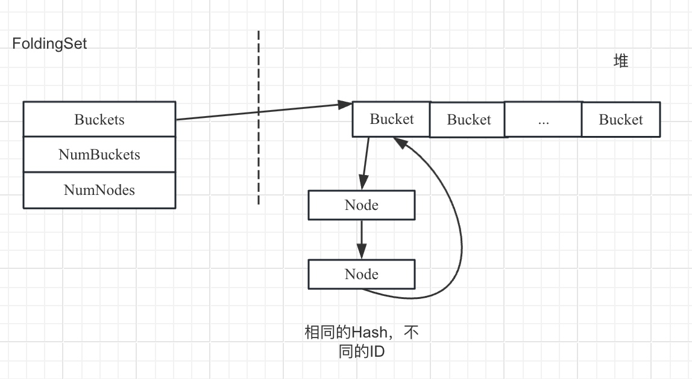

# LLVM中Set
ADT中提供了一系列Set相关的集合，由于很多Set是基于Map，建议读者先阅读Map容器。

## DenseSet、SmallDenseSet

DenseSet基于DenseMap实现的Set，对于DenseMap来说，Set中元素作为Map的Key，Map的Value是一个固定Empty值。同样地SmallDenseSet是基于SmallDenseMap实现的Set（默认空间更小，只有4个元素）。

## SmallSet

SmallSet是ADT提供的一个集合，专门处理元素较少的场景。它的底层使用SmallVector和std::set作为存储结构，当SmallSet的元素较少时使用SmallVector，当元素超过SmallVector中栈空间的大小时，将SmallVector转化为std::set。
添加数据使用insert。

## SmallPtrSet

SmallSet是处理一般元素，当处理指针的时候会使用SmallPtrSet。因为SmallSet底层使用SmallVector或者std::set，在存储时会根据对象的类型（是否支持Copy函数）进行Copy构造对象。而使用指针可以提供更好的性能，无需进行Copy构造。
SmallPtrSet只能接受指针类型，同样地其内存布局也分为两种：一个小数组（分配在栈上）和一个指针（分配在堆上），当元素个数较少时使用数组进行管理，当元素较多时使用指针进行管理。使用数组时元素按照顺序存放，查找也按照顺序进行；当使用指针时会对指针进行Hash，然后计算对应位置，因此可能存在Hash冲突问题，解决Hash冲突的方法也是开发定址法。
添加数据使用insert。

## StringSet

它继承于StringMap，key为StringRef，Value类型为null。对String期望获得较高性能。添加数据使用insert，且只支持单元素添加，不像SmallSet、SmallPtrSet可以支持一次添加多个元素。。

## SparseSet

这个容器目的时为Set提供更高查询、插入、删除效率，相应地该容器需要较多的额外存储空间。它的设计如下：

使用一个SmallVector存储真正的Value；使用一个数组存储存储Value在SmallVector对应的索引位置（Index），而Value在数组也有一个索引，它是通过一个Hash计算得到。
通常来说，使用SpareSet的性能比HashTable性能更好，它的查询、插入、删除一般是常量数量级别，依赖于插入或者删除的操作的执行顺序。

## SpareMultiSet

它和SpareSet类似，但是支持多个重复元素。它的设计和SparseSet也非常类似，最大的区别对SmallVector存储的数据进行了升级，在SparseSet中SmallVector存储的Value，而SparseMultiSet中SmallVector存放的是一个结构，这个结构不仅仅包括了Value，还包括了双向链表，用于将相同的Value节点串起来。

## ImmutableSet

类似于ImmuatbleMap，也是使用平衡二叉树实现，当添加、删除元素时都会创建一颗新的平衡二叉树。

## SetVector

ADT中提供了一个容器，要求元素不能重复（Set的基本功能），同时提供了元素顺序访问的能力。在底层使用SmallVector和DenseSet。默认情况下，元素顺序插入到SmallVector中，同时会将元素插入到DenseSet，DenseSet主要用于保证元素不能重复。
这个容器还可以接受一个额外的参数N，表示元素较少场景中的使用。在元素较少场景，只使用SmallVector，不使用DenseSet，所以在插入元素时需要遍历SmallVector，确保元素唯一。
该容器对外接口基本上以SmallVector为主，甚至可以将整个SmallVector暴露出去。

## UniqueVector

这也是一个特殊的似于Set的容器，它要求数据成员不能重复，同时提供了元素顺序访问的能力。在底层使用std::vector保存真实的数据，同时使用std::map<T, unsigned>已经在Vector存放的元素。它非常类似于SetVector，但是在底层使用map，所以map中会储存一个ID。这个容器使用成本比较高，但是它能和std标准算法直接交互。

## FoldingSet

这个集合提供了特殊功能，第一针对集合的元素进行增强，集合元素需要额外继承于FoldingSetNode，FoldingSetNode提供了一个机制，计算元素唯一ID的函数Profile，开发者需要根据元素的特点自定义如何形成这个唯一ID（FoldingSetNodeID）。第二集合提供额外的处理能力，例如GetOrInsertNode函数会根据ID计算Node是否已经存在，如果存在则丢弃新插入的Node返回原来的Node，否则新插入Node。RemoveNode删除特定Node。

该容器的实现基于一个连续的内存为主，称为Buckets，每个Bucket又是一个单链表，用于将相同的Hash值管理起来。其结果如下所示：

FoldingSet也不会执行元素的析构函数，只是将元素从FoldingSet管理的结构中移除。
SmallSet只能处理对象引用，SmallPtrSet只能处理对象指针
FoldingSet使用方法：
1）定义Node继承于FlodingSetNode，实现Profile函数（目的是计算对象的ID）
2）定义FlodingSet
3）通过FindNodeOrInsertPos、GetOrInsertNode、RemoveNode使用集合

# std中Set实现

非常类似于Map也是采用红黑树进行实现。只不过key和value相同。

<!-- more -->
