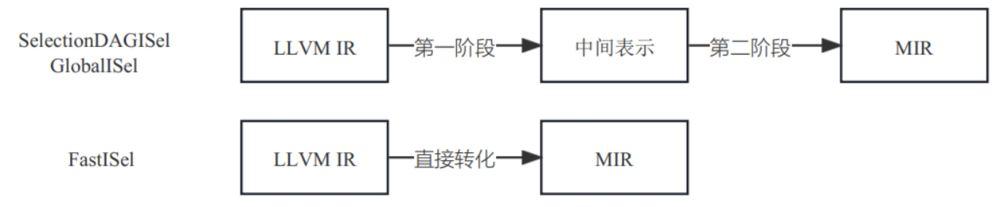

在编译器中，将高级语言映射到目标架构指令的过程称为指令选择。无论是简单的编译器（直接将高级语言转为目标架构指令），还是优化能力较强的编译器（通过IR进行优化后再转为目标架构指令）都会有这样一个阶段。这是因为高级语言（或者中间表示语言）与目标架构指令之间存在语义差异，需要通过一定的规则才能将高级语言指令转为对应的目标架构指令。规则有可能很简单、也可能很复杂。

<!-- more -->

例如一个简单的规则是一对一的映射，如图7-1所示，一条高级语言的加法指令直接对应一条目标架构加法指令。

图7- 1 指令选择一对一示意图

再例如一个复杂的规则可以把多条高级语言指令生成为一条目标架构指令，如图7-2所示，一条高级语言的“乘法”指令和一条高级语言的“加法”指令可以对应一条目标架构的“乘加”复合指令（假设某后端存在一条乘加复合指令mac）。此外，还有一条高级语言指令对应多条目标架构指令等复杂情况。

图7- 2 指令选择多对一示意图

通过上述2个例子，我们可以看到指令选择的大致过程。
首先，它要为一条或者多条高级语言指令序列匹配对应的目标架构指令序列，如上述的一条加法指令序列的匹配、乘法和加法两条指令序列的匹配。
其次，可以发现上述加法指令既可以匹配成一条目标架构的加法指令，也可以和乘法指令一起匹配成一条乘加指令，因此有两种匹配方法，两种匹配都是合法（即生成的目标指令都可以被执行[ 出现这种情况的原因有多种，一种最典型的场景就是目标架构既提供乘法、加法指令，同时又提供一条乘加复合指令，功能重复。目标架构提供功能重复的指令原因也可能有多种，其中之一就是性能问题，例如乘加复合指令比单独执行乘法和加法性能更好。]），需要选择其中的一种。
最后，根据匹配结果生成目标架构指令。
根据上述描述，可以看出指令选择过程有两个子问题需要解决：
* 模式匹配：寻找所有可以匹配的指令序列。
* 模式选择：当有多个匹配序列存在的时候，根据需要选择其中的一个模式作为匹配结果。
目前已经存在许多算法来解决这两个问题。首先是模式匹配的算法，目前有4种主要的匹配方式：单指令匹配、树匹配、有向无环图（DAG）匹配和图匹配。其次是模式选择的寻优算法，基本都是以最短运行时间和最小内存开销为目标定制相关的启发式规则，从而选出合适的指令序列。
针对这两个问题，实现中有两类处理方法，一类方法是将这两个问题分开处理，先找到所有可以匹配的序列，然后再选择一个最优的匹配结果；另一类方法是将这两个阶段合并起来实现，通过启发式算法，一边匹配一边判断是否是当前最优的选择，最终可能得到一个相对较优的匹配结果，但处理时间比前一种会更好。因为指令选择是一个已知的NP困难问题，在问题规模变大之后要找全局最优所需的时间是指数级，所以目前大部分的编译器会选择后一种方式，通过启发式算法解决问题。
下面主要对LLVM中实现的指令选择模块进行介绍，首先介绍LLVM指令选择模块的基本框架；然后介绍 LLVM 实现的3种指令选择算法的基本原理和过程；最后比较3种算法的差异。

## 7.1 指令选择概述

在LLVM中指令选择模块是在后端实现的。但它并不是后端的第一个Pass，在做指令选择之前会有一些基于LLVM IR的准备工作，一方面是进一步降低LLVM IR与后端IR的语义差异，方便后续进行后端IR的变换；另一方面是一些功能的处理，如异常处理和intrinsic处理。另外，在指令选择执行完成之后，还有一个finalize-isel的过程来完成指令选择相关的一些事情。指令选择整体流程图如图7-3所示，可以将其分为3个阶段：指令选择预处理阶段、指令选择阶段、指令选择后处理阶段，这3个阶段包含了众多Pass，此处仅仅演示几个重要的Pass，如图7-3所示。

图7- 3 指令选择3个阶段重要Pass示意图

这几个Pass是指令选择中较为重要的Pass，下面简单介绍一下它们功能。
* PreISelIntrinsicLowering：将2类intrinsic指令（intrinsic是LLVM内部定义的特殊指令），llvm.load.relative和llvm.objc.*，分别转换为相应的LLVM IR指令。
* ExpandLargeDivRem：将超过目标架构可用位数长度的除法或者取余指令展开成可用位数范围里的除法或者取余替代指令。当前支持的最小范围是32位。
* CodeGenPrepare：主要是metadata的配置和对LLVM IR做窥孔优化。
* ExceptionHandling：用于生成异常处理代码，根据不同的异常约定（如WASM、Windows和Dwarf等都有不同的异常约定）生成相应的代码。如果不需要支持异常，则此Pass无需开启。
* ISelPrepare：主要是两个栈安全相关的功能实现：安全栈（Safe Stack）和栈保护（Stack Protect），防止栈溢出或被破坏带来的安全漏洞。
* Instrucution Selection：指令选择，将LLVM IR翻译成MIR。例如一条LLVM IR的加法指令为：%add = add nsw i32 %a, %b经过指令选择后就变成了MIR的加法指令：%2:gpr32 = nsw ADDwrr %1:gpr32, %0: gpr32（ADDwrr是Aarch64的指令）。
* Finalize Isel：指令选择之后紧跟的Pass，有些目标架构自定义的伪指令会在这个阶段展开成机器指令。Finalize Isel之后就是后端的各个优化Pass，如通用子表达式消除、寄存器分配、指令调度等。
由于LLVM迭代演进的原因，目前指令选择模块里实现了3套完整的指令选择算法，按实现的时间排序，分别是SelectionDAGISel、FastISel和GlobalISel。SelectionDAGISel和GlobalISel两个算法的结构是相似的，它们都为了减少多后端冗余的问题，做了分层的设计。多后端冗余问题是由于LLVM后端支持多种芯片指令集导致。因为大部分指令集之间都会存在相似的指令（如算术运算指令、逻辑运算指令等），如果每个架构都独立地翻译这些指令，就有相当多的代码是重复冗余的。因此，SelectionDAGISel和GlobalISel通过引入新的中间表示（SelectionDAGIsel的中间表示为DAG IR、GlobalISel的中间表示为GMIR），将指令选择分为两个阶段，第一个阶段主要是将LLVM IR展开成中间表示；第二个阶段是将中间表示翻译成MIR。而FastISel如其名字一样，是为了减少指令选择的时间而设计的，因此它减少了中间转化的过程，直接将LLVM IR展开成了MIR。FastISel与上述两个算法相比，相当于只做了第一阶段的展开工作。3种指令选择算法工作流程如图7-4所示。

图7- 4 LLVM实现的3种指令选择算法工作流程图

对于SelectionDAGISel和GlobalISel来说，第一阶段主要使用宏展开算法进行指令生成，而第二阶段主要使用了树匹配算法进行指令生成（SelectionDAGISel是在DAG上的树匹配，而GlobalISel是在函数图上的树匹配）。宏展开算法（Macro Expansion）是一种简单的指令选择算法，它每次只处理一条IR，将一条IR生成一条或多条更低阶的IR指令或机器指令。通常会产生多条指令，因此，它生成的代码质量比较差。树匹配算法扩大了匹配范围，利用指令间的数据流关系，以指令树的形式处理多条IR，将它们生成一条或多条更低阶的IR指令或机器指令。通常只产生一条指令，生成的代码质量较好。关于两个基本算法的原理，读者可以进一步阅读相关指令选择论文[  指令选择经过几十年的发展，论文变得非常繁多，其中有一篇综述Survey on Instruction Selection整理了指令选择技术的发展脉络，可作为学习的前置知识，供读者参考。]，后文将展开介绍3种LLVM算法实现的详细过程。

