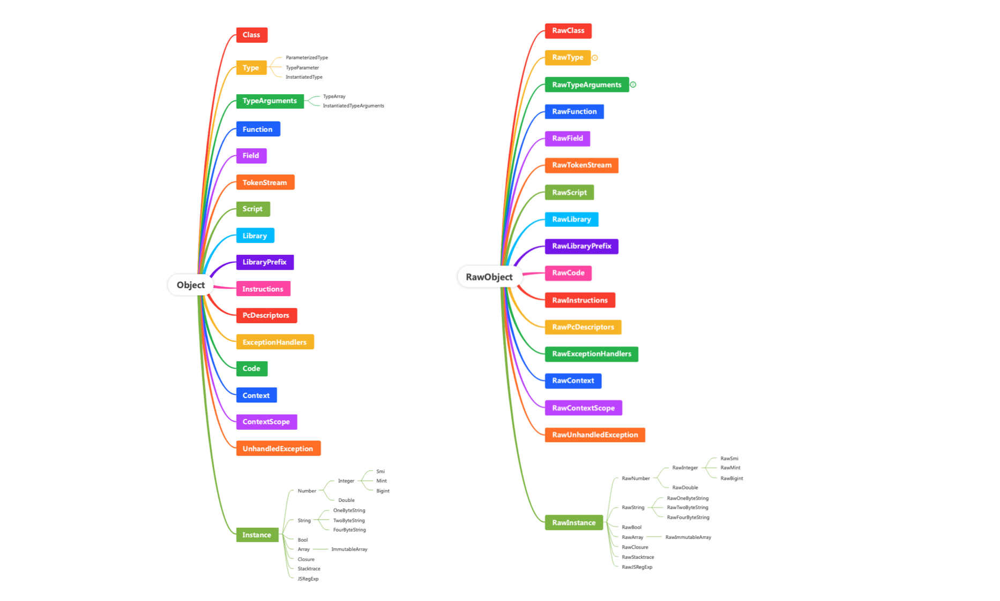
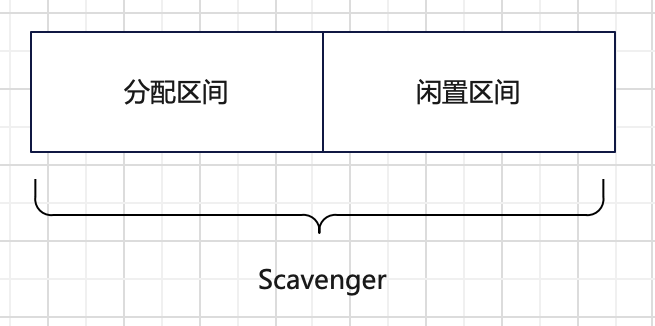

Dart是Google在2011年10月10号发布的一种用于客户端（web或者移动应用）开发的编程语言，它是为了解决Javascript语言相关问题而设计。它有个基于VM思想实现的运行环境，即DartVM。本文通过阅读DartVM的早期代码和相关文章，了解DartVM的设计思路和整体框架结构。

<!-- more -->

## Dart语言简介

Dart是一种面向对象的语言，语法类似于C语言的语法，有C等编程语言基础的比较容易入门。

它基本类型如下。

```dart
int、double、String、bool、List、Map、Set
```

```
int x = 2;
bool flag = true;
String str = "Dart";

List list = new List(3);
list[0] = 'dart';

Map map = new Map();
map['F'] = 'Dart';
```

Dart可以声明动态类型的变量，具体关键字如下。

```
var: 需要类型推导的变量；
final：编译时确定类型；
const：运行时确定类型；
```

Dart语言的一些特性：

1. 可以通过“？”保证null安全，即变量没有标记“？”就是默认不为空的。

2. Dart里的Function也是一种Object，它有类型。
3. class里可以给属性定义Setter和Getter函数，用于获取和设置属性值。
4. 具有异常处理机制。
5. 并发机制。

## DartVM整体框架

DartVM早期代码量如下，总体上有71kLoc。


## 表示形式规范

### 源码

### AST

node类型

```c++
// runtime/vm/ast.h
#define NODE_LIST(V)                                                           \
  V(ReturnNode, "return")                                                      \
  V(LiteralNode, "literal")                                                    \
  V(TypeNode, "type")                                                          \
  V(BinaryOpNode, "binop")                                                     \
  V(StringConcatNode, "concat")                                                \
  V(ComparisonNode, "compare")                                                 \
  V(UnaryOpNode, "unaryop")                                                    \
  V(IncrOpLocalNode, "incr local")                                             \
  V(IncrOpInstanceFieldNode, "incr instance field")                            \
  V(IncrOpStaticFieldNode, "incr static field")                                \
  V(IncrOpIndexedNode, "incr indexed")                                         \
  V(ConditionalExprNode, "?:")                                                 \
  V(IfNode, "if")                                                              \
  V(SwitchNode, "switch")                                                      \
  V(CaseNode, "case")                                                          \
  V(WhileNode, "while")                                                        \
  V(DoWhileNode, "dowhile")                                                    \
  V(ForNode, "for")                                                            \
  V(JumpNode, "jump")                                                          \
  V(ArgumentListNode, "args")                                                  \
  V(ArrayNode, "array")                                                        \
  V(ClosureNode, "closure")                                                    \
  V(ImplicitClosureNode, "implicit closure")                                   \
  V(StaticImplicitClosureNode, "static implicit closure")                      \
  V(InstanceCallNode, "instance call")                                         \
  V(StaticCallNode, "static call")                                             \
  V(ClosureCallNode, "closure call")                                           \
  V(ConstructorCallNode, "constructor call")                                   \
  V(InstanceGetterNode, "instance getter call")                                \
  V(InstanceSetterNode, "instance setter call")                                \
  V(StaticGetterNode, "static getter")                                         \
  V(StaticSetterNode, "static setter")                                         \
  V(NativeBodyNode, "native body")                                             \
  V(PrimaryNode, "primary")                                                    \
  V(LoadLocalNode, "load local")                                               \
  V(StoreLocalNode, "store local")                                             \
  V(LoadInstanceFieldNode, "load field")                                       \
  V(StoreInstanceFieldNode, "store field")                                     \
  V(LoadStaticFieldNode, "load static field")                                  \
  V(StoreStaticFieldNode, "store static field")                                \
  V(LoadIndexedNode, "load indexed")                                           \
  V(StoreIndexedNode, "store indexed")                                         \
  V(SequenceNode, "seq")                                                       \
  V(CatchClauseNode, "catch clause block")                                     \
  V(TryCatchNode, "try catch block")                                           \
  V(ThrowNode, "throw")                                                        \
  V(InlinedFinallyNode, "inlined finally")                                     \
```

### 运行时表示

#### 类型系统

共有49个类型。

```c++
#define CLASS_LIST(V)                                                          \
  V(Object)                                                                    \
  CLASS_LIST_NO_OBJECT(V)
  
// Macrobatics to define the Object hierarchy of VM implementation classes.
#define CLASS_LIST_NO_OBJECT(V)                                                \
  V(Class)                                                                     \
  V(Type)                                                                      \
    V(ParameterizedType)                                                       \
    V(TypeParameter)                                                           \
    V(InstantiatedType)                                                        \
  V(TypeArguments)                                                             \
    V(TypeArray)                                                               \
    V(InstantiatedTypeArguments)                                               \
  V(Function)                                                                  \
  V(Field)                                                                     \
  V(TokenStream)                                                               \
  V(Script)                                                                    \
  V(Library)                                                                   \
  V(LibraryPrefix)                                                             \
  V(Code)                                                                      \
  V(Instructions)                                                              \
  V(PcDescriptors)                                                             \
  V(ExceptionHandlers)                                                         \
  V(Context)                                                                   \
  V(ContextScope)                                                              \
  V(UnhandledException)                                                        \
  V(Instance)                                                                  \
    V(Number)                                                                  \
      V(Integer)                                                               \
        V(Smi)                                                                 \
        V(Mint)                                                                \
        V(Bigint)                                                              \
      V(Double)                                                                \
    V(String)                                                                  \
      V(OneByteString)                                                         \
      V(TwoByteString)                                                         \
      V(FourByteString)                                                        \
    V(Bool)                                                                    \
    V(Array)                                                                   \
      V(ImmutableArray)                                                        \
    V(Closure)                                                                 \
    V(Stacktrace)                                                              \
    V(JSRegExp)                                                                
```

## 内存管理

### 对象模型

因为，DartVM将数据表示成对象，即一个数据就是一个对象（Object）；同时，将数据在内存中的形式表示成原始对象（RawObject）。所以，DartVM设计了两个基本类型：Object和RawObject，用于描述上述两个场景下的数据表示。

- Object，描述数据的应用信息；
- RawObject，描述数据的内存信息。

它们两个是一一对应的，并且继承自它们的类型也是一一对应的。如下图所示，左边是Dart VM里基本的数据类型，右边是这些数据类型的内存形式。



### 堆内存管理

堆内存管理的整体架构图如下，分为三层。

- 应用接口层：通过Heap给应用代码提供内存分配接口。
- 内存管理算法层：实现应用内存分配和回收功能，当前有两种实现分别是PageSpace和Scavenger。
- 系统适配层：通过VirtualMemory适配多个操作系统，实现向操作系统申请内存和释放内存等功能。


#### 应用接口层

应用接口层管理应用的堆内存，如内存空间初始化、内存分配等，这些功能都在Heap这个数据结构里。

在Heap里内存被划分成如下三个空间。

- New Space：存放生命周期比较短的数据，如String，BigInt，Context和ExceptHandle等。最大容量是32MB，使用Scavenger进行管理。
- Old Space：存放生命周期长的数据，如Function、TokenStream等。最大容量是512MB，使用PageSpace进行管理。
- Code Space：存放可执行的代码数据。最大容量是4MB，使用PageSpace进行管理。

这个三个空间被标识为三种类型kNew、kOld和kExecutable。在Heap提供的内存分配接口中，它会根据请求的内存类型在上述对应的内存空间上进行分配，具体流程如下图所示，如果类型是kNew就在New Space里进行分配；而类型是kOld就在Old Space里进行分配；否则在Code Space里进行分配。


其中Old Space和Code Space如果没有内存空间进行分配就会报错，而New Space不会直接报错，它会先进行一次垃圾回收，然后在分配一次，如果还不行就在Old Space里进行分配。

#### 内存管理算法层

堆内存有两种算法实现--PageSpace和Scavenger。

**PageSpace**不提前分配内存，而是每次内存不足的时候，按页进行内存申请再进行分配。分配得到的页是以链表的形式进行组织。这里的页分为两种，一种是大小固定的页（目前是256KB），一种是大小不固定的大页。因此，一个PageSpace里有两条页链表分别管理这两种内存页。如下图所示，pages表示的是固定页的链表，large pages表示的是大页的链表。


这两种页虽然大小是不同的，但是结构是相同的，都是由页头和数据空间组成。如下图所示，页头放的是一个由heapPage表示的页表元数据，里面主要是三个数据，即页的虚拟内存块元数据的地址、数据空间顶部地址和下一个页表地址；而数据空间就是存放数据，不过两种页存放的数据数量存在不同，固定页里会存放多个数据，而大页里只会存放一个数据。


下面我们介绍下PageSpace进行内存分配和内存回收的过程。

当应用向PageSpace管理的内存空间申请一块内存的时候，PageSpace就会进行内存分配，有以下4个步骤。

1. 根据申请的内存大小判断是否可以在固定页里分配；
2. 如果申请的内存小于固定页的大小就按固定页进行分配；
3. 否则按大页进行分配；
4. 返回申请结果，地址或者0。

固定页方式的内存分配过程如下。

1. 判断尾部页是否存在，以及剩余空间是否足够，如果尾部页不存在或者尾部页的剩余空间不够，则跳到第2步，否则跳到第3步；

2. 申请新的固定页，使用尾插法，将其插到固定页链表的尾部，作为新的尾部页，如下图所示，新增的PageN是放在尾部的；

   

3. 在固定页里进行内存分配，此时使用的是Bump Allocation算法，即将数据空间顶部地址直接后移，得到所需的内存空间。

大页的内存分配过程比较简单，它是按所需内存大小进行对齐后的结果直接申请一块大的内存块，然后将这个内存块按大页的形式插入到大页链表的头部进行管理（头插法，与固定页链表的插入方式不同，但从目前的实现来看，固定页链表的插入方式也是可以改成这种方式，可以节省一个尾指针的空间），最后再给到申请者这块内存的地址，供其使用。

PageSpace的内存回收比较简单，它是在PageSpace析构的时候直接释放所有内存。因此，不存在动态的垃圾回收过程。

**Scavenger**使用了Cheney算法，是一种复制内存管理算法，它在初始化阶段会向系统申请了一段固定的内存，然后将内存均分为两个区间进行管理，如下图所示，在内存分配阶段会固定在一个区间里进行分配即分配区间，而另一个区间不做任何事情作为闲置区间。



当分配区间里无法分配内存了就会触发内存回收，在内存回收阶段会先依次检查分配区间里的每个数据是否存活（即是否还有存在的必要），并将存活的数据复制到闲置区间，最后释放分配区间里的数据并交换两个区间的角色。如下图所示，在经过一个分配和回收周期后，原有的分配区间变成闲置区间，而原有的闲置区间则变成分配区间。


在大部分的论文或者实现里，这两个内存区间会被称为分配区间/幸存者区间（Allocation Space/Survivor Space）或者From space/To space。DartVM里采用的是From space/To space这对名称来命名Scavenger的两个内存区间，下面我们将DartVM的Scavenger的实现分为初始化、内存分配和内存回收三个阶段分别进行介绍。

首先，在Scavenger初始化阶段，Scavenger就申请了32MB内存，并平均划分成From和To两个16MB内存空间，这两个内存空间都是通过Memory Region进行管理的。

然后，在内存分配阶段，Scavenger会在To内存空间里进行分配，它会维护一个top指针和一个end指针，top指针表示To内存空间的堆顶位置，end指针表示To内存空间的最大内存位置。主要分配步骤如下：

1. 通过end-top计算出To空间剩余的内存大小，然后判断这个剩余内存是否可以满足申请的内存大小，不满足就返回空指针，满足就进行下一步；
2. 将top指针作为申请到的内存首地址，并上移top指针分配出所申请的内存空间；
3. 返回申请到的内存首地址。

如下图例子所示，当申请一块内存之后top指针就会上移。


最后，当无法从To空间申请出内存后，就会触发内存回收过程，此过程会尝试进行无用内存的回收，从而释放出可用空间。在这个内存回收阶段里（即垃圾回收阶段），主要的步骤有。

1. 交换To和From指针，将新的To空间作为分配空间进行内存分配；
2. 使用宽度优先遍历算法（相比深度优先具有更好的局部性）遍历内存对象根节点集合（root集），将所有属于From的内存对象复制到To空间；
3. 遍历To空间所有的内存对象，逐个判断内存对象的子对象，将属于From的子对象复制到To空间；

经过上述步骤之后，存活的对象都是在新的To空间里了，而新的From空间里剩余的对象都是垃圾，下次可以直接覆写掉。在第2步中提到的根节点集合指的是From空间的存活对象内存链表的首节点，通过这些根节点我们就可以找到From空间所有的存活对象内存，从而可以将所有的存活对象都复制到To空间里。Scavenger中根节点有以下8个来源，这些对象及其子对象如果有在From空间的，就可以被复制到To空间里。

- Object Store的所有子对象；
- Isolate StubCode的StubEntry对象；
- Isolate所有Zone里的对象；
- Isolate的所有StackFrame的对象；
- Isolate的ApiState的对象；
- Isolate的CodeIndexTable的对象；
- Isolate的RawContext对象；
- old_space和code_space的对象；

因为内存对象是多链表的形式保存的，所以设计了一个基础的内存对象访问器用于对象访问，并且设计了三个子类访问器，每个子类访问器都实现了对内存对象的特定处理。如下图所示，目前有ScavengerVisitor、SnapshotWriterVisitor和VerifyPointersVisitor三个子类访问器。


其中，ScavengerVisitor是用于内存回收的访问器，它实现了有个主要的函数实现了内存对象识别和复制内存对象到To空间的功能，这个函数具体可以分为以下几个部分：

1. 从对象指针中获取原始地址；
2. 判断地址是否属于From空间，如果不是则返回，否则继续；
3. 判断地址是否已经处理过了，如果处理过就直接获取新地址，否则继续；
4. 从新的To空间申请内存空间，复制数据到新内存空间，将老Object里的rawaddr换成新内存空间的地址；
5. 将旧的Object换成新的Object。

总体上，Scavenger可以快速的分配内存且内存碎片率低，但同时它存在内存利用率低（一个闲置空间被浪费了），需要暂停业务（数据多的话会需要较长GC的时间）。

#### 系统接口层

DartVM给应用提供了自动内存管理的功能，但是具体内存还是需要向操作系统申请的。因为DartVM适配了多个操作系统（win、macos、linux），不同操作系统的内存申请接口会存在差异，所以DartVM里设计了VirtualMemory作为系统接口层，屏蔽掉不同系统带来的差异。它由以下三部分功能组成。

- 内存申请：提供了内存保留和内存提交功能；
- 内存释放：提供了释放内存的功能；
- 内存信息管理：提供了获取内存首地址、内存大小和判断是否包含某个地址等功能。

#### 总结

DartVM早期的内存管理模块具备了内存管理的基本功能，也有了相应的分层设计，避免了和系统或应用的耦合，可以支持dart的运行期间的内存需求。当然实现的算法还是比较简单的，GC暂停时间也比较长，后续会进一步改进。


```c++
class Isolate {
  Heap* heap_;
};
```

```c++
class Heap {
  // The different spaces used for allocation.
  Scavenger* new_space_;
  PageSpace* old_space_;
  PageSpace* code_space_;
};
```

RawObject类型只有属性和链表操作，Object只有成员函数和静态属性。

```c++
class RawObject {
  RawClass* class_;
};

class Object {
  RawObject* raw_;  // The raw object reference.
};
```

PageSpace

使用的是bump allocate算法。

```c++
// runtime/vm/pages.h
class PageSpace {
  HeapPage* pages_;
  HeapPage* pages_tail_;
  HeapPage* large_pages_;
};
```

分配内存时，如果内存空间不足就从虚拟内存中申请。

````c++
// runtime/vm/pages.cc
uword PageSpace::TryAllocate(intptr_t size) {
  AllocatePage();
}

void PageSpace::AllocatePage() {
  HeapPage* page = HeapPage::Allocate(kPageSize, is_executable_);  
}

HeapPage* HeapPage::Allocate(intptr_t size, bool is_executable) {
  VirtualMemory* memory =
      VirtualMemory::ReserveAligned(size, PageSpace::kPageAlignment);
  return Initialize(memory, is_executable);
}
````

```c++
// runtime/vm/virtual_memory.cc
VirtualMemory* VirtualMemory::ReserveAligned(intptr_t size,
                                             intptr_t alignment) {
  VirtualMemory* result = VirtualMemory::Reserve(size + alignment); 
  return result;
}  
```

分配的内存也是通过memory region进行管理。

```c++
VirtualMemory* VirtualMemory::Reserve(intptr_t size) {
  void* address = VirtualAlloc(NULL, size, MEM_RESERVE, PAGE_NOACCESS);
  if (address == NULL) {
    return NULL;
  }
  MemoryRegion region(address, size);
  return new VirtualMemory(region, address);
}
```

Scavenger

```c++
// runtime/vm/scavenger.h
class Scavenger {
  VirtualMemory* space_;
  MemoryRegion* to_;
  MemoryRegion* from_;  
};
```

Scavenger在构造函数阶段就会申请内存，并平均分为to和from两个半区。

```c++
Scavenger::Scavenger(Heap* heap, intptr_t max_capacity, uword object_alignment)
    : heap_(heap),
      object_alignment_(object_alignment),
      count_(0),
      scavenging_(false) {
  // Allocate the virtual memory for this scavenge heap.
  space_ = VirtualMemory::Reserve(max_capacity);
        
  // Setup the semi spaces.
  uword semi_space_size = space_->size() / 2;
  to_ = new MemoryRegion(space_->address(), semi_space_size);
  uword middle = space_->start() + semi_space_size;
  from_ = new MemoryRegion(reinterpret_cast<void*>(middle), semi_space_size);        
}      
```

在heap使用new space分配不出内存时，会触发new space的内存回收。

```c++
uword Heap::AllocateNew(intptr_t size) {
  new_space_->Scavenge();
}
```

整个回收过程由4部分组成，并且有个迭代器进行指针遍历。

```c++
void Scavenger::Scavenge() {
  // Setup the visitor and run a scavenge.
  ScavengerVisitor visitor(this);
  Prologue();
  IterateRoots(&visitor);
  ProcessToSpace(&visitor);
  Epilogue();
}
```

因为对象一开始是分配在to空间的，所以在前期阶段主要是交换from和to指针，为后面的from空间到to空间的对象拷贝做准备。

```c++
void Scavenger::Prologue() {
  // Flip the two semi-spaces so that to_ is always the space for allocating
  // objects.
  MemoryRegion* temp = from_;
  from_ = to_;
  to_ = temp;
}
```

从Isolate、old space和code space这三者包含的子object开始遍历（即它们三者包含的object是Roots），如果object是from space的，就拷贝到to space中。

```c++
void Scavenger::IterateRoots(ObjectPointerVisitor* visitor) {
  Isolate::Current()->VisitObjectPointers(
      visitor, StackFrameIterator::kDontValidateFrames);
  heap_->IterateOldPointers(visitor);
}
```

遍历to space object的class object和field object，如果object是from space的，就拷贝到to space中。

```c++
class ScavengerVisitor : public ObjectPointerVisitor {
  void VisitPointers(RawObject** first, RawObject** last) {
    for (RawObject** current = first; current <= last; current++) {
      ScavengePointer(current);
    }
  }
};
```

首先，如果object不是堆上的object或者它不在from space就不需要处理直接返回。然后，通过kForwarded标志判断object是否已经处理过了，如果处理过就直接返回；否则，就申请to space空间，拷贝，并将旧指针置为新指针和kForwarded标志或之后的值。

```c++
class ScavengerVisitor : public ObjectPointerVisitor {
  void ScavengePointer(RawObject** p) {
    RawObject* raw_obj = *p;

    // Fast exit if the raw object is a Smi.
    if (!raw_obj->IsHeapObject()) return;

    uword raw_addr = RawObject::ToAddr(raw_obj);
    // Objects should be contained in the heap.
    // TODO(iposva): Add an appropriate assert here or in the return block
    // below.
    // The scavenger is only interested in objects located in the from space.
    if (!scavenger_->from_->Contains(raw_addr)) {
      // Addresses being visited cannot point in the to space. As this would
      // either mean the pointer is being visited twice or this pointer has not
      // been evacuated during the last scavenge. Both of these situations are
      // an error.
      ASSERT(!scavenger_->to_->Contains(raw_addr));
      return;
    }    
  }
};
```


## 代码流程

### Dart执行过程

主流程里有

1. 参数解析
2. DartVM初始化
3. isolate创建
4. 进入scope（独立的handle管理和内存分配）
5. dart文件编译
6. dart库链接
7. dart文件执行（从main开始）
8. 执行结果处理
9. 退出scope
10. 消息循环执行
11. profiler符号记录
12. isolate关闭

```c++
int main(int argc, char** argv) {
  ParseArguments(argc, argv, &vm_options, &script_name, &dart_options);
  Dart_Initialize(vm_options.count(), vm_options.arguments(), MainIsolateInitCallback);
  Dart_Isolate isolate = Dart_CreateIsolate(snapshot_buffer, script_name);
  
  Dart_EnterScope();
  Dart_CompileAll();
  Dart_Handle script_url = Dart_NewString(script_name);
  Dart_Result result = Dart_LookupLibrary(script_url);
  
  Dart_Handle library = Dart_GetResult(result);
  result = Dart_InvokeStatic(library,
                             Dart_NewString(""),
                             Dart_NewString("main"),
                             0,
                             NULL);
  Dart_Handle result_obj = Dart_GetResult(result);
  Dart_ExitScope();
  
  Dart_RunLoop();
  DumpPprofSymbolInfo();
  Dart_ShutdownIsolate();
}
```

#### Dart初始化

```c++
// TODO(iposva): This is a placeholder for the eventual external Dart API.
DART_EXPORT bool Dart_Initialize(int argc,
                                 char** argv,
                                 Dart_IsolateInitCallback callback) {
  return Dart::InitOnce(argc, argv, callback);
}
```

1. OS初始化，设置了一个标志位，用于防止重复初始化；
2. 虚拟内存初始化，获取内存页的大小；
3. Isolate初始化，创建线程key；
4. 创建vm isolate并初始化；
5. 将Isoalte::Current置空；
6. 设置初始化回调函数。

```c++
// runtime/vm/dart.cc
bool Dart::InitOnce(int argc, char** argv,
                    Dart_IsolateInitCallback callback) {
  OS::InitOnce();
  VirtualMemory::InitOnce();
  Isolate::InitOnce();
  
  // Create the VM isolate and finish the VM initialization.
  { .. }
  
  Isolate::SetCurrent(NULL);  // Unregister the VM isolate from this thread.
  Isolate::SetInitCallback(callback);
  return true;
}  
```

创建vm isolate并初始化：

1. 新建一个vm_isolate;
2. 初始化新Heap;
3. 初始化新ObjectStore；
4. 初始化Object；
5. 初始化stub_code，生成stub_code代码；
6. 初始化PortMap；
7. 初始化Scanner；

```c++
// runtime/vm/dart.cc
bool Dart::InitOnce(int argc, char** argv,
                    Dart_IsolateInitCallback callback) { 
  // Create the VM isolate and finish the VM initialization.
  {
    ASSERT(vm_isolate_ == NULL);
    vm_isolate_ = Isolate::Init();
    Zone zone;
    HandleScope handle_scope;
    Heap::Init(vm_isolate_);
    ObjectStore::Init(vm_isolate_);
    Object::InitOnce();
    StubCode::InitOnce();
    PortMap::InitOnce();
    Scanner::InitOnce();
  }
}  
```

```c++
// runtime/vm/object.cc
void Object::InitOnce() {
}
```

```c++
// runtime/vm/stub_code.cc
void StubCode::InitOnce() {
}
```

```c++
void PortMap::InitOnce() {
}
```

#### 创建Isolate

其中Object可以直接初始化，也可以来自snapshot。

```c++
// runtime/vm/dart_api_impl.cc
DART_EXPORT Dart_Isolate Dart_CreateIsolate(void* snapshot, void* data) {
  Isolate* isolate = Dart::CreateIsolate(snapshot, data);
  return reinterpret_cast<Dart_Isolate>(isolate);
}
```

```c++
Isolate* Dart::CreateIsolate(void* snapshot_buffer, void* data) {
  // Create and initialize a new isolate.
  Isolate* isolate = Isolate::Init();
  Zone zone;
  HandleScope handle_scope;
  Heap::Init(isolate);
  ObjectStore::Init(isolate);
  if (snapshot_buffer == NULL) {
    Object::Init(isolate);
  } else {
    // Initialize from snapshot (this should replicate the functionality
    // of Object::Init(..) in a regular isolate creation path.
    Object::InitFromSnapshot(isolate);
    Snapshot* snapshot = Snapshot::SetupFromBuffer(snapshot_buffer);
    SnapshotReader reader(snapshot, isolate->heap(), isolate->object_store());
    reader.ReadFullSnapshot();
  }

  StubCode::Init(isolate);
  CodeIndexTable::Init(isolate);

  // Give the embedder a shot at setting up this isolate.
  // Isolates spawned from within this isolate will be given the callback data
  // returned by the callback.
  data = Isolate::InitCallback()(data);
  // TODO(iposva): Shutdown the isolate on failure.
  isolate->set_init_callback_data(data);
  return isolate;
}
```

CodeIndexTable初始化

```c++
// runtime/vm/code_index_table.cc
void CodeIndexTable::Init(Isolate* isolate) {
  ASSERT(isolate->code_index_table() == NULL);
  CodeIndexTable* code_index_table = new CodeIndexTable();
  isolate->set_code_index_table(code_index_table);
}
```

1. dart文件加载；
2. 核心库加载；

```c++
static void* MainIsolateInitCallback(void* data) {
  result = LoadScript(script_name);
  Dart_Handle library = Dart_GetResult(result);
  
  Builtin_ImportLibrary(library);
  // Setup the native resolver for built in library functions.
  Builtin_SetNativeResolver();
}
```

```c++
// runtime/bin/process_script.cc
Dart_Result LoadScript(const char* script_name) {
  Dart_Result result = ReadStringFromFile(script_name);
  Dart_Handle source = Dart_GetResult(result);
  Dart_Handle url = Dart_NewString(script_name);

  return Dart_LoadScript(url, source, LibraryTagHandler);
}
```

将代码以字符串的形式读到内存中。

```c++
static Dart_Result ReadStringFromFile(const char* filename) {
  File* file = File::OpenFile(filename, false);
  intptr_t len = file->Length();
  char* text_buffer = reinterpret_cast<char*>(malloc(len + 1));
  file->ReadFully(text_buffer, len);
  Dart_Handle str = Dart_NewString(text_buffer);
  return Dart_ResultAsObject(str);
}
```

生成Library

```c++
DART_EXPORT Dart_Result Dart_LoadScript(Dart_Handle url,
                                        Dart_Handle source,
                                        Dart_LibraryTagHandler handler) {
  isolate->set_library_tag_handler(handler);
  library = Library::New(url_str);
  library.Register();
  Dart_Result result;
  CompileSource(library, url_str, source_str, RawScript::kScript, &result);
  return result;  
}                                        
```

```c++
// runtime/vm/parser.cc
static void CompileSource(const Library& lib,
                          const String& url,
                          const String& source,
                          RawScript::Kind kind,
                          Dart_Result* result) {
  Compiler::Compile(lib, script);
}  
```

```c++
void Compiler::Compile(const Library& library, const Script& script) {
  const String& library_key = String::Handle(library.private_key());
  script.Tokenize(library_key);
  Parser::ParseCompilationUnit(library, script);  
}
```

前端解析

```c++
// runtime/vm/parser.cc
void Parser::ParseCompilationUnit(const Library& library,
                                  const Script& script) {
  Parser parser(script, library);
  parser.ParseTopLevel();
}
```

```c++
void Parser::ParseTopLevel() {
  while (true) {
    set_current_class(Class::Handle());  // No current class.
    if (CurrentToken() == Token::kCLASS) {
      ParseClassDefinition(&classes);
    } else if (CurrentToken() == Token::kTYPEDEF) {
      ParseFunctionTypeAlias(&classes);
    } else if (CurrentToken() == Token::kINTERFACE) {
      ParseInterfaceDefinition(&classes);
    } else if (IsVariableDeclaration()) {
      set_current_class(toplevel_class);
      ParseTopLevelVariable(&top_level);
    } else if (IsTopLevelFunction()) {
      set_current_class(toplevel_class);
      ParseTopLevelFunction(&top_level);
    } else if (IsTopLevelAccessor()) {
      set_current_class(toplevel_class);
      ParseTopLevelAccessor(&top_level);
    } else if (CurrentToken() == Token::kEOS) {
      break;
    } else {
      UnexpectedToken();
    }
  }
}                            
```

#### 函数代码编译

编译Dart代码，依次遍历每个库文件，在每个库文件里依次编译class中的函数和匿名class中的函数。

```c++
// runtime/vm/dart_api_impl.cc
DART_EXPORT Dart_Result Dart_CompileAll() {
  CompileAll(&result);
}
```

```c++
// runtime/vm/object.cc
void Library::CompileAll() {
  Library& lib = Library::Handle(
      Isolate::Current()->object_store()->registered_libraries());
  Class& cls = Class::Handle();
  while (!lib.IsNull()) {
    ClassDictionaryIterator it(lib);
    while (it.HasNext()) {
      Compiler::CompileAllFunctions(cls);
    }
    
    Array& anon_classes = Array::Handle(lib.raw_ptr()->anonymous_classes_);
    for (int i = 0; i < lib.raw_ptr()->num_anonymous_; i++) {
      Compiler::CompileAllFunctions(cls);
    }
    lib = lib.next_registered();
  }
}
```

```c++
// runtime/vm/compiler.cc
void Compiler::CompileAllFunctions(const Class& cls) {
  Array& functions = Array::Handle(cls.functions());
  Function& func = Function::Handle();
  for (int i = 0; i < functions.Length(); i++) {
    CompileFunction(func);
  }
}

void Compiler::CompileFunction(const Function& function) {
  CompileFunctionHelper(function, false);
}
```

有三种编译过程：

1. 首次编译，直接会编译成未优化代码；

2. 在有未优化代码的情况下，编译成优化代码；

   这个场景下会根据退优化的次数判断是否使用类型反馈信息。

3. 将优化代码切换成未优化代码。

编译完成后，函数指针会被添加到CodeIndexTable中。

```c++
static void CompileFunctionHelper(const Function& function, bool optimized) {
  ParsedFunction parsed_function(function);
  Parser::ParseFunction(&parsed_function);
  CodeIndexTable* code_index_table = Isolate::Current()->code_index_table();
  Assembler assembler;
  
  if (optimized) {
    ExtractTypeFeedback(Code::Handle(parsed_function.function().code()),  
                        parsed_function.node_sequence());  
    OptimizingCodeGenerator code_gen(&assembler, parsed_function);
    code_gen.GenerateCode();
    function.SetCode(code);
    code_index_table->AddFunction(function);
  } else {
    // Unoptimized code.
    if (Code::Handle(function.unoptimized_code()).IsNull()) {
      ASSERT(Code::Handle(function.code()).IsNull());
      // Compiling first time.
      CodeGenerator code_gen(&assembler, parsed_function);
      code_gen.GenerateCode();
      function.SetCode(code);
      code_index_table->AddFunction(function);
    } else {
      // Disable optimized code.
      const Code& optimized_code = Code::Handle(function.code());
      ASSERT(optimized_code.is_optimized());
      CodePatcher::PatchEntry(Code::Handle(function.code()));
      // Use previously compiled code.
      function.SetCode(Code::Handle(function.unoptimized_code()));
      CodePatcher::RestoreEntry(Code::Handle(function.unoptimized_code()));
    }
  }
}
```

函数解析

```c++
// Parser is at the opening parenthesis of the formal parameter declaration
// of function. Parse the formal parameters and code.
SequenceNode* Parser::ParseFunc(const Function& func,
                                Array& default_parameter_values) {
}    
```

不优化的CodeGen--CodeGenerator。

通过宏隔离区分不同Target的实现。

```
TARGET_ARCH_IA32
TARGET_ARCH_ARM
TARGET_ARCH_X64
```

```c++
// NOTE: First 5 bytes of the code may be patched with a jump instruction. Do
// not emit any objects in the first 5 bytes.
void CodeGenerator::GenerateCode() {
  GeneratePreEntryCode();
  GenerateEntryCode();
  parsed_function_.node_sequence()->Visit(this);
  GenerateDeferredCode();
  pc_descriptors_list_->AddDescriptor(PcDescriptors::kPatchCode,
                                      assembler_->CodeSize(),
                                      AstNode::kInvalidId,
                                      0,
                                      -1);
  __ jmp(&StubCode::FixCallersTargetLabel());  
}
```

函数进入前的栈溢出检查和调用次数上报（用于后续的优化等级提升），此外，当允许优化的时候跳到优化代码上去。

```c++
// Pre entry code is called before the frame has been constructed:
// - check for stack overflow.
// - optionally count function invocations.
// - optionally trigger optimizing compiler if invocation threshold has been
//   reached.
// Note that first 5 bytes may be patched with a jump.
// TODO(srdjan): Add check that no object is inlined in the first
// 5 bytes (length of a jump instruction).
void CodeGenerator::GeneratePreEntryCode() {
  if (may_optimize) {
    __ cmpl(EBX, Immediate(FLAG_optimization_invocation_threshold));
    __ j(GREATER, &StubCode::OptimizeInvokedFunctionLabel());
  }
}
```

栈帧创建和参数处理。

```c++
// Call to generate entry code:
// - compute frame size and setup frame.
// - allocate local variables on stack.
// - optionally check if number of arguments match.
// - initialize all non-argument locals to null.
//
// Input parameters:
//   ESP : points to return address.
//   ESP + 4 : address of last argument (arg n-1).
//   ESP + 4*n : address of first argument (arg 0).
//   EDX : arguments descriptor array.
void CodeGenerator::GenerateEntryCode() {

}
```

遍历节点进行指令生成。

```c++
#define DEFINE_VISIT_FUNCTION(type, name)                                      \
  void type::Visit(AstNodeVisitor* visitor) {                                  \
    visitor->Visit##type(this);                                                \
  }
NODE_LIST(DEFINE_VISIT_FUNCTION)
#undef DEFINE_VISIT_FUNCTION
```

```c++
// runtime/vm/code_generator_ia32.cc
void CodeGenerator::VisitSequenceNode(SequenceNode* node_sequence) {
}

void CodeGenerator::VisitLoadLocalNode(LoadLocalNode* node) {
  // Load the value of the local variable and push it onto the expression stack.
  if (IsResultNeeded(node)) {
    GeneratePushVariable(node->local(), EAX);
  }
}

oid CodeGenerator::GeneratePushVariable(const LocalVariable& variable,
                                         Register scratch) {
  if (variable.is_captured()) {
    // The variable lives in the context.
    int delta = state()->context_level() - variable.owner()->context_level();
    ASSERT(delta >= 0);
    Register base = CTX;
    while (delta-- > 0) {
      __ movl(scratch, FieldAddress(base, Context::parent_offset()));
      base = scratch;
    }
    __ pushl(FieldAddress(base, Context::variable_offset(variable.index())));
  } else {
    // The variable lives in the current stack frame.
    __ pushl(Address(EBP, variable.index() * kWordSize));
  }
}
```

在调用object成员函数的时候就会用到inline cache和deopt功能。

```c++
void CodeGenerator::VisitInstanceCallNode(InstanceCallNode* node) {
  const int number_of_arguments = node->arguments()->length() + 1;
  // Compute the receiver object and pass it as first argument to call.
  node->receiver()->Visit(this);
  // Now compute rest of the arguments to the call.
  node->arguments()->Visit(this);
  // Some method may be inlined using type feedback, therefore this may be a
  // deoptimization point.
  MarkDeoptPoint(node->id(), node->token_index());

  GenerateInstanceCall(node->id(),
                       node->token_index(),
                       node->function_name(),
                       number_of_arguments,
                       node->arguments());
  // Result is in EAX.
  if (IsResultNeeded(node)) {
    __ pushl(EAX);
  }
}
```

inline cache调用

```c++
void CodeGenerator::GenerateInstanceCall(intptr_t node_id,
                                         intptr_t token_index,
                                         const String& function_name,
                                         int arg_count,
                                         ArgumentListNode* arguments) {
  // Set up the function name and number of arguments (including the receiver)
  // to the InstanceCall stub which will resolve the correct entrypoint for
  // the operator and call it.
  __ LoadObject(ECX, function_name);
  __ LoadObject(EDX, ArgumentsDescriptor(arg_count, arguments));
  __ call(&StubCode::CallInstanceFunctionLabel());
  AddCurrentDescriptor(PcDescriptors::kIcCall,
                       node_id,
                       token_index);
  __ addl(ESP, Immediate(arg_count * kWordSize));
}
```

```c++
void StubCode::GenerateCallInstanceFunctionStub(Assembler* assembler) {
  __ CallRuntimeFromStub(kResolvePatchInstanceCallRuntimeEntry);
}
```

```c++
// Resolve instance call and patch it to jump to IC stub or megamorphic stub.
// After patching the caller's instance call instruction, that call will
// be reexecuted and ran through the created IC stub. The null receivers
// have special handling, i.e., they lead to megamorphic lookup that implements
// the appropriate null behavior.
//   Arg0: receiver object.
DEFINE_RUNTIME_ENTRY(ResolvePatchInstanceCall, 1) {
  const Instance& receiver = Instance::CheckedHandle(arguments.At(0));
  const Code& code = Code::Handle(ResolveCompileInstanceCallTarget(receiver));
  DartFrameIterator iterator;
  DartFrame* caller_frame = iterator.NextFrame();
  String& function_name = String::Handle();
  if ((!receiver.IsNull() && code.IsNull()) || !FLAG_inline_cache) {
  } else {
    CodePatcher::GetInstanceCallAt(caller_frame->pc(),
                                   &function_name,
                                   &num_arguments,
                                   &num_named_arguments,
                                   &caller_target);
    // If caller_target is not in CallInstanceFunction stub (resolve call)
    // then it must be pointing to an IC stub.
    const Class& receiver_class = Class::ZoneHandle(receiver.clazz());    
    const Code& ic_code = Code::Handle(ICStubs::GetICStub(classes, targets));
    CodePatcher::PatchInstanceCallAt(caller_frame->pc(), ic_code.EntryPoint());
  }
}
```

```c++
// runtime/vm/code_patcher_ia32.cc
void CodePatcher::GetInstanceCallAt(uword return_address,
                                    String* function_name,
                                    int* num_arguments,
                                    int* num_named_arguments,
                                    uword* target) {
  InstanceCall call(return_address);
  *num_arguments = call.argument_count();
  *num_named_arguments = call.named_argument_count();
  *target = call.target();
  *function_name = call.function_name();  
}                                    
```

```C++
// runtime/vm/ic_stubs_ia32.cc

// Generate inline cache stub for given targets and classes.
//  EDX: arguments descriptor array (preserved).
//  ECX: function name (unused, preserved).
//  TOS: return address.
// Jump to target if the receiver's class matches the 'receiver_class'.
// Otherwise jump to megamorphic lookup. TODO(srdjan): Patch call site to go to
// megamorphic instead of going via the IC stub.
// IC stub structure:
//   A: Get receiver, test if Smi, jump to IC miss or hit.
//   B: Get receiver's class, compare with all known classes.
RawCode* ICStubs::GetICStub(const GrowableArray<const Class*>& classes,
                            const GrowableArray<const Function*>& targets) {

}                            
```

优化代码生成器--OptimizingCodeGenerator

继承自CodeGenerator，在一些Node实现上进行扩展，生成更高效的代码。

```C++
void OptimizingCodeGenerator::VisitLoadLocalNode(LoadLocalNode* node) {
  if (!IsResultNeeded(node)) return;
  if (IsResultInEaxRequested(node)) {
    GenerateLoadVariable(EAX, node->local());
    node->info()->set_result_returned_in_eax(true);
  } else {
    GeneratePushVariable(node->local(), EAX);
  }
}
```

在优化生成器中会有退优化的操作。首先是生成检查点。

```c++
// TODO(srdjan): Expand inline caches to detect Smi/double operations, so that
// we do not have to call the instance method, and therefore could guarantee
// that the result is a Smi at the end.
void OptimizingCodeGenerator::GenerateSmiBinaryOp(BinaryOpNode* node) {
   if (left_info.IsClass(smi_class_) || right_info.IsClass(smi_class_)) {
     DeoptimizationBlob* deopt_blob = AddDeoptimizationBlob(node, EAX, EDX);
     overflow_label = deopt_blob->label();
     __ movl(ECX, EAX);  // Save if overflow (needs original value).
     if (!left_info.IsClass(smi_class_) || !right_info.IsClass(smi_class_)) {
       Register test_reg = left_info.IsClass(smi_class_) ? EDX : EAX;
       __ testl(test_reg, Immediate(kSmiTagMask));
       __ j(NOT_ZERO, deopt_blob->label());
     }
  } 
}
```

然后在生成退优化代码，即DeferredCode。

```c++
void OptimizingCodeGenerator::GenerateDeferredCode() {
  CodeGenerator::GenerateDeferredCode();
  for (int i = 0; i < deoptimization_blobs_.length(); i++) {
    deoptimization_blobs_[i]->Generate(this);
  }
}

// Code that calls the deoptimizer, emitted as deferred code (out of line).
// Specify the corresponding 'node' and the registers that need to
// be pushed for the deoptimization point in unoptimized code.
class DeoptimizationBlob : public ZoneAllocated {
  void Generate(OptimizingCodeGenerator* codegen) {
    codegen->assembler()->Bind(&label_);
    for (int i = 0; i < registers_.length(); i++) {
      codegen->assembler()->pushl(registers_[i]);
    }
    codegen->CallDeoptimize(node_->id(), node_->token_index());
  }  
};

void OptimizingCodeGenerator::CallDeoptimize(intptr_t node_id,
                                             intptr_t token_index) {
  __ call(&StubCode::DeoptimizeLabel());
  AddCurrentDescriptor(PcDescriptors::kOther, node_id, token_index);
}
```

#### 执行代码

1. 从函数库中加载函数地址；
2. 设置参数；
3. 调用函数。

```c++
DART_EXPORT Dart_Result Dart_InvokeStatic(Dart_Handle library_in,
                                          Dart_Handle class_name_in,
                                          Dart_Handle function_name_in,
                                          int number_of_arguments,
                                          Dart_Handle* arguments) {
  const Function& function = Function::Handle(
    Resolver::ResolveStatic(library,
                            class_name,
                            function_name,
                            number_of_arguments,
                            Array::Handle(),  // Named arguments are not yet
                                              // supported in the API.
                            Resolver::kIsQualified));
  
  GrowableArray<const Object*> dart_arguments(number_of_arguments);
  for (int i = 0; i < number_of_arguments; i++) {
    const Object& arg = Object::Handle(Api::UnwrapHandle(arguments[i]));
    dart_arguments.Add(&arg);
  }
  
  InvokeStatic(function, dart_arguments, &retval);
  return retval;
}                                          
```

动态链接，有两种场景。

1. 全局函数链接；
2. class中静态成员函数链接；

```c++
// runtime/vm/resolver.cc
RawFunction* Resolver::ResolveStatic(const Library& library,
                                     const String& class_name,
                                     const String& function_name,
                                     int num_arguments,
                                     const Array& argument_names,
                                     StaticResolveType resolve_type) {
  if (class_name.IsNull() || (class_name.Length() == 0)) {
    // Check if we are referring to a top level function.
    const Object& object = Object::Handle(library.LookupObject(function_name));
  } else {
    // Lookup class_name in the library's class dictionary to get at
    // the dart class object. If class_name is not found in the dictionary
    // ResolveStatic will return a NULL function object.
    const Class& cls = Class::Handle(library.LookupClass(class_name));
    function = ResolveStatic(cls,
                             function_name,
                             num_arguments,
                             argument_names,
                             resolve_type); 
  }
  return function.raw();
}  
```

先在当前库中查找符号，找不到在遍历import的库进行查找。

```c++
RawObject* Library::LookupObject(const String& name) const {
  Object& obj = Object::Handle(LookupLocalObject(name));
  if (!obj.IsNull()) {
    return obj.raw();
  }
  Library& import = Library::Handle();
  Array& imports = Array::Handle(this->imports());
  for (intptr_t i = 0; i < num_imports(); i++) {
    import ^= imports.At(i);
    obj = import.LookupLocalObject(name);
    if (!obj.IsNull()) {
      return obj.raw();
    }
  }
  return Object::null();
}
```

从Library的字典中查找函数。

```c++
RawObject* Library::LookupLocalObject(const String& name) const {
  const Array& dict = Array::Handle(dictionary());
  intptr_t dict_size = dict.Length() - 1;
  intptr_t index = name.Hash() % dict_size;
  
  entry = dict.At(index);
  // Search the entry in the hash set.
  while (!entry.IsNull()) {
    if (entry.IsFunction()) {
      func ^= entry.raw();
      entry_name = func.name();
    }  
    
    if (entry_name.Equals(name)) {
      return entry.raw();
    }
    
    index = (index + 1) % dict_size;
    entry = dict.At(index);    
  }
}  
```

调用函数。

```c++
// NOTE: Need to pass 'result' as a parameter here in order to avoid
// warning: variable 'result' might be clobbered by 'longjmp' or 'vfork'
// which shows up because of the use of setjmp.
static void InvokeStatic(const Function& function,
                         GrowableArray<const Object*>& args,
                         Dart_Result* result) {
  const Instance& retval = Instance::Handle(DartEntry::InvokeStatic(function, args));
  result->type_ = kRetObject;
  result->retval_.obj_value = Api::NewLocalHandle(retval);  
}                         
```

首先，如果函数还没有汇编代码，则会先调用编译接口进行编译。然后，获取stub函数和执行上下文。最后，调用函数。

```c++
// runtime/vm/dart_entry.cc
RawInstance* DartEntry::InvokeStatic(
    const Function& function, const GrowableArray<const Object*>& arguments) {
  // Get the entrypoint corresponding to the function specified, this
  // will result in a compilation of the function if it is not already
  // compiled.
  if (!function.HasCode()) {
    Compiler::CompileFunction(function);
  }
  
  const Code& code = Code::Handle(function.code());
  const Instructions& instrs = Instructions::Handle(code.instructions());
  // Now Call the invoke stub which will invoke the dart function.
  invokestub entrypoint = reinterpret_cast<invokestub>(
      StubCode::InvokeDartCodeEntryPoint());
  const Context& context =
      Context::ZoneHandle(Isolate::Current()->object_store()->empty_context());
  return entrypoint(
      instrs.EntryPoint(),
      CodeGenerator::ArgumentsDescriptor(arguments.length(), NULL),
      arguments.data(),
      context);  
}  
```

stub

```c++
// runtime/vm/stub_code.h
// List of stubs created per isolate, these stubs could potentially contain
// embedded objects and hence cannot be shared across isolates.
#define STUB_CODE_LIST(V)                                                      \
  V(InvokeDartCode)                                                            \
  V(AllocateContext)                                                           \
  
// class StubCode is used to maintain the lifecycle of stubs.
class StubCode {
  // Define the per-isolate stub code accessors.
#define STUB_CODE_ACCESSOR(name)                                               \
  static StubEntry* name##_entry() {                                           \
    return Isolate::Current()->stub_code()->name##_entry_;                     \
  }                                                                            \
  static uword name##EntryPoint() {                                            \
    return name##_entry()->EntryPoint();                                       \
  }                                                                            \
  static intptr_t name##Size() {                                               \
    return name##_entry()->Size();                                             \
  }
  STUB_CODE_LIST(STUB_CODE_ACCESSOR);
#undef STUB_CODE_ACCESSOR  
};  
```

```c++
// Called when invoking dart code from C++ (VM code).
// Input parameters:
//   ESP : points to return address.
//   ESP + 4 : entrypoint of the dart function to call.
//   ESP + 8 : arguments descriptor array.
//   ESP + 12 : pointer to the argument array.
//   ESP + 16 : new context containing the current isolate pointer.
// Uses EAX, EDX, ECX, EDI as temporary registers.
void StubCode::GenerateInvokeDartCodeStub(Assembler* assembler) {
  // Call the dart code entrypoint.
  __ call(Address(EBP, kEntryPointOffset));  
}
```

### gen_snapshot执行过程

```c++
int main(int argc, char** argv) {
  // Initialize the Dart VM.
  Dart_Initialize(vm_options.count(),
                  vm_options.arguments(),
                  SnapshotCreateCallback);
                  
  // Create an isolate. As a side effect, SnapshotCreateCallback
  // gets called, which loads the script (if one is specified), its libraries
  // and writes out a snapshot.
  Dart_Isolate isolate = Dart_CreateIsolate(NULL, script_name);
  
  // Shutdown the isolate.
  Dart_ShutdownIsolate();
  return 0;  
}
```

执行环境初始化，然后调用回调函数。

```c++
DART_EXPORT Dart_Isolate Dart_CreateIsolate(void* snapshot, void* data) {
  // Create and initialize a new isolate.
  Isolate* isolate = Isolate::Init();
  Zone zone;
  HandleScope handle_scope;
  Heap::Init(isolate);
  ObjectStore::Init(isolate);
  Object::Init(isolate);
  StubCode::Init(isolate);
  CodeIndexTable::Init(isolate);

  // Give the embedder a shot at setting up this isolate.
  // Isolates spawned from within this isolate will be given the callback data
  // returned by the callback.
  data = Isolate::InitCallback()(data);
  // TODO(iposva): Shutdown the isolate on failure.
  isolate->set_init_callback_data(data);
  return isolate;
}
```

```c++
// runtime/bin/gen_snapshot.cc
static void* SnapshotCreateCallback(void* data) {
  const char* script_name = reinterpret_cast<const char*>(data)
  Dart_EnterScope();
  result = LoadScript(script_name);
  Dart_Handle library = Dart_GetResult(result);
  Builtin_ImportLibrary(library);
  // Setup the native resolver for built in library functions.
  Builtin_SetNativeResolver();
  
  // First create the snapshot.
  result = Dart_CreateSnapshot(&buffer, &size);  
  // Now write the snapshot out to specified file and exit.
  WriteSnapshotFile(buffer, size);
  Dart_ExitScope();
  return data;  
}
```

```c++
DART_EXPORT Dart_Result Dart_CreateSnapshot(uint8_t** snapshot_buffer,
                                            intptr_t* snapshot_size) {
}                                            
```

### 内存管理

Heap分为三个区，New，Old和Code。其中，New使用Scavenger进行管理，Old和Code使用PageSpace进行管理。

使用的是**Cheney's algorithm**（Copy GC）。

在申请内存的时候，发现没有空间则进行GC。如果GC之后还没有内存空间，则尝试从老生代进行分配。

```c++
uword Heap::AllocateNew(intptr_t size) {
  uword addr = new_space_->TryAllocate(size);
  if (addr != 0) {
    return addr;
  }
  new_space_->Scavenge();
 
  addr = new_space_->TryAllocate(size);
  if (addr != 0) {
    return addr;
  }
  return AllocateOld(size);
}
```

```c++
void Scavenger::Scavenge() {
  // Setup the visitor and run a scavenge.
  ScavengerVisitor visitor(this);
  Prologue();
  IterateRoots(&visitor);
  ProcessToSpace(&visitor);
  Epilogue();
}
```

### vm_isolate

```
the non-GC'd Dart::vm_isolate_.
```

### 3.7

```
enum class GCType {
  kScavenge,
  kEvacuate,
  kStartConcurrentMark,
  kMarkSweep,
  kMarkCompact,
};

enum class GCReason {
  kNewSpace,     // New space is full.
  kStoreBuffer,  // Store buffer is too big.
  kPromotion,    // Old space limit crossed after a scavenge.
  kOldSpace,     // Old space limit crossed, or old space allocation failed.
  kFinalize,     // Concurrent marking finished.
  kFull,         // Heap::CollectAllGarbage
  kExternal,     // Dart_NewFinalizableHandle Dart_NewWeakPersistentHandle
  kIdle,         // Dart_NotifyIdle
  kDestroyed,    // Dart_NotifyDestroyed
  kDebugging,    // service request, etc.
  kCatchUp,      // End of ForceGrowthScope or Dart_PerformanceMode_Latency.
};
```


## 参考

1. https://medium.com/@author2000.1225/the-history-and-rules-of-dart-language-f25e09a58530
1. https://mrale.ph/blog/2015/01/11/whats-up-with-monomorphism.html

### 内存管理

1. https://cloud.tencent.com/developer/article/1879916
1. https://juejin.cn/post/7036005463946690590
1. https://lambda.uta.edu/cse5317/notes/node48.html
1. https://dbpedia.org/page/Cheney's_algorithm
1. https://www.cs.princeton.edu/courses/archive/spr16/cos320/lectures/13-GC.pdf
1. 
