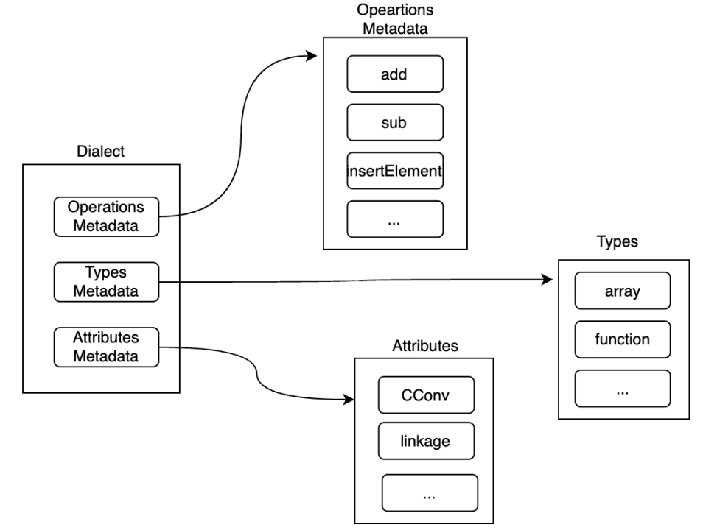
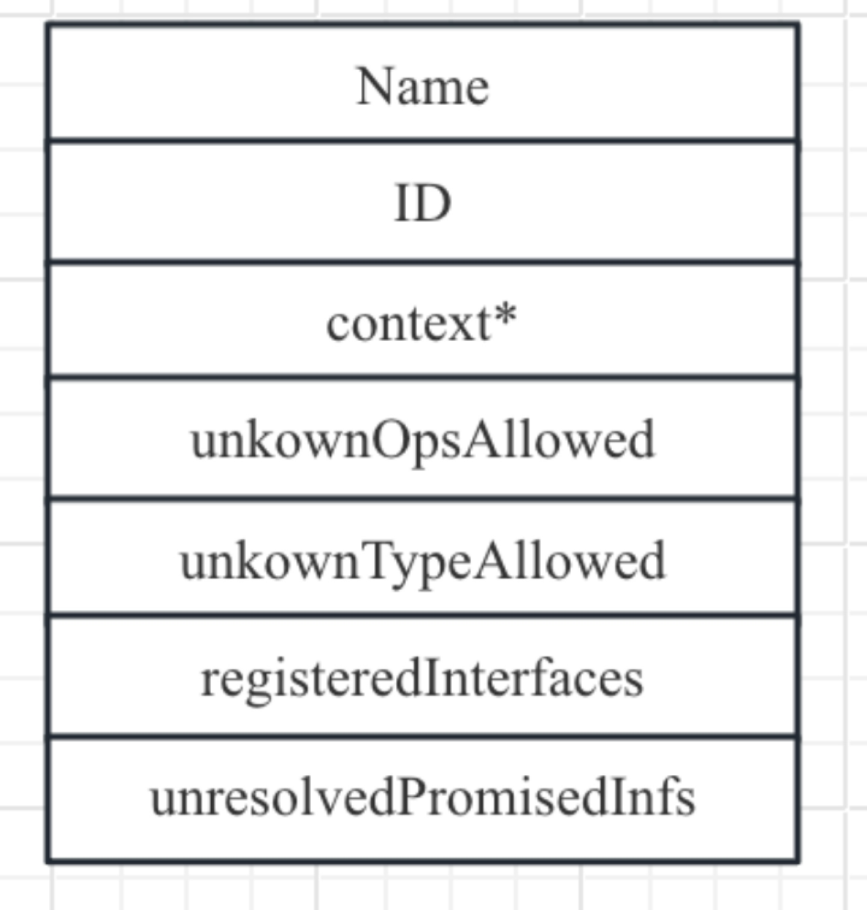
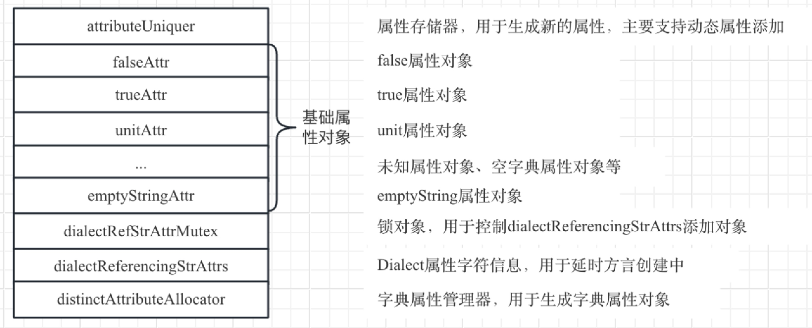

# 第3章类型、属性、操作和方言详解

第2章简单介绍了MLIR基础知识，本章详细介绍MLIR方言、操作、类型和属性相关知识。其中操作是MLIR中最基础的概念，变换、转换、分析等都是针对操作进行；类型用于修饰操作，属性可以修饰操作和方言，为操作和方言提供额外的信息；方言用于管理类型、属性和操作元数据（方言管理的类型和属性都是对象，原因是类型和属性都是全局唯一；但是操作可以多次示例化多个操作对象，所以方言并不直接管理操作对象，而是管理操作的元数据）。最后MLIR框架提供了MLIRContext管理各种方言，开发者通过MLIRContext可以访问方言、从而访问类型和属性以及操作元数据（并可以通过操作元数据示例化操作对象）。下面逐一介绍类型、属性、操作和方言。

## 3.1类型

在MLIR中类型作用于操作，例如操作的结果、操作中的操作数、基本块参数等都是有类型的。可以分为两类：内建类型（Built-in type）和自定义类型。内建类型是MLIR提供的常见类型，例如BFloat16、Integer、Complex、Vector、RankedTensor、UnRankedTensor、MemRef等，开发者可以直接使用内建类型。当内建类型无法满足开发者需要时，开发者可以自定义类型，对于自定义类型MLIR并未提供显式的约束，所以开发者可以任意定义需要的类型。对于内建类型，MLIR框架会负责类型的降级（例如从MLIR世界进入到LLVM世界时，MLIR会统一将内建类型转换为LLVM IR能够接受的类型）；对于自定义类型，开发者需要在方言降级时进行类型的降级，否则可能会出错。
我们知道在一个系统中类型通常都是唯一的（类型可以看作是操作对象的约束，多个操作共享同一种类型约束，所以一个类型只需要示例化对象即可；当操作的约束不同时，应该使用不同的类型描述），类型对象通常存在方言中。本质上类型都是C++的类，当使用类型时就是示例化一个C++类的对象。
无论是内建类型还是自定义类型，目前MLIR都是通过TD文件进行定义，然后通过mlir-tblgen将TD文件转变记录，然后再解释为C++类，同时mlir-tblgen提供了一些胶水代码，将类型注册到方言中。这样开发者就可以使用方言中的类型。
### 3.1.1类型定义和使用
下面以内建类型Integer为例介绍如何定义和使用类型。

#### TD定义
首先在TD中定义类型，Integer在TD中的定义为：

```def Builtin_Integer : Builtin_Type<"Integer"> {
  let summary = "Integer type with arbitrary precision up to a fixed limit";
  let description = [{
    ......
  }];
  let parameters = (ins "unsigned":$width, 
"SignednessSemantics":$signedness);
  let builders = [
    TypeBuilder<(ins "unsigned":$width,
                     CArg<"SignednessSemantics", 
"Signless">:$signedness)>
  ];

  // IntegerType uses a special storage class that compacts parameters 
  // to save memory.
  let genStorageClass = 0;
  let skipDefaultBuilders = 1;
  let genVerifyDecl = 1;
  let extraClassDeclaration = [{
    /// Signedness semantics.
    enum SignednessSemantics : uint32_t {
      Signless, /// No signedness semantics
      Signed,   /// Signed integer
      Unsigned, /// Unsigned integer
    };

    ......
  }];
}
```
为了节约篇幅，笔者将Builtin_Integer中两个字段description和extraClassDeclaration进行了删减（下同），其中description字段描述的是Integer类型的描述信息，用于生成文档；extracClassDeclaration描述的是Integer类型需要开发者额外在C++文件用到的类型定义和需要实现的函数声明。
下面对Integer的实现做一个简单的介绍，主要字段的含义如下：

* Summary/Description：Integer类的描述信息，主要用于文档生成；
* Parameter：Integer类的参数，MLIR中Integer类可以接受两个参数，分别是Integer的位宽和符号标志；
* Builders：负责构建Integer对象的构造器；
* genStorageClass：表示是否为Integer类自动生成StorageClass，StorageClass用于表示Integer的内存布局，该值为0表示不会自动生成Storageclass；
* skipDefaultBuilders：是否为Integer类生成默认的构造函数，该值为1表示不生成；
* genVerifyDecl：是否为Integer类生成默认的Verify函数声明，该值为1表示生成函数声明；
* extraClassDeclaration：是否需要为Integer类增加额外的C++成员函数和成员变量。

另外Integer类继承于Builtin_Type，而Builtin_Type也是一个记录类，它的定义如下：

```class Builtin_Type<string name, list<Trait> traits = [],
                   string baseCppClass = "::mlir::Type">
    : TypeDef<Builtin_Dialect, name, traits, baseCppClass> {
  let mnemonic = ?;
}
```
可以看到Builtin_Type是TypeDef的封装类，主要是指定了Integer在生成的对应C++基类为::mlir::Type。在自定义类型时通常直接继承于TypeDef，也可以类似于Integer类型的厨房方法封装一个记录基类（MLIR有多个内建类型，对于内建类型都会要求生成的对应C++基类为::mlir::Type，所以封装一个记录基类可以节约代码量）。

#### 从TD到记录

接下来mlir-gblgen工具将解析TD文件，将记录类翻译为record信息，例如Integer类对应的record如下：

```def Builtin_Integer {// Constraint TypeConstraint Type DialectType AttrOrTypeDef TypeDef Builtin_Type
  Pred predicate = anonymous_5;
  string summary = "Integer type with arbitrary precision up to a fixed limit";
  string cppClassName = "IntegerType";
  code description = [{
    // ......
  }];
  string builderCall = "";
  Dialect dialect = Builtin_Dialect;
  string cppBaseClassName = "::mlir::Type";
  string storageClass = "IntegerTypeStorage";
  string storageNamespace = "detail";
  bit genStorageClass = 0;
  bit hasStorageCustomConstructor = 0;
  dag parameters = (ins "unsigned":$width, "SignednessSemantics":$signedness);
  list<AttrOrTypeBuilder> builders = [anonymous_344];
  list<Trait> traits = [];
  string mnemonic = ?;
  string assemblyFormat = ?;
  bit hasCustomAssemblyFormat = 0;
  bit genAccessors = 1;
  bit skipDefaultBuilders = 1;
  bit genVerifyDecl = 1;
  code extraClassDeclaration = [{
    /// ......
  }];
  code extraClassDefinition = [{}];
  string cppType = "::mlir::IntegerType";
}

def anonymous_343 {// CArg
  string type = "SignednessSemantics";
  string defaultValue = "Signless";
}
def anonymous_344 {// AttrOrTypeBuilder TypeBuilder
  dag dagParams = (ins "unsigned":$width, anonymous_343:$signedness);
  string body = "";
  string returnType = "";
  bit hasInferredContextParam = 0;
}
```

这一步骤和llvm-tblgen没有什么区别，参考《深入理解LLVM：代码生成》第6章。

#### 从记录到C++代码
再接下来mlir-tblgen工具将从record提取信息，生成C++类。上面提到Integer类型需要自定义IntegerTypeStorage，它定义了Integer类型真正的存储结构，代码如下所示：

```/// Integer Type Storage and Uniquing.
struct IntegerTypeStorage : public TypeStorage {
  IntegerTypeStorage(unsigned width,
                     IntegerType::SignednessSemantics signedness)
      : width(width), signedness(signedness) {}

  /// The hash key used for uniquing.
  using KeyTy = std::tuple<unsigned, IntegerType::SignednessSemantics>;

  // ......

  static IntegerTypeStorage *construct(TypeStorageAllocator &allocator,
                                       KeyTy key) {
    return new (allocator.allocate<IntegerTypeStorage>())
        IntegerTypeStorage(std::get<0>(key), std::get<1>(key));
  }

  KeyTy getAsKey() const { return KeyTy(width, signedness); }

  unsigned width : 30;
  IntegerType::SignednessSemantics signedness : 2;
};
```
IntegerTypeStorage最主要的目的就是存储Integer类型的成员变量，这样做是为了保持Integer类型干净，全部成员变量都移入到IntegerTypeStorage中。而IntegerType最终会继承于IntegerTypeStorage，从而可以访问成员变量。
对于Integer类型，mlir-tblgen工具生成的C++类如下：

```class IntegerType : public ::mlir::Type::TypeBase<IntegerType, ::mlir::Type, detail::IntegerTypeStorage> {
public:
  using Base::Base;
  // 来自于extraClassDeclaration成员函数和成员变量
  // ......
  // 自动生成代码，用于获取Integer类型以及对Integer类型进行验证，可以看到以下三个函数中最后两个参数都是来自于Parameter的输入字段，因此验证工作针对Parameter进行验证，如果合法返回正常的Interger类型对象，如果非法一般返回特殊的Integer类型对象（MLIR是一个空对象）
  using Base::getChecked;
  static IntegerType get(::mlir::MLIRContext *context, unsigned width, SignednessSemantics signedness = Signless);
  // 自动生成代码，用于对Integer类型进行验证，可以看到以下两个函数中最后两个参数都是来自于Parameter的输入字段，因此验证工作针对Parameter进行验证，如果合法返回正常的Interger类型对象，如果非法一般返回特殊的Integer类型对象（MLIR是一个空对象）
  static IntegerType getChecked(::llvm::function_ref<::mlir::InFlightDiagnostic()> emitError, ::mlir::MLIRContext *context, unsigned width, SignednessSemantics signedness = Signless);
  static ::mlir::LogicalResult verify(::llvm::function_ref<::mlir::InFlightDiagnostic()> emitError, unsigned width, SignednessSemantics signedness);
  // 自动生成代码，来自于Parameter的输入字段 
  unsigned getWidth() const;
  SignednessSemantics getSignedness() const;
};
代码显示IntegerType继承于TypeBase，TypeBase的定义如下：

class Type {
public:
  /// Utility class for implementing types.
  template <typename ConcreteType, typename BaseType, typename StorageType,
            template <typename T> class... Traits>
  using TypeBase = detail::StorageUserBase<ConcreteType, BaseType, StorageType,
                                           detail::TypeUniquer, Traits...>;

  using ImplType = TypeStorage;

  using AbstractTy = AbstractType;

  constexpr Type() = default;
  /* implicit */ Type(const ImplType *impl)
      : impl(const_cast<ImplType *>(impl)) {}

  // ......

protected:
  ImplType *impl{nullptr};
};
其中StorageUserBase也是模板类，定义如下：

template <typename ConcreteT, typename BaseT, typename StorageT,
          typename UniquerT, template <typename T> class... Traits>
class StorageUserBase : public BaseT, public Traits<ConcreteT>... {

  // ......
};
```
通过上述代码可以看出IntegerType最后会继承于IntegerTypeStorage，从而自动生成的代码可以方便访问成员变量。

#### 注册类型到方言中
当类型定义完成后，需要将类型注册到方言中，假设定义一个自定义方言为MyDialect，并定义一个初始化方法initialize，通常会在initialize调用addTypes将类型注册到方言中（方言的initialize方法在方言初始化时被调用）。代码如下所示：

```void MyDialect::initialize() {
/// Add the defined types to the dialect.
addTypes<
#define GET_TYPEDEF_LIST
#include "MyDialect/Types.cpp.inc"
>();
}
```
addTypes有一个模版参数，可以接受多个类型，并将所有的类型都注册到方言中，方言最终通过一个map对象存储类型对象（具体的存储样式在3.4节会再次介绍）。
对于内建类型来说，所有的内建类型可以被所有操作共享，因此内建类型对象会被放在MLIRContext中（MLIRContext是全局唯一对象）。
#### 使用类型
当定义好类型以后，并且通过胶水代码将类型注册到方言中就可以使用类型。两种常见的使用方式：一是在TD定义操作中使用类型、二是在C++代码中使用类型。在C++代码中使用类型比较简单，因为类型已经被转换为C++类，而且已经注册到方言中，所以可以通过方言获取要使用的类型对象。在TD中使用类型，涉及到另外一个问题就是类型的解析，即将一个字符串解析为一个类型，然后将类型和具体的要约束的变量进行关联（要约束的变量指的是操作的返回值、操作的操作数、基本块参数等）。
所以在TD中使用类型一个关键的步骤就是将字符串解析为类型，而解析过程就涉及到类型的文法。

### 3.1.2类型文法
一般来说，只有符合一定规范的字符串才可以被解析成类型。这样的规范通常通过EBNF（Extended Backus–Naur Form）进行定义，MLIR中类型的定义如下：

```type ::= type-alias | dialect-type | builtin-type

type-list-no-parens ::=  type (`,` type)*
type-list-parens ::= `(` `)` | `(` type-list-no-parens `)`

// This is a common way to refer to a value with a specified type.
ssa-use-and-type ::= ssa-use `:` type
ssa-use ::= value-use

// Non-empty list of names and types.
ssa-use-and-type-list ::= ssa-use-and-type (`,` ssa-use-and-type)*

function-type ::= (type | type-list-parens) `->` (type | type-list-parens)
type-alias-def ::= `!` alias-name `=` type
type-alias ::= `!` alias-name

dialect-namespace ::= bare-id

dialect-type ::= `!` (opaque-dialect-type | pretty-dialect-type)
opaque-dialect-type ::= dialect-namespace dialect-type-body
pretty-dialect-type ::= dialect-namespace `.` pretty-dialect-type-lead-ident
                                              dialect-type-body?
pretty-dialect-type-lead-ident ::= `[A-Za-z][A-Za-z0-9._]*`

dialect-type-body ::= `<` dialect-type-contents+ `>`
dialect-type-contents ::= dialect-type-body
                            | `(` dialect-type-contents+ `)`
                            | `[` dialect-type-contents+ `]`
                            | `{` dialect-type-contents+ `}`
                            | [^\[<({\]>)}\0]+
```
因此在mlir-tblgen读入类型的过程中需要实现上述EBNF，从而可以解析对应的类型。

## 3.2属性
属性是为操作和类型增加额外的表达语义，其定义和使用方法非常类似于类型。同样地可以根据属性提供者，可以将MLIR中属性分为内建属性和自定义属性。对于内建属性，例如FloatAttr、IntegerAttr、AffineMapAttr等，MLIR框架负责属性的定义、解析等，开发者可以直接使用内建属性。当内建属性无法满足开发者需要时，开发者可以自定义属性，对于自定义属性MLIR并未提供显式的约束，所以开发者可以任意定义需要的属性。
MLIR中属性分为两种Attribute和Property，为了区别本书将Attribute翻译为属性，Property翻译为特性。特性是一种特殊的属性。

### 3.2.1属性（Attribute）
属性和类型非常类似，我们通过内建属性IntegerAttr快速介绍属性的定义和使用。IntegerAttr在TD中的定义如下：

```def Builtin_IntegerAttr : Builtin_Attr<"Integer"> {
  let summary = "An Attribute containing a integer value";
  let description = [{
    ......
  }];
  let parameters = (ins AttributeSelfTypeParameter<"">:$type, "APInt":$value);
  let builders = [
    .....
  ];
  let extraClassDeclaration = [{
    ......
  }];
  let genVerifyDecl = 1;
  let skipDefaultBuilders = 1;
}
```
可以看到IntegerAttr的定义和Integer类型几乎一致，字段含义也和Integer类型中字段一致。类似地，mlir-tblgen工具也会先将TD文件转换记录，然后再将记录转换到C++代码，IntegerAttr对应的C++代码如下：

```struct IntegerAttrStorage : public ::mlir::AttributeStorage {
  using KeyTy = std::tuple<::mlir::Type, APInt>;
  IntegerAttrStorage(::mlir::Type type, APInt value) : type(std::move(type)), value(std::move(value)) {}

  ......
 
  ::mlir::Type type;
  APInt value;
};

class IntegerAttr : public ::mlir::Attribute::AttrBase<IntegerAttr, ::mlir::Attribute, detail::IntegerAttrStorage, ::mlir::TypedAttr::Trait> {
public:
  using Base::Base;
  using ValueType = APInt;

    // 来自于字段extraClassDeclaration
......

public:
  // 辅助函数，用于生成IntegerAttr对象以及
  using Base::getChecked;
  static IntegerAttr get(Type type, const APInt &value);
  static IntegerAttr getChecked(::llvm::function_ref<::mlir::InFlightDiagnostic()> emitError, Type type, const APInt &value);
  static IntegerAttr get(::mlir::MLIRContext *context, const APSInt &value);
  static IntegerAttr getChecked(::llvm::function_ref<::mlir::InFlightDiagnostic()> emitError, ::mlir::MLIRContext *context, const APSInt &value);
  static IntegerAttr get(Type type, int64_t value);
  static IntegerAttr getChecked(::llvm::function_ref<::mlir::InFlightDiagnostic()> emitError, Type type, int64_t value);
  static ::mlir::LogicalResult verify(::llvm::function_ref<::mlir::InFlightDiagnostic()> emitError, ::mlir::Type type, APInt value);
 
  // 获取IntegerAttr的成员变量，其真实的存储位于类IntegerAttrStorage中
  ::mlir::Type getType() const;
  APInt getValue() const;
};
```
最后同样地需要将属性注册到方言中。

```void MyDialect::initialize() {
/// Add the defined attributes to the dialect.
addAttributes<
#define GET_ATTRDEF_LIST
#include "MyDialect/Attributes.cpp.inc"
>();
}
```
addAttributes有一个模版参数，可以接受多个属性，并将所有的属性都注册到方言中，方言最终通过一个map对象存储属性对象（具体的存储样式在3.4节会再次介绍）。
同样，MLIR也需要将字符串识别为属性，属性也会使用EBNF进行定义。对应的文法如下所示：

```
attribute-entry ::= (bare-id | string-literal) `=` attribute-value
attribute-value ::= attribute-alias | dialect-attribute | builtin-attribute
attribute-alias-def ::= `#` alias-name `=` attribute-value
attribute-alias ::= `#` alias-name

dialect-namespace ::= bare-id

dialect-attribute ::= `#` (opaque-dialect-attribute | pretty-dialect-attribute)
opaque-dialect-attribute ::= dialect-namespace dialect-attribute-body
pretty-dialect-attribute ::= dialect-namespace `.` pretty-dialect-attribute-lead-ident
                                              dialect-attribute-body?
pretty-dialect-attribute-lead-ident ::= `[A-Za-z][A-Za-z0-9._]*`

dialect-attribute-body ::= `<` dialect-attribute-contents+ `>`
dialect-attribute-contents ::= dialect-attribute-body
                            | `(` dialect-attribute-contents+ `)`
                            | `[` dialect-attribute-contents+ `]`
                            | `{` dialect-attribute-contents+ `}`
                            | [^\[<({\]>)}\0]+
     ```                       
```

在mlir-tblgen读入属性的过程中需要实现上述EBNF，从而可以解析对应的属性。
### 3.2.2特性（Property）
特性是一种特殊的属性，在MLIR属性分为两类：固有属性（Inherent attributes）和可丢弃属性（Discardable attributes）。
固有属性是指操作定义中为了保证语义完整所携带的属性，对于固有属性操作本身应该验证属性的一致性。例如MLIR中arith方言中cmpi操作，其定义如下：
operation ::= `arith.cmpi` $predicate `,` $lhs `,` $rhs attr-dict `:` type($lhs)
对于操作中predicate是一个属性，它的取值范围只有几个（例如eq、ne、slt、sle、sgt、sge、ult、ule、ugt、uge），表示要进行什么样的比较，这个属性值是比较操作必须的，因此称为固有属性。
可丢弃属性是指为操作添加额外语义，但不是必须内容，可丢弃属性只需要和操作语义兼容即可。我们所说的属性大部分属于这类属性。
MLIR社区在演化过程中将固有属性剥离出来，称为特性。其主要目的是固有属性应该归属于操作，而不应该将固有属性放在方言中（因为方言可以认为是相对全局唯一），所以应该将固有属性将抽离出来。

## 3.3操作

### 3.3.1操作定义
下面以一个简单的操作AddI为例介绍操作的定义、构建和使用。
TD定义
首先在TD中定义操作，AddI在TD中的定义为：

```class Arith_Op<string mnemonic, list<Trait> traits = []> :
    Op<Arith_Dialect, mnemonic,
       traits #
       [DeclareOpInterfaceMethods<VectorUnrollOpInterface>, NoMemoryEffect] #
       ElementwiseMappable.traits>;

class Arith_ArithOp<string mnemonic, list<Trait> traits = []> :
    Arith_Op<mnemonic, traits # [SameOperandsAndResultType]>;

// Base class for binary arithmetic operations.
class Arith_BinaryOp<string mnemonic, list<Trait> traits = []> :
    Arith_ArithOp<mnemonic, traits> {
  let assemblyFormat = "$lhs `,` $rhs attr-dict `:` type($result)";
}

// Base class for integer binary operations.
class Arith_IntBinaryOp<string mnemonic, list<Trait> traits = []> :
    Arith_BinaryOp<mnemonic, traits #
      [DeclareOpInterfaceMethods<InferIntRangeInterface>]>,
    Arguments<(ins SignlessIntegerLike:$lhs, SignlessIntegerLike:$rhs)>,
    Results<(outs SignlessIntegerLike:$result)>;

// Base class for integer binary operations without undefined behavior.
class Arith_TotalIntBinaryOp<string mnemonic, list<Trait> traits = []> :
    Arith_IntBinaryOp<mnemonic, traits # [Pure]>;

def Arith_AddIOp : Arith_TotalIntBinaryOp<"addi", [Commutative]> {
  let summary = "integer addition operation";
  let description = [{
    // ......
  }];
  let hasFolder = 1;
  let hasCanonicalizer = 1;
}
```
该示例代码非常简单，只有7个字段，功能分别如下：

* arguments：继承于Arguments，描述操作接受的参数，本例中AddI操作接受2个参数，都是“类似”无符号类型的整数（例如整数、Index、向量类型且向量元素为整数、Tensor类型且Tensor元素类型为整数等），名字分别为lhs和rhs。
* results：继承于Results，描述操作的结果，本例中AddI操作返回结果是“类似”无符号类型的整数，名字为result。
* summary：操作的简单描述。
* description：操作的详细描述，在本例中提供了使用AddI操作的示例，因篇幅原因，本书将其删除。
* hasFolder：表示mlir-tblgen工具会生成一个函数名为fold的函数声明，开发者需要进行实现。fold指的是操作可以进行常量折叠的实现。
* hasCanonicalizer：表示mlir-tblgen工具会生成一个函数名为getCanonicalizationPatterns的函数声明，开发者需要进行实现。getCanonicalizationPatterns指的是操作可以进行归一化的实现（归一化的目的是为了更好地优化，例如对于加法来说，有两个操作数，一个为变量另一个外常量，总是要求变量在前，常量在后，这样的行为就是归一化）。
* assemblyFormat：表示操作的汇编格式。

实际上操作还还有一些其他字段可以定义，例如hasVerifier表示是否需要开发者提供验证器（在第4章介绍）、extraClassDeclaration声明C++需要实现的函数等。默认情况下，不提供的字段mlir-tblgen会提供一个默认值，一般不会生成相应代码。
#### 从TD到记录
接下来mlir-gblgen工具将解析TD文件，将记录类翻译为record信息，例如AddI类对应的record如下：

```def Arith_AddIOp {// Op Arith_Op Arith_ArithOp Arith_BinaryOp Arguments Results Arith_IntBinaryOp Arith_TotalIntBinaryOp
  Dialect opDialect = Arith_Dialect;
  string opName = "addi";
  string cppNamespace = "::mlir::arith";
  string summary = "integer addition operation";
  code description = [{
    // ......
  }];
  OpDocGroup opDocGroup = ?;
  dag arguments = (ins SignlessIntegerLike:$lhs, SignlessIntegerLike:$rhs);
  dag results = (outs SignlessIntegerLike:$result);
  dag regions = (region);
  dag successors = (successor);
  list<OpBuilder> builders = ?;
  bit skipDefaultBuilders = 0;
  string assemblyFormat = "$lhs `,` $rhs attr-dict `:` type($result)";
  bit hasCustomAssemblyFormat = 0;
  bit hasVerifier = 0;
  bit hasRegionVerifier = 0;
  bit hasCanonicalizer = 1;
  bit hasCanonicalizeMethod = 0;
  bit hasFolder = 1;
  bit useCustomPropertiesEncoding = 0;
  list<Trait> traits = [Commutative, Pure, anonymous_443, SameOperandsAndResultType, anonymous_442, NoMemoryEffect, Elementwise, Scalarizable, Vectorizable, Tensorizable];
  string extraClassDeclaration = ?;
  string extraClassDefinition = ?;
}

def anonymous_442 {// DeclareInterfaceMethods Interface Trait NativeTrait InterfaceTrait OpInterfaceTrait OpInterface DeclareOpInterfaceMethods
  // ......
  string cppInterfaceName = "VectorUnrollOpInterface";
  // ......
}
def anonymous_443 {// DeclareInterfaceMethods Interface Trait NativeTrait InterfaceTrait OpInterfaceTrait OpInterface DeclareOpInterfaceMethods
  // ......
  string cppInterfaceName = "InferIntRangeInterface";
  // ......
}

```
#### 从记录到C++代码

再接下来mlir-tblgen工具将从record提取信息，生成C++类。对于上述record，mlir-tblgen工具生成的C++类如下：

```namespace detail {
class AndIOpGenericAdaptorBase {
  ......
};

} // namespace detail
template <typename RangeT>
class AndIOpGenericAdaptor : public detail::AndIOpGenericAdaptorBase {
  ......
};

class AndIOpAdaptor : public AndIOpGenericAdaptor<::mlir::ValueRange> {
public:
  using AndIOpGenericAdaptor::AndIOpGenericAdaptor;
  AndIOpAdaptor(AndIOp op);

  ::mlir::LogicalResult verify(::mlir::Location loc);
};

class AndIOp : public ::mlir::Op<AndIOp, ::mlir::OpTrait::ZeroRegions, ::mlir::OpTrait::OneResult, ::mlir::OpTrait::OneTypedResult<::mlir::Type>::Impl, ::mlir::OpTrait::ZeroSuccessors, ::mlir::OpTrait::NOperands<2>::Impl, ::mlir::OpTrait::OpInvariants, ::mlir::OpTrait::IsCommutative, ::mlir::OpTrait::IsIdempotent, ::mlir::ConditionallySpeculatable::Trait, ::mlir::OpTrait::AlwaysSpeculatableImplTrait, ::mlir::MemoryEffectOpInterface::Trait, ::mlir::InferIntRangeInterface::Trait, ::mlir::OpTrait::SameOperandsAndResultType, ::mlir::VectorUnrollOpInterface::Trait, ::mlir::OpTrait::Elementwise, ::mlir::OpTrait::Scalarizable, ::mlir::OpTrait::Vectorizable, ::mlir::OpTrait::Tensorizable, ::mlir::InferTypeOpInterface::Trait> {
public:
  using Op::Op;
  using Op::print;
  // Adaptor提供给外部使用，在方言降级中会使用到该类型
  using Adaptor = AndIOpAdaptor;
  // GenericAdaptor和FoldAdaptor用于fold函数的参数，为什么引入Adaptor类型？这里先留一个问题，在方言降级中详细介绍
  template <typename RangeT>
  using GenericAdaptor = AndIOpGenericAdaptor<RangeT>;
  using FoldAdaptor = GenericAdaptor<::llvm::ArrayRef<::mlir::Attribute>>;
  // 获取属性名、操作名、操作数、结果
  static ::llvm::ArrayRef<::llvm::StringRef> getAttributeNames() {
    return {};
  }

  static constexpr ::llvm::StringLiteral getOperationName() {
    return ::llvm::StringLiteral("arith.andi");
  }

  std::pair<unsigned, unsigned> getODSOperandIndexAndLength(unsigned index);
  ::mlir::Operation::operand_range getODSOperands(unsigned index);
  ::mlir::Value getLhs();
  ::mlir::Value getRhs();
  ::mlir::OpOperand &getLhsMutable();
  ::mlir::OpOperand &getRhsMutable();
  std::pair<unsigned, unsigned> getODSResultIndexAndLength(unsigned index);
  ::mlir::Operation::result_range getODSResults(unsigned index);
  ::mlir::Value getResult();
  // 用于构建AddI操作对象
  static void build(::mlir::OpBuilder &odsBuilder, ::mlir::OperationState &odsState, ::mlir::Type result, ::mlir::Value lhs, ::mlir::Value rhs);
  static void build(::mlir::OpBuilder &odsBuilder, ::mlir::OperationState &odsState, ::mlir::Value lhs, ::mlir::Value rhs);
  static void build(::mlir::OpBuilder &odsBuilder, ::mlir::OperationState &odsState, ::mlir::TypeRange resultTypes, ::mlir::Value lhs, ::mlir::Value rhs);
  static void build(::mlir::OpBuilder &, ::mlir::OperationState &odsState, ::mlir::TypeRange resultTypes, ::mlir::ValueRange operands, ::llvm::ArrayRef<::mlir::NamedAttribute> attributes = {});
  static void build(::mlir::OpBuilder &odsBuilder, ::mlir::OperationState &odsState, ::mlir::ValueRange operands, ::llvm::ArrayRef<::mlir::NamedAttribute> attributes = {});
  // 用于验证AddI对象
  ::mlir::LogicalResult verifyInvariantsImpl();
  ::mlir::LogicalResult verifyInvariants();
  // 用于归一化和常量折叠
  static void getCanonicalizationPatterns(::mlir::RewritePatternSet &results, ::mlir::MLIRContext *context);
  ::mlir::OpFoldResult fold(FoldAdaptor adaptor);
  // 用于结果类型推导
  static ::mlir::LogicalResult inferReturnTypes(::mlir::MLIRContext *context, ::std::optional<::mlir::Location> location, ::mlir::ValueRange operands, ::mlir::DictionaryAttr attributes, ::mlir::OpaqueProperties properties, ::mlir::RegionRange regions, ::llvm::SmallVectorImpl<::mlir::Type>&inferredReturnTypes);
  void inferResultRanges(::llvm::ArrayRef<::mlir::ConstantIntRanges> argRanges, ::mlir::SetIntRangeFn setResultRanges);
  // 用于将字符串解析为AddI对象，其输入格式由assemblyFormat定义
  static ::mlir::ParseResult parse(::mlir::OpAsmParser &parser, ::mlir::OperationState &result);
  // 用于将AddI对象输出为字符串，其输出格式由assemblyFormat定义
  void print(::mlir::OpAsmPrinter &_odsPrinter);
  // 由于AddI操作继承于特质NoMemoryEffects，这个特质需要实现一个函数getEffects，对于NoMemoryEffects其实现为空，在第4章还会讨论特质
  void getEffects(::llvm::SmallVectorImpl<::mlir::SideEffects::EffectInstance<::mlir::MemoryEffects::Effect>> &effects);
public:
};

} // namespace arith

} // namespace mlir
// 这是一个宏，用于声明操作的标识符，通过该标识符可以识别操作
MLIR_DECLARE_EXPLICIT_TYPE_ID(::mlir::arith::AndIOp)
```
在生成的C++实现文件中通常还会有宏MLIR_DEFINE_EXPLICIT_TYPE_ID(::mlir::arith::AndIOp)实现这个操作的标识符。
接下来看几个函数的实现。代码如下：

```// 用于获取操作数，从代码实现中可以看出AddI类应有一个getOperation函数，返回Operation*的类型，它包含了操作数
::mlir::Operation::operand_range AddIOp::getODSOperands(unsigned index) {
  auto valueRange = getODSOperandIndexAndLength(index);
  return {std::next(getOperation()->operand_begin(), valueRange.first),
           std::next(getOperation()->operand_begin(), valueRange.first + valueRange.second)};
}

......

// 用于构建AddI操作对象。从代码上看，构建并没有真正完成，而是把操作数以及返回类型设置到OperationState的对象中
void AddIOp::build(::mlir::OpBuilder &odsBuilder, ::mlir::OperationState &odsState, ::mlir::Type result, ::mlir::Value lhs, ::mlir::Value rhs) {
  odsState.addOperands(lhs);
  odsState.addOperands(rhs);
  odsState.addTypes(result);
}

// 用于构建AddI操作对象。从代码上看，构建并没有真正完成，而是把操作数以及返回类型设置到OperationState的对象中。该例更为特殊，因为返回类型未知，所以调用了inferReturnTypes推断返回类型
void AddIOp::build(::mlir::OpBuilder &odsBuilder, ::mlir::OperationState &odsState, ::mlir::Value lhs, ::mlir::Value rhs) {
  odsState.addOperands(lhs);
  odsState.addOperands(rhs);

        ::llvm::SmallVector<::mlir::Type, 2> inferredReturnTypes;
        if (::mlir::succeeded(AddIOp::inferReturnTypes(odsBuilder.getContext(),
                      odsState.location, odsState.operands,
                      odsState.attributes.getDictionary(odsState.getContext()),
                      odsState.getRawProperties(),
                      odsState.regions, inferredReturnTypes)))
          odsState.addTypes(inferredReturnTypes);
        else
          ::llvm::report_fatal_error("Failed to infer result type(s).");
}

......

// 用于验证AddI操作对象。该函数在构造完AddI对象后被MLIR框架调用
::mlir::LogicalResult AddIOp::verifyInvariantsImpl() {
  {
    unsigned index = 0; (void)index;
    auto valueGroup0 = getODSOperands(0);

    for (auto v : valueGroup0) {
// 函数__mlir_ods_local_type_constraint_ArithOps1也是自动生成的代码，它验证操作数0的类型是满足要求。
// 在AddI的定义时提到要求操作数和返回值都是类似整数类型，这里就会对它的类型进行判断，如果合法则构建对象成功，否则构造对象失败。
      if (::mlir::failed(__mlir_ods_local_type_constraint_ArithOps1(*this, v.getType(), "operand", index++)))
        return ::mlir::failure();
    }
    ......
  }
  ......
}
```


#### 注册操作到方言中
接下来需要将操作注册到方言中，以Arith方言为例，其操作注册代码如下：

```void arith::ArithmeticDialect::initialize() {
addOperations<
#define GET_OP_LIST
#include "mlir/Dialect/Arithmetic/IR/ArithmeticOps.cpp.inc"
>();
......;
}
```
添加操作使用模版函数addOperations，它接受多个操作类作为参数。但是操作注册和类型、属性注册少有不同，注册操作时并不会真正的实例化对象，而仅仅将操作元数据注册到方言中，主要原因是操作可以被多次实例化。在MLIR框架中设计了RegisteredOperationName类，它存储了操作类的标识符、名字等信息，然后RegisteredOperationName实例化的对象会被存储到MLIRContext中，当需要实例化操作对象时，会通过RegisteredOperationName判断操作是否已经注册，对于注册的操作可以实例化操作对象。

### 3.3.2操作内存布局

MLIR框架自动生成的代码看起来比较简单，但是对于读者理解并不友好，一个典型的现象是自动生成需要和MLIR框架配合才能理解其含义，例如build函数用于生成对象，但实际上build仅仅定义了一个OperationState对象，MLIR框架通过OperationState对象完成真正操作对象的构建。这部分代码位于OpBuilder中的create函数，其定义如下：

  ```template <typename OpTy, typename... Args>
  OpTy create(Location location, Args &&...args) {
    OperationState state(location,
                         getCheckRegisteredInfo<OpTy>(location.getContext()));
// 这里的build就是自动生成的build函数，返回state对象
    OpTy::build(*this, state, std::forward<Args>(args)...);
// 通过state对象构造AddI对象
    auto *op = create(state);
    auto result = dyn_cast<OpTy>(op);
    assert(result && "builder didn't return the right type");
    return result;
  }
```
但这里明显还有一个问题，我们可以看AddIop的定义，它根本没有任何字段，它只是继承于mlir::Op类，这个类的定义如下：

```template <typename ConcreteType, template <typename T> class... Traits>
class Op : public OpState, public Traits<ConcreteType>... {
public:

......

}
```
继续观察，可以发现Op类也没有任何字段，它继承于OpState和一些特质，特质主要是约束作用（并没有相应的成员变量），OpState的定义如下：

```class OpState {
......
private:
  Operation *state;

  /// Allow access to internal hook implementation methods.
  friend RegisteredOperationName;
};
它有一个唯一的字段Operation*，而Operation类的定义如下所示：

class alignas(8) Operation final
    : public llvm::ilist_node_with_parent<Operation, Block>,
      private llvm::TrailingObjects<Operation, detail::OperandStorage,
                                    detail::OpProperties, BlockOperand, Region,
                                    OpOperand> {

  ......
 

  Block *block = nullptr;
  Location location;
  mutable unsigned orderIndex = 0;
  const unsigned numResults;
  const unsigned numSuccs;
  const unsigned numRegions : 23;
  bool hasOperandStorage : 1;
  unsigned char propertiesStorageSize : 8;
  OperationName name;
  DictionaryAttr attrs;
  friend struct llvm::ilist_traits<Operation>;

};

```
Operation类型包含了一些信息，比如结果个数、区域个数、是否包含操作数、属性大小等信息，我们可以猜测应该是操作对象的具体信息就应该放在这个类实例化的对象中。但需要注意的是操作对象本身只是包含一个Operation*的指针，操作对象的大小是4字节（假设不考虑继承、虚函数等因素），真实的大小依赖于Operation实例化的对象。读者可能已经注意到Operation这个类是MLIR框架定义的，一般来说，当类定义完成后，它实例化的对象大小也是固定，但是这不满足MLIR对操作对象的要求，因为不同的操作对象操作数、返回结果、属性等各不相同，也就是说Operation类本身静态大小并不能反映操作对象的大小。也就是说Operation实例化的对象大小应该动态变化，这样就能反映操作对象。为此MLIR框架提供的build函数，在build函数中提供OpeartionState对象（该对象可以由mlir-tblgen工具根据build函数原型生成，也可以由开发者提供），这个对象存储操作数、返回结果类型、属性等，再由MLIR框架根据OpeationState对象动态实例化真正的操作对象。
实际上在上面的create函数会体现上面的设计，在create函数中会调用Operation::create函数，在Operation::create函数中会先分配内存，然后依次初始化Operation的字段，代码如下所示：

```Operation *Operation::create(Location location, OperationName name,
TypeRange resultTypes, ValueRange operands,
NamedAttrList &&attributes, BlockRange successors,
unsigned numRegions) {
.....
unsigned numTrailingResults = OpResult::getNumTrailing(resultTypes.size());
unsigned numInlineResults = OpResult::getNumInline(resultTypes.size());
unsigned numSuccessors = successors.size();
unsigned numOperands = operands.size();
unsigned numResults = resultTypes.size();

......
size_t byteSize =
totalSizeToAlloc<detail::OperandStorage, BlockOperand, Region, OpOperand>(
needsOperandStorage ? 1 : 0, numSuccessors, numRegions, numOperands);
size_t prefixByteSize = llvm::alignTo(
Operation::prefixAllocSize(numTrailingResults, numInlineResults),
alignof(Operation));
char *mallocMem = reinterpret_cast<char *>(malloc(byteSize + prefixByteSize));
void *rawMem = mallocMem + prefixByteSize;

// Create the new Operation.
Operation *op = ::new (rawMem) Operation(
location, name, numResults, numSuccessors, numRegions,
attributes.getDictionary(location.getContext()), needsOperandStorage);

......

// Initialize the results.
auto resultTypeIt = resultTypes.begin();
for (unsigned i = 0; i < numInlineResults; ++i, ++resultTypeIt)
new (op->getInlineOpResult(i)) detail::InlineOpResult(*resultTypeIt, i);
for (unsigned i = 0; i < numTrailingResults; ++i, ++resultTypeIt) {
new (op->getOutOfLineOpResult(i))
detail::OutOfLineOpResult(*resultTypeIt, i);
}

// Initialize the regions.
for (unsigned i = 0; i != numRegions; ++i)
new (&op->getRegion(i)) Region(op);

// Initialize the operands.
if (needsOperandStorage) {
new (&op->getOperandStorage()) detail::OperandStorage(
op, op->getTrailingObjects<OpOperand>(), operands);
}

// Initialize the successors.
auto blockOperands = op->getBlockOperands();
for (unsigned i = 0; i != numSuccessors; ++i)
new (&blockOperands[i]) BlockOperand(op, successors[i]);

return op;
}
```


Operation的对象布局如下图所示：


https://mlir.llvm.org/OpenMeetings/2023-02-09-Properties.pdf


### 3.3.3操作文法

```operation             ::= op-result-list? (generic-operation | 
                         custom-operation)   trailing-location?
generic-operation     ::= string-literal `(` value-use-list? `)` 
                          successor-list? dictionary-properties? 
                          region-list? dictionary-attribute?
                          `:` function-type
custom-operation      ::= bare-id custom-operation-format
op-result-list        ::= op-result (`,` op-result)* `=`
op-result             ::= value-id (`:` integer-literal)?
successor-list        ::= `[` successor (`,` successor)* `]`
successor             ::= caret-id (`:` block-arg-list)?
dictionary-properties ::= `<` dictionary-attribute `>`
region-list           ::= `(` region (`,` region)* `)`
dictionary-attribute  ::= `{` (attribute-entry (`,` attribute-entry)*)? `}`
trailing-location     ::= `loc` `(` location `)`
```


#### 基本块
```block           ::= block-label operation+
block-label     ::= block-id block-arg-list? `:`
block-id        ::= caret-id
caret-id        ::= `^` suffix-id
value-id-and-type ::= value-id `:` type
```

```// Non-empty list of names and types.
value-id-and-type-list ::= value-id-and-type (`,` value-id-and-type)*

block-arg-list ::= `(` value-id-and-type-list? `)`


region      ::= `{` entry-block? block* `}`
entry-block ::= operation+
```

## 3.4方言

### 3.4.1方言定义

#### TD定义
下面以Airth方言为例介绍方言的定义、使用。Arith方言定义如下：

```def Arith_Dialect : Dialect {
  let name = "arith";
  let cppNamespace = "::mlir::arith";
  let description = [{
    ......
  }];

  let hasConstantMaterializer = 1;
  let useDefaultAttributePrinterParser = 1;
}
```
在Arith方言中，这几个字段的主要含义如下：

1. name：该字段名字是方言管理的操作、类型和属性的命名空间，例如Arith中的操作op都是形如arith.op这样格式。
2. cppNamespace：该字段是生成C++代码的命名空间。
3. description：Arith方言的描述信息。
4. hasConstantMaterializer：该字段表示mlir-tblgen会生成一个函数名为materializeConstant的声明，开发者需要进行实现。其目的是为了生成常量操作对象。
5. useDefaultAttributePrinterParser：该字段表示mlir-tblgen会生成函数名为parseAttribute、printAttribute的声明，用于解析和输出属性。

#### 从TD到记录
mlir-tblgen工具将TD文件翻译为Arith方言，得到结果如下：

```def Arith_Dialect {// Dialect
  string name = "arith";
  string summary = ?;
  code description = [{
    ......
  }];
  list<string> dependentDialects = [];
  string cppNamespace = "::mlir::arith";
  string extraClassDeclaration = "";
  bit hasConstantMaterializer = 1;
  bit hasNonDefaultDestructor = 0;
  bit hasOperationAttrVerify = 0;
  bit hasRegionArgAttrVerify = 0;
  bit hasRegionResultAttrVerify = 0;
  bit hasOperationInterfaceFallback = 0;
  bit useDefaultAttributePrinterParser = 1;
  bit useDefaultTypePrinterParser = 0;
  bit hasCanonicalizer = 0;
  bit isExtensible = 0;
  bit usePropertiesForAttributes = 1;
}
```
这个记录比较清晰，对比TD文件和记录，可发现在TD文件中能够为方言定义许多字段，这些字段都有有些特殊的用途，这里简单介绍几个关键字段
dependentDialects：表示方言依赖的其他方言。在MLIR框架中当对当前方言进行降级或者变换时，可能会使用到其他方言的操作，此时需要指定依赖，否则可能出错。

#### TD到C++代码
mlir-tblgen会将上述记录翻译为C++代码，arith方言对应的头文件如下所示：

```class ArithDialect : public ::mlir::Dialect {
  explicit ArithDialect(::mlir::MLIRContext *context);

  void initialize();
  friend class ::mlir::MLIRContext;
public:
  ~ArithDialect() override;
  static constexpr ::llvm::StringLiteral getDialectNamespace() {
    return ::llvm::StringLiteral("arith");
  }

  /// Parse an attribute registered to this dialect.
  ::mlir::Attribute parseAttribute(::mlir::DialectAsmParser &parser,
                                   ::mlir::Type type) const override;

  /// Print an attribute registered to this dialect.
  void printAttribute(::mlir::Attribute attr,
                      ::mlir::DialectAsmPrinter &os) const override;

  /// Materialize a single constant operation from a given attribute value with
  /// the desired resultant type.
  ::mlir::Operation *materializeConstant(::mlir::OpBuilder &builder,
                                         ::mlir::Attribute value,
                                         ::mlir::Type type,
                                         ::mlir::Location loc) override;
};
} // namespace arith
} // namespace mlir
```
MLIR_DECLARE_EXPLICIT_TYPE_ID(::mlir::arith::ArithDialect)
结合上面的介绍，这段C++代码就非常简单，唯一需要解释的initialize函数，根据3.1、3.2、3.3介绍可以看出，它用于将类型、属性、操作注册到方言。initialize函数会被airth方言的构造函数调用，由mlir-tblgen自动生成，代码如下所示：

```MLIR_DEFINE_EXPLICIT_TYPE_ID(::mlir::arith::ArithDialect)

ArithDialect::ArithDialect(::mlir::MLIRContext *context)
    : ::mlir::Dialect(getDialectNamespace(), context, ::mlir::TypeID::get<ArithDialect>()) {
 
  initialize();
}
```
那么还剩下的问题就是arith方言何时被初始化？以及初始化对象放在放在哪里？
简单的回答就是MLIR框架提供了DialectRegistry类用于管理注册方言，它包含了一个Map结构，其key为方言的名字，value为方言的构造器。当开发者调用DialectRegistry中的insert函数时会将方言添加到DialectRegistry对象中，当使用方言时通过map查找，如果找到则执行构造器实例化方言对象。
前面提到目前MLIR框架使用一个全局唯一的MLIRContext对象用于管理编译过程，在MLIRContext中包含了一个DialectRegistry对象，用于保存注册的方言。当使用时通过getOrLoadDialect函数获取方言（第一次使用方言时需要实例化，然后缓存方言对象共后续使用）。

#### 方言接口
MLIR还可以为方言定义接口，便于对方言进行统一处理。例如在LLVM方言（有多个方言，LLVM、SVE、GPU等）要到LLVM IR时，通过定义接口，能够对所有的方言进行处理。MLIR框架定义接口LLVMTranslationDialectInterface，在接口中定义了convertOperation用于将方言中算子转换为LLVM IR。同时MLIR还提供了用于自动生成算子转换的代码，只要让操作继承于LLVM_IntrOpBase即可，该类用于生成LLVM IR中的Intrinsic。
再例如MLIR框架定义了DialectInlineInterface接口，该接口文件定义了一些接口，用于判断Call、Op、Region是否可以Inline。这样各个方言就可以实现自己的Inline逻辑，例如Affine、Bufferize、Arithmetic、CF、Func等方言都可以根据自己业务特点决定是否实现Inline优化。同时MLIR框架提供了Inliner Pass用于将所有实现InlineInterface的方言都收集起来，在该Pass中针对方言依次执行Inline功能。

### 3.4.2扩展方言
MLIR的框架设计非常好，提供方言的扩展能力，另外还可以针对Transform_Dialect方言（这里称为动态方言）增加新的操作，用于处理变换。而这些功能都是基于扩展方言实现。
在DialectRegistry中除了包含一个map结构用于保存一般方言外，还有一个extensions字段（vector类型）用于存储扩展方言，扩展方言的目的是对方言进行扩展，其基类如下所示：

```class DialectExtensionBase {
public:
  virtual ~DialectExtensionBase();

  ArrayRef<StringRef> getRequiredDialects() const { return dialectNames; }

  virtual void apply(MLIRContext *context,
                     MutableArrayRef<Dialect *> dialects) const = 0;

  virtual std::unique_ptr<DialectExtensionBase> clone() const = 0;

protected:
  DialectExtensionBase(ArrayRef<StringRef> dialectNames)
      : dialectNames(dialectNames.begin(), dialectNames.end()) {}

private:
  SmallVector<StringRef> dialectNames;
};

template <typename DerivedT, typename... DialectsT>
class DialectExtension : public DialectExtensionBase {
public:
  virtual void apply(MLIRContext *context, DialectsT *...dialects) const = 0;

  std::unique_ptr<DialectExtensionBase> clone() const final {
    return std::make_unique<DerivedT>(static_cast<const DerivedT &>(*this));
  }

protected:
  DialectExtension()
      : DialectExtensionBase(
            ArrayRef<StringRef>({DialectsT::getDialectNamespace()...})) {}

  void apply(MLIRContext *context,
             MutableArrayRef<Dialect *> dialects) const final {
    unsigned dialectIdx = 0;
    auto derivedDialects = std::tuple<DialectsT *...>{
        static_cast<DialectsT *>(dialects[dialectIdx++])...};
    std::apply([&](DialectsT *...dialect) { apply(context, dialect...); },
               derivedDialects);
  }
};
```
在DialectExtension中有aplly方法，它接受MLIRContext和方言，apply的目的就是针对方言进行扩展。
另外在DialectReistry中还定义了applyExtensions方法，它会调用extensions中的apply方法，从而实现对方言的扩展。换句话说，如果要支持扩展方言，开发者只需要定义自己的扩展类并继承于DialectExtension，同时实现apply方法，MLIR框架就可以完成对方言的扩展。
例如在MLIR中可以为方言添加一个接口，用于表示方言具有相同的特性。例如arith方言需要添加接口，这个接口用于表示将arith方言降级到LLVM IR（关于接口在第4章讨论）。代码如下：

```void mlir::arith::registerConvertArithToLLVMInterface(
    DialectRegistry &registry) {
  registry.addExtension(+[](MLIRContext *ctx, arith::ArithDialect *dialect) {
    dialect->addInterfaces<ArithToLLVMDialectInterface>();
  });
}

```
其中DialectRegistry中的addExtnesions函数用于将函数指针注册到DialectRegistry中的extensions。在addExtensions中定义一个临时的Extension类继承于DialectExtension，并实现apply函数，而apply函数会调用addExtnesions的函数指针。代码如下所示：

```template <typename... DialectsT>
  void  addExtension(std::function<void(MLIRContext *, DialectsT *...)> extensionFn) {
    using ExtensionFnT = std::function<void(MLIRContext *, DialectsT * ...)>;

    struct Extension : public DialectExtension<Extension, DialectsT...> {
      Extension(const Extension &) = default;
      Extension(ExtensionFnT extensionFn)
          : extensionFn(std::move(extensionFn)) {}
      ~Extension() override = default;

      void apply(MLIRContext *context, DialectsT *...dialects) const final {
        extensionFn(context, dialects...);
      }
      ExtensionFnT extensionFn;
    };
    addExtension(std::make_unique<Extension>(std::move(extensionFn)));
  }
```
MLIR框架会在何时的地方调用执行extension的apply函数（例如在getOrLoadDialect函数中加载方言时进行调用），从而实现方言的扩展。
### 3.4.3方言管理操作、类型和属性



Types、Attribute不是存储元数据，直接存储对象

## 3.5编译上下文管理
上面提到MLIR通过全局唯一的MLIRContext管理方言、内建类型、内建属性等。实际上说MLIRContext全局唯一并不准确，由于MLIR可以支持多线程并行编译，MLIRContext仅仅是在单个编译线程唯一。MLIRContext结构如下所示：








对于一般开发者来说，一般使用MLIR的步骤如下：

```// 定义DialectRegistry对象
DialectRegistry registry;
// 注册方言
registry.insert<acc::OpenACCDialect,
                  affine::AffineDialect,
                  amdgpu::AMDGPUDialect,
                  amx::AMXDialect,
                  arith::ArithDialect,
  ......
  >;
// 注册扩展方言
registry.addExtensions<***DialectExtension>();
// 将注册的方言注册到MLIRContext 
MLIRContext context(registry);
// 后续就可以使用MLIRContext中的操作、类型、属性等
```


<!-- more -->
