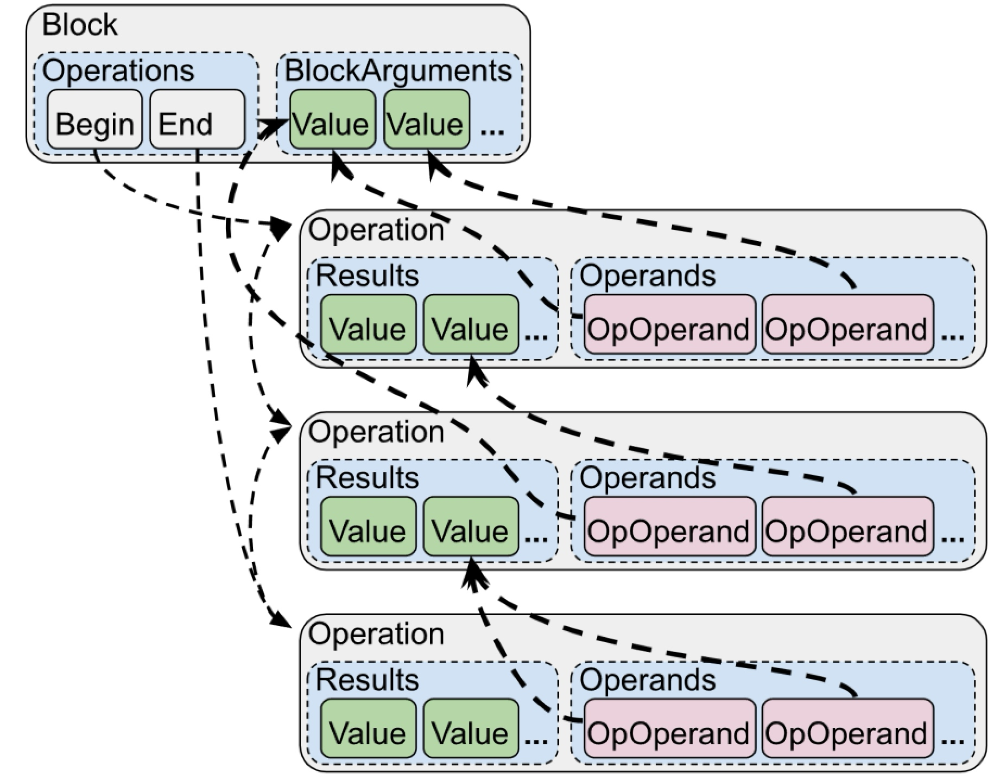

# 第2章 MLIR-设计、实现与架构

[TOC]

MLIR作为一款编译器框架，提供了许多功能，包括：如何定义IR，包括操作、操作与之关联的类型、操作上的属性，并将这些信息通过方言进行管理。还有针对IR中操作的优化，多级IR之间的转化，编译过程的中调试功能等功能。本章主要介绍MLIR涉及到的各种概念，主要包括：
* MLIR的组成和结构，包括操作、类型、属性、方言以及IR结构等内容；
* 约束、特质和接口机制，保证IR的正确性以及提供公共能力；
* 操作匹配和重写机制，方便开发者针对操作实现优化；
* Pass和Pass管理机制，方便开发者实现自己的优化；
* 文档生成、解析IR、打印IR、位置信息、多线程编译、Pass管理等。

## 2.1MLIR的组成与结构

MLIR是一种编译器的中间表示，它非常类似于传统SSA形式的三地址码，同时它又引入了针对循环的多面体优化表述形式。通过MLIR框架可以完成代码表示、分析、优化、和高性能目标代码生成。

### 2.1.1操作

操作（Operation）是MLIR中最基础的单元，它的含义也非常丰富。例如用操作表述高级语义时，一个操作可以是函数定义、函数调用、缓存区分配、缓存区切片，甚至是进程创建等；用操作表述低级语义时，一个操作可以是目标架构无关的算术运算、目标架构相关的指令描述、寄存器信息、电路信息。MLIR相关工作基本上都是围绕操作展开的。
例如编译器开发者针对矩阵乘这样的运算将其抽象为一个操作（记为matmul），matmul本质上就是一条IR。而matmul通常是通过多重循环进行实现（循环的层数依赖于输入的矩阵），可以将循环抽象为一个操作（记为for），那么matmul这个操作可以通过for操作进行实现。通过这个例子可以看出可以把信息处理过程的抽象为操作，MLIR允许开发者定义自己的操作，甚至还可以对上游社区的操作进行扩展，从而大大提供了IR的表达能力。

### 2.1.2类型

操作总是有与之关联的数据类型（Type），例如matmul处理矩阵类型（记为Tensor），可以是二维、三位甚至是多维的。
例如可以通过Tensor<2 x 3 x f32>这样的形式来描述一个具体的类型，它表示2行3列的矩阵，每个矩阵元素类型为float类型。这样就可以使用matmul操作实现描述针对具体数据类型进行的矩阵乘，例如matmul(t1 : Tensor<2 x 3 x f32>, t2: Tensor< 3 x 4 x f32>)就表示输入为两个矩阵，分别是2行3列、3行4列的矩阵，相乘后得到2行4列的矩阵，记为Tensor<2 x 4 x f32>。整理得到这样的代码：
t3 : Tensor<2 x 4 x f32> = matmul(t1 : Tensor<2 x 3 x f32>, t2: Tensor< 3 x 4 x f32>)
MLIR允许开发者定义自己的类型，用于描述操作要处理的信息。当然MLIR社区也定义了许多类型，例如RankedTensor、MemRef、Vector、Integer等，开发者可以直接使用这些类型。
2.1.3属性
开发者在定义操作和类型时，可以为它们添加属性（Attribute），用于指定操作或者类型额外的信息。例如上面的类型Tensor<2 x 3 x f32>表示一个矩阵，但是在一些场景中矩阵中大多数元素为0，那么可以对矩阵进行压缩存储，一种自然的想法是为Tensor<2 x 3 x f32>增加一个属性，用于表示压缩格式（当然针对矩阵压缩有很多压缩方式，在13章稀疏张量还会进一步介绍）。例如Tensor<2 x 3 x f32, encoding>这里的encoding就是各种不同的压缩方式。
同样地对于操作也可以添加属性用于增加操作的表达能力。

### 2.1.4方言

由于开发者可自由定义操作、以及与操作关联的类型、属性，每个操作操作都是一个IR。为了更好管理自定义IR，MLIR提供了方言机制（Dialect），对操作、属性、类型进行管理（方言有点类似容器或者命名空间的概念）。通过方言机制，可以将同一层次抽象出来的操作、类型和属性放在具体的方言中，这样的方言称为一层IR。
例如上面例子中的matmul操作，可以通过定义方言linalg（Liner algorithm，线性算法）方言将matmul等操作进行管理。而matmul操作展开后使用的循环用for操作表示，将for操作定义在affine（仿射）方言中。这样就存在从方言linalg到方言affine的转换（Conversion）。
另外作为一款编译器框架，还应该提供优化处理能力，MLIR是以操作为核心，所以MLIR还提供变换（Transform）机制针对操作进行优化（例如matmul操作在数据很大时，可以尝试进行数据并行处理，此时一种经典的处理就是将矩阵进行分开进行乘法，这样针对matmul操作进行优化的过程称为变换）。
最后还可以看出MLIR基于LLVM IR之上，也就是说最后编译过程要从MLIR世界进入到LLVM IR世界，这一过程称为翻译（Translate）。
简单的说，变换是一个方言到另一个方言的处理（在MLIR中最场景的情况是从一个高级抽象的方言到一个相对低级抽象的方言，因此本书通常也使用降级（Lowering）替代变换，但需要注意的是变换也可以指从低级抽象方言到高级抽象方言的处理，这一个过程通常使用提升（Raising或者Lifting）替代变换），在基于MLIR编译器的开发过程通常需要定义一个或者多个方言，因此变换一般都是必须的；而转换通常针对优化，因此可以是选做；通常也需要从MLIR世界进入到别的世界（通常为LLVM IR，但也可以有其它的场景，例如从MLIR进入到源代码），所以翻译一般也是必须的。在MLIR变换和转换都是基于Pass和Pass管理实现，为了方便编译器的调试和开发，MLIR提供了mlir-opt这样的工具，方便处理变换和转换，MLIR还提供了mlir-translate方便处理翻译过程。
下面是一段MLIR代码片段，展示了方言、操作、类型和属性等信息。

%value_definition="dialect.operation"(%value_use){attribute_name=#attr_kind<"value">}({
//Regionscontainblocks.
^block(%block_argument:!argument_type):
"dialect.further_operation"()[^successor]:()->()
^successor://moreoperationsbelow
}):(!operand_type)->!result_type<"may_be_parameterized">

方言（Dialect）：把操作、类型、属性统一管理的结构。

### 2.1.5IR结构

操作定了抽象的信息处理，但是操作本身还可以携带处理过程，表达处理过程的IR称为payload IR。MLIR的IR结构除了定义的操作外，还定义了区域（Region）和基本块（Block）2种基本单元。这3种基本单元可以进行递归定义从而构成了MLIR的基础。

#### 区域

区域是MLIR中特别引入的单元，主要有SSACFG和Graph两种区域。但为什么MLIR引入区域，而不是直接采用操作+基本块两层结构？主要原因是：
1)提升抽象级别，可以加快编译过程、指令提取或者SIME并行性；
2)区域可以提供明确的边界，便于更合适做编译优化。
但引入区域后也带来了新的问题，例如计算变量的支配关系和传统的SSA有所不同，导致支配计算相对更为复杂。
注意：区域不能有类型和属性。

#### 基本块

基本块是由一组连续执行的操作组成，和传统的基本块定义基本一致，但和传统基本块最大的不同之处在于MLIR中基本块接受参数（Block Argument），而不使用PHI指令（PHI表示不同执行路径的聚合点，同一变量在不同路径被赋值，在聚合点需要引入PHI指令，将不同路径的赋值变量通过PHI指令重新聚合为一个变量，从而满足SSA要求）。
通过这样的设计，可以看出MLIR代码本质上是一个图，其中图中节点表示操作，边是操作或者基本块参数的结果（记为值），每个值都有对应的类型。
https://mlir.llvm.org/docs/Tutorials/UnderstandingTheIRStructure/

### 2.1.6存储格式与使用

MLIR在使用过程中提供了3种IR的描述方式，分别是：
* 文本格式：使用字符串格式定义IR，MLIR框架支持读取和解析字符串，并生成相应的对象；
* 内存格式：在MLIR编译时使用的内存对象；
* 字节码格式：便于传输的压缩格式。

这3种格式可以相互转化。因此本质上可以认为MLIR以字符串形式定义IR，并且MLIR框架允许自定义IR的格式。这里就有一个问题：为什么采用字符串形式？有哪些优势和不足？
采用字符串形式定义IR最大的优势可以支持非常灵活的IR，开发者完全可以自定义IR的格式。但是灵活性也带了另外的问题，如何保证IR的正确性？为了解决正确性问题，在MLIR中提供了约束、特质等功能用于保证IR的正确性。

## 2.2谓词、约束、特质和接口

MLIR使用谓词、约束、特质和接口解决IR正确性保证。而正确性可以分为IR运行之前以及IR运行时两种，其中IR运行之前主要可以分为IR的解析和构建，因此可以IR正确性保证可以分为：

* IR解析：保证IR格式正确，当定义错误的IR格式，在IR解析阶段就能发现错误。
* IR构建：对于格式正确的IR可以构建出对象（例如操作、类型对象）。格式正确的IR但语义可能不符合IR的要求，MLIR框架应该有能力发现这样的错误。
* IR运行时：保证构建的IR对象在运行时仍然具有某些正确性语义，满足运行时的约束。

为了MLIR提供了3类约束，分别是：谓词（CPred）、约束（Constraint）和特质（Trait）。其中谓词和约束含义相同，MLIR社区未来会将谓词和约束进行合并，由于约束概念较为宽泛，本书统一使用谓词表示。总的来说，谓词用于IR运行之前，属于静态约束；而特质用于IR运行时，属于动态约束。
我们将在第4章详细展开。

## 2.3匹配、重写和Pass以及PassManager

MLIR的设计围绕操作，提供其中一个重要的功能是以操作为核心的匹配、重写机制，这也是MLIR中变换的核心：针对操作进行匹配，并对可以匹配的操作提供重写新IR、替换或者删除旧IR的辅助能力。开发者只需要关注如何匹配操作（定义匹配规则），当操作匹配成功后关注如何替换操作、插入新的操作、删除旧操作等业务相关内容。
在MLIR提供的转换框架中还进一步提供如何递归匹配操作，详细内容将在第6章介绍。除此以外，MLIR中还有一个特殊的场景，即方言降级到另一个方言，这和一般针对操作的匹配/重写机制有所不同，一般的匹配/重写关注操作的处理，但一般假定操作相关的类型不发生变化。而方言降级除了关注操作的变化外，还会关注类型的变化，引进方言降级更为复杂。例如上面提到的matmul操作输入类型为Tensor，当降级到for操作时，for操作介绍的类型为MemRef，所以针对matmul降级到for需要同时处理操作和类型。这对匹配/重写工作机制提出了额外的要求，因为matmul降级过程中可以同时完成操作和类型的处理，但是matmul降级后，有其它的操作引用了matmul操作（即matmul是其它操作的操作数），此时就会有问题，引用的操作中操作数的类型发生了变化，在匹配引用操作就会失败，因此MLIR实现了独立的方言降级来解决这一问题，我们在第6章详细介绍。
匹配/重写机制通过Pass进行管理，而Pass又通过PassManager进行管理，PassManager也是MLIR的基础框架，我们将在第5章介绍如何定义Pass和PassManager，以及利用Pass机制实现一些公共优化能力。

## 2.4调试

MLIR提供了丰富的调试功能，这也是MLIR能够成功的愿意之一，典型的调试方法有四种：
1.Pass运行前后IR打印机制：由于MLIR也有Pass，所以也类似于LLVM针对Pass运行前后打印IR，方便开发者观察Pass运行的效果，主要选项有：print-before、print-after等，该功能依赖于Pass的插桩机制。
2.Action机制：提供细粒度的调试、追踪能力。Action机制主要解决IR单次处理的能力，例如开发者需要处理多次IR运行的情况，如果没有Action机制只能通过debug机制获得log后再进行文本分析，而通过Action机制可以方便实现这样的功能，目前在MLIR框架提供了一Debug Counter的功能，可以指定Pass运行在满足一定条件下IR的情况（例如跳过多少次、执行多少次信息）。
3.Reduce机制：为了帮助Pass运行定位问题，MLIR社区提供了mlir-reduce工具，当Pass运行过程中如果发生错误（或者不符合预期）可以通过该高能工具将相关的IR片段抽取出来。mlir-reduce根据需要抽取的操作创建Reduction-Tree寻找最小IR片段，具体算法在扩展阅读中介绍。
4.错误捕捉回复机制：针对Pass运行提供了参数mlir-pass-pipeline-crash-reproducer用于捕捉出错的Pass以及Pass运行的IR，同时还会添加一些额外的信息，这些用于重放待执行的IR。

## 2.5表描述语言及工具

MLIR作为LLVM项目的一部分，也使用TD描述操作、类型、方言等。由于MLIR在使用TD时有自己含义，所以MLIR框架提供了mlir-tblgen工具，将TD文件转转化为C++相关代码，mlir-tblgen工具在转化过程也分为两步：将TD转化为记录（Record）和将记录转化为C++代码，生成的C++可以和MLIR框架配合使用。
这一过程非常类似于llvm-tblgen工具，在《深入理解LLVM：代码生成》中第6章介绍了TD文法、转化过程。虽然mlir-tblgen生成的最终代码和llvm-tblgen生成的代码目的有所不同，但是过程基本一致，本书不再详细介绍这一过程，在后续章节中如果使用TD到，会直接描述对应的C++代码，读者如果不属性这一过程可以参考《深入理解LLVM：代码生成》。

## 2.6其它公共功能

MLIR还提供位置追踪、文档生成、并行编译和Python交互等能力。

### 2.6.1位置追踪

操作的来源（包括其原始位置和应用的转换）应易于在系统中追溯。这是为了解决在复杂编译系统中常见的缺乏透明性问题，而在复杂编译系统中，很难了解最终表示是如何从原始表示中构造出来的完整过程。在编译安全性至关重要的敏感应用程序时，这是一个突出的问题，在这类程序中，跟踪降级和优化步骤是软件认证程序的重要组成部分[43]。当使用安全代码（例如加密协议，或对隐私敏感的数据进行操作的算法）进行操作时，编译器常会碰到看似冗余或繁琐的计算，这些计算会嵌入未被源程序的功能语义完全捕获的安全性或私有属性，而安全代码可以防止旁路暴露或加强代码以防止网络攻击或故障攻击。优化可能会改变或使此类保护完全失效[56]；这种缺乏透明性在安全编译中称为WYSINWYX[6]。准确地将高层次信息传播到较低层的一个间接目标就是帮助实现安全且可追溯的编译过程。
MLIR提供了位置信息的紧凑表示形式，并鼓励在整个系统中处理和传播位置信息。位置信息可用于保留产生Op的源程序堆栈踪迹，用以生成调试信息。位置信息使编译器产生诊断信息的方式变得标准化，并可用于各种测试工具。位置信息也是可扩展的，允许编译器引用现有的位置跟踪系统、高级AST节点、LLVM风格的文件-行-列（file-line-column ）地址、DWARF调试信息或其它高质量编译实现所需的信息。

### 2.6.2文档生成

框架提供了自动文档生成功能，只要方言、操作、接口等定义时在TD中都会有summary、description、parament、result等信息，MLIR框架可以直接抓起这些信息自动生成文档。

### 2.6.3并行编译

MLIR的一个重要需求是可以利用多核计算机来加快编译速度。pass管理器支持并发遍历和修改中间表示，这可以通过操作的“与上方隔离（isolated-from-above）”属性提供的不变量来实现，因为静态单赋值 use-def链无法跨越这些op的区域边界，因此具有这种行为的操作（例如“ std.func”操作）定义了可以并行处理的区域树。
这个需求也是MLIR不具有整个模块use-def链的原因（这与LLVM相反）。全局对象通过符号表条目进行引用，而常量则由具有关联属性的操作实现。

### 2.6.4Python交互

目的是在Python方便进行MLIR开发，在Python可以C++实现的MLIR进行交互。

<!-- more -->
