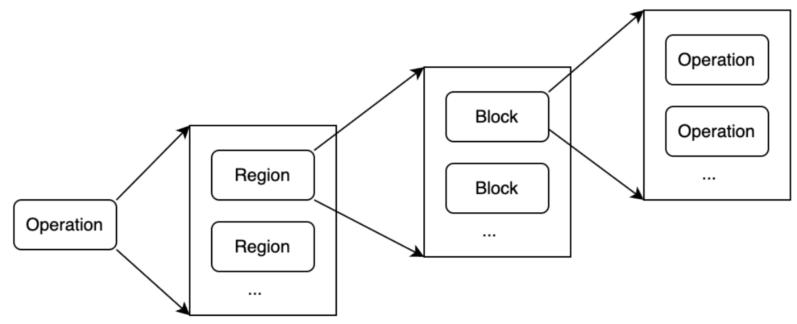

# 第2章 MLIR-设计、实现与架构

[TOC]

MLIR作为一款编译器框架，提供了许多功能，包括：如何定义IR，包括操作、操作与之关联的类型、操作上的属性，并通过方言进行管理这些信息。另外MLIR框架中还包括针对IR中操作的优化，多级IR之间的转化，编译过程的中调试功能等功能。这些功能为MLIR的成功提供了基础。本章主要介绍MLIR涉及到的各种概念，主要包括：
1.MLIR的组成和结构，包括操作、类型、属性、方言以及IR结构等内容。
2.约束、特质和接口机制，保证IR的正确性以及提供公共能力。
3.操作匹配和重写机制，方便开发者针对操作实现优化。
4.Pass和Pass管理机制，方便开发者实现自己的优化。
5.文档生成、解析IR、打印IR、位置信息、多线程编译、Pass管理等。

## 2.1MLIR的组成与结构

MLIR的IR是一种编译器的中间表示，它非常类似于传统SSA形式的三地址码，同时它又引入了针对循环的多面体优化表述形式。通过MLIR框架可以完成代码表示、分析、优化、和高性能目标代码生成。

### 2.1.1操作

操作（Operation）是MLIR中最基础的单元，它的含义也非常丰富。例如用操作表述高级语义时，一个操作可以是函数定义、函数调用、缓存区分配、缓存区切片，甚至是进程创建等；用操作表述低级语义时，一个操作可以是目标架构无关的算术运算、目标架构相关的指令描述、寄存器信息、电路信息。MLIR相关工作基本上都是围绕操作展开的。
例如编译器开发者针对矩阵乘这样的运算将其抽象为一个操作，记为matmul。而matmul通常是通过多重循环进行实现（循环的层数依赖于输入的矩阵），可以将循环抽象为一个操作，记为for。那么matmul这个操作可以通过for操作进行实现，通过这个例子可以看出可以把信息处理过程的抽象为操作。
MLIR允许开发者定义自己的操作，甚至还可以对上游社区的操作进行扩展，从而大大提供了代码的表达能力。

### 2.1.2类型

操作总是有与之关联的数据类型（Type），例如matmul处理矩阵类型（记为Tensor），可以是二维、三位甚至是多维的。
例如可以通过Tensor<2 x 3 x f32>这样的形式来描述一个具体的类型，它表示2行3列的矩阵，每个矩阵元素类型为float类型。这样就可以使用matmul操作实现描述针对具体数据类型进行的矩阵乘，例如matmul(t1 : Tensor<2 x 3 x f32>, t2: Tensor< 3 x 4 x f32>)就表示输入为两个矩阵，分别是2行3列、3行4列的矩阵，相乘后得到2行4列的矩阵，记为Tensor<2 x 4 x f32>。整理得到这样的代码：
t3 : Tensor<2 x 4 x f32> = matmul(t1 : Tensor<2 x 3 x f32>, t2: Tensor< 3 x 4 x f32>)
MLIR允许开发者定义自己的类型，用于描述操作要处理的信息。当然MLIR社区也定义了许多类型，例如RankedTensor、memRef、vector、integer等，开发者可以直接使用这些类型（这些类型称为内建类型，在第后文再次介绍）。

### 2.1.3属性
开发者在定义操作和类型时，可以为它们添加属性（Attribute），用于指定操作或者类型额外的信息。例如上面的类型Tensor<2 x 3 x f32>表示一个矩阵，但是在一些场景中矩阵中大多数元素为0，那么可以对矩阵进行压缩存储，一种自然的想法是为Tensor<2 x 3 x f32>增加一个属性，用于表示压缩格式（当然针对矩阵压缩有很多压缩方式，在第10.2.7节稀疏张量还会进一步介绍）。例如Tensor<2 x 3 x f32, encoding>这里的encoding就是各种不同的压缩方式。
同样地对于操作也可以添加属性用于增加操作的表达能力。

### 2.1.4方言

由于开发者可自由定义操作、以及与操作关联的类型、属性，每个操作操作都是一个IR。为了更好管理自定义IR，MLIR框架提供了方言机制（Dialect），对操作、属性、类型进行管理（方言有点类似容器或者命名空间的概念）。通过方言机制，可以将同一层次抽象出来的操作、类型和属性放在具体的方言中，这样的方言称为一层IR。
例如上面例子中的matmul操作，可以通过定义方言linalg（Liner algorithm，线性算法）方言将matmul等操作进行管理。而matmul操作展开后使用的循环用for操作表示，将for操作定义在affine（仿射）方言中。
由于不同的方言表达的功能是一样，抽象层次不同，因此它们提供的优化能力所有不同。MLIR框架是以操作为核心，MLIR提供变换（Transform）机制针对操作进行优化，例如matmul操作在输入数据很大时，可以尝试进行数据并行处理，此时一种经典的处理就是将矩阵进行分开进行乘法，这样针对matmul操作进行优化的过程称为变换。当基于高层方言的优化完成后，将将高层方言转换到低层方言。例如从方言linalg转换到方言affine，这一过程称为转换（Convert）。
另外MLIR框架利用了LLVM的代码生成的能力，因此可以认为MLIR中的IR基于LLVM IR之上，也就是说最后编译过程要从MLIR世界进入到LLVM IR世界，这一过程称为翻译（Translate），当翻译为LLVM IR后就可以基于LLVM进行优化和代码生成。
简单的说，转换是一个方言到另一个方言的处理（在MLIR中最场景的情况是从一个高级抽象的方言到一个相对低级抽象的方言，因此本书通常也使用降级（Lowering）替代转换，但需要注意的是转换也可以指从低级抽象方言到高级抽象方言的处理，这一个过程通常使用提升（Raising或者Lifting）替代转换），在基于MLIR编译器的开发过程通常需要定义一个或者多个方言，因此转换一般都是必须的；而变换通常针对优化，因此可以是选做；通常也需要从MLIR世界进入到别的世界（通常为LLVM IR，但也可以有其它的场景，例如从MLIR进入到源代码），所以翻译一般也是必须的。在MLIR变换和转换都是基于Pass和Pass管理实现，为了方便编译器的调试和开发，MLIR提供了mlir-opt这样的工具，方便处理变换和转换，MLIR还提供了mlir-translate方便处理翻译过程。
代码2-1是一段MLIR代码片段，展示了如何使用方言、操作、类型和属性等。

```%value_definition = "dialect.operation"(%value_use){ attribute_name = #attr_kind<"value"> }({ 
^block(%block_argument : !argument_type):
"dialect.further_operation"() [ ^successor ]:() -> ()
^successor:
  ...
}) : (!operand_type) -> !result_type<"may_be_parameterized">
```
这段IR的解释如代码2-2所示。

```//value_definition表示一个值，由dialect.operation进行定义
//其中dialect为方言名，operation为操作名
//操作接受参数为value_use，并且操作有一个属性，名字为attribute_name
//属性值为attr_kind<"value">，属性的结构为key-value对形式
//操作的输入类型即value_use的类型是operand_type
//operand_type前面的！表示operand_type为自定义类型
//操作的输出类型为result_type<"may_be_parameterized">
%value_definition = "dialect.operation"(%value_use){ attribute_name = #attr_kind<"value"> }({ //  这里的{定义了区域，下面整个区域是操作的payload
//区域包含了基本块.其中基本块是^开头定义的
//block表示基本块的名字，而block_argument是基本块参数，其类型为argument_type
//在argument_type前面的！表示argument_type是开发者自定义的类型
^block(%block_argument : !argument_type):
//基本块又包括了操作，操作为dialect。further_operation
//操作输入类型为void，输出类型为void
//further_operation执行完后跳转到后继基本块successor
"dialect.further_operation"() [ ^successor ]:() -> ()
//基本块successor的定义，它没有基本块参数
^successor:
//下面可能有更多的操作忽略
  ...
}) : (!operand_type) -> !result_type<"may_be_parameterized">
```

总结来说使用dialect.operation定义值value_definition可以供其它代码引用。而operation本身可以内嵌更多的操作，且内嵌需要按照一定的格式组织。
当然，这只是操作使用简单的示例，实际操作还可能更为复杂，例如操作的返回值可以有多个，在操作上还可以附加调试信息等，将在第3章进一步介绍。

### 2.1.5IR结构

操作定了抽象的信息处理，但是操作本身还可以携带处理过程，表达处理过程的IR称为payload IR。MLIR的IR结构除了定义的操作外，还定义了区域（Region）和基本块（Block）2种基本单元。操作可以包含区域，区域又可以包含基本块，基本块又可以包含操作。这3种基本单元可以进行递归定义从而构成了IR的基础。如图2-1所示。




#### 区域

在MLIR LangRef[ https://mlir.llvm.org/docs/LangRef/，2024年7月访问。]中提到区域是由一些基本块组成，基本块中包含了一些操作。但是并没有进一步明确操作执行的顺序。原因是区域是MLIR中特别引入的单元，目前有SSACFG和Graph两种区域[ MLIR中引入了区域导致了一些问题，目前社区正在讨论引入一种新的区域，但是目前尚未形成最后结论。https://discourse.llvm.org/t/rfc-region-based-control-flow-with-early-exits-in-mlir/76998，2024年7月访问。]。其中：
* SSACFG区域：表示区域内的操作具有执行顺序约束，这个执行顺序和我们熟知的CFG完全相同。它可以由多个基本块组成。
* Graph区域：区域内的操作并没有执行顺序约束，甚至一个使用的变量可以出现在其定义之前。它只能包含一个块[ 特别提示这里是说块而非基本块，原因是块里面的操作执行顺序和传统意义上基本块内执行顺序执行不一致。]。
但为什么MLIR引入区域，而不是直接采用操作+基本块两层结构？主要原因是：
1)提升抽象级别，可以加快编译过程、指令提取或者并行性。
2)区域可以提供明确的边界，便于更合适做编译优化。还可以进行一些原来属于函数间的优化。
但引入区域后也带来了新的问题，例如计算变量的支配关系和传统的SSA有所不同，导致支配计算相对更为复杂（目前MLIR社区对于支配仅仅计算基本块之间的支配，要求基本块所在的区域是SSACFG，基本块在同一个区域内或者它们的父区域是一个）。
区域有一些特殊要求，例如区域定义不能有类型和属性。区域内定义的SSA值不能逃逸到区域外（即区域增加了作用域的概念）。

#### 基本块

基本块是由一组连续执行的操作组成，和传统的基本块定义基本一致（这里不讨论图区域中的块），但和传统基本块最大的不同之处在于MLIR中基本块接受参数（Block Argument，基本块参数），而不使用PHI指令（PHI表示不同执行路径的聚合点，同一变量在不同路径被赋值，在聚合点需要引入PHI指令，将不同路径的赋值变量通过PHI指令重新聚合为一个变量，从而满足SSA要求）。
通过这样的设计，可以看出MLIR代码本质上是一个图，其中图中节点表示操作，边是操作或者基本块参数的结果（记为值），每个值都有对应的类型[ https://mlir.llvm.org/docs/Tutorials/UnderstandingTheIRStructure/， 2024年7月访问。]。

### 2.1.6存储格式与使用

MLIR在使用过程中提供了3种IR的描述方式，分别是：
* 文本格式：使用字符串格式定义IR，MLIR框架支持读取和解析字符串，并生成相应的对象；
* 内存格式：在MLIR编译时使用的内存对象；
* 字节码格式：便于传输的压缩格式。
这3种格式可以相互转化。因此本质上可以认为MLIR以字符串形式定义IR，并且MLIR框架允许自定义IR的格式。
注意：为什么采用字符串形式？有哪些优势和不足？
采用字符串形式定义IR最大的优势可以支持非常灵活的IR，开发者完全可以自定义IR的格式。但是灵活性也带了另外的问题，如何保证IR的正确性？为了解决正确性问题，在MLIR中提供了约束、特质等功能用于保证IR的正确性。

## 2.2谓词、约束、特质和接口

MLIR使用谓词、约束、特质解决IR正确性保证。而正确性保证可以分为IR运行之前以及IR运行时两种，其中IR运行之前主要可以分为IR的解析和构建，因此可以IR正确性保证可以分为：
* IR解析：保证IR格式正确，当定义错误的IR格式，在IR解析阶段就能发现错误。
* IR构建：对于格式正确的IR可以构建出对象（例如操作、类型对象）。格式正确的IR但语义可能不符合IR的要求，MLIR框架应该有能力发现这样的错误。
* IR运行时：保证构建的IR对象在运行时仍然具有某些正确性语义，满足运行时的约束。
为此MLIR提供了3类约束，分别是：谓词（CPred）、约束（Constraint）和特质（Trait）。其中谓词和约束含义相同，MLIR社区未来会将谓词和约束进行合并，由于约束概念较为宽泛，本书统一使用谓词表示。总的来说，谓词用于IR运行之前，属于静态约束；而特质用于IR运行时，属于动态约束。我们将在第4章详细展开。
特质是通过继承实现，即每一个操作对象都直接继承于特质。但在实现场景中还有动态绑定的诉求，因此MLIR框架提供接口功能，用于满足对操作提供动态绑定的能力。

## 2.3匹配、重写和Pass以及PassManager

MLIR的设计围绕操作，提供其中一个重要的功能是以操作为核心的匹配、重写机制，这也是MLIR中转换的核心：针对操作进行匹配，并对可以匹配的操作提供重写新IR、替换或者删除旧IR的辅助能力。开发者只需要关注如何匹配操作（定义匹配规则），当操作匹配成功后关注如何替换操作、插入新的操作、删除旧操作等业务相关内容。
在MLIR提供的转换框架中还进一步提供如何递归匹配操作，详细内容将在第6章介绍。除此以外，MLIR中还有一个特殊的场景，即方言降级到另一个方言，这和一般针对操作的匹配/重写机制有所不同，一般的匹配/重写关注操作的处理，但会假定操作中相关的类型不发生变化。而方言降级除了关注操作的变化外，还会关注类型的变化，因此方言降级更为复杂。例如上面提到的matmul操作输入类型为Tensor，当从linalg方言降级到affine方言的for操作时，for操作接受的类型为memRef，所以针对matmul降级到for需要同时处理操作和类型。这对匹配/重写机制提出了额外的要求，因为matmul降级过程中可以同时完成操作和类型的处理，但是matmul降级后，可能有其它的操作引用了matmul操作（即matmul是其它操作的操作数），此时就会有问题，引用的操作中操作数的类型发生了变化，再匹配引用操作就会失败，因此MLIR实现了独立的方言降级来解决这一问题，在第6章详细介绍。
另外要特别指出的是MLIR不仅仅提供多层IR，它还有一个特点“混合IR”，即多个层级IR可以共存。这在匹配/重写机制和方言降级中需要特别考虑，从而保证正确性，因此MLIR在匹配/重写实现了部分操作转换（允许多种方言共存）和全部操作转换（某一方言的操作应该全部降级）。
匹配/重写机制通过Pass进行管理，而Pass又通过PassManager进行管理，PassManager也是MLIR的基础框架，我们将在第5章介绍如何定义Pass和PassManager，以及利用Pass机制实现一些公共优化能力。

## 2.4调试

MLIR提供了丰富的调试功能，这也是MLIR能够成功的原因之一，典型的调试方法有四种：
1.Pass运行前后IR打印机制：由于MLIR也有Pass，也提供了类似于LLVM针对Pass运行前后打印IR，方便开发者观察Pass运行的效果，主要选项有：print-before、print-after等，该功能依赖于Pass的插桩机制。
2.Action机制：提供细粒度的调试、追踪能力。Action机制主要解决MLIR框架中只支持IR单次处理的问题。例如开发者需要处理多次IR运行的情况，如果没有Action机制只能通过debug机制获得log后再进行文本分析，而通过Action机制可以方便实现这样的功能，目前在MLIR框架提供了Debug Counter的功能，可以指定Pass运行在满足一定条件下IR的情况（例如跳过多少次、执行多少次信息）。
3.Reduce机制：为了帮助Pass运行定位问题，MLIR社区提供了mlir-reduce工具，当Pass运行过程中如果发生错误（或者不符合预期）可以通过该高能工具将相关的IR片段抽取出来。mlir-reduce根据需要抽取的操作创建Reduction-Tree寻找最小IR片段。
错误捕捉回复机制：针对Pass运行提供了参数mlir-pass-pipeline-crash-reproducer用于捕捉出错的Pass以及Pass运行的IR，同时还会添加一些额外的信息，这些用于重放待执行的IR。

## 2.5表描述语言及工具

MLIR作为LLVM项目的一部分，也使用TD描述操作、类型、方言等。由于MLIR在使用TD时有自己含义，所以MLIR框架提供了mlir-tblgen工具，将TD文件转转化为C++相关代码，mlir-tblgen工具在转化过程也分为两步：将TD转化为记录（Record）和将记录转化为C++代码，生成的C++可以和MLIR框架配合使用。
这一过程非常类似于llvm-tblgen工具，在《深入理解LLVM：代码生成》中第6章介绍了TD文法、转化过程。虽然mlir-tblgen生成的最终代码和llvm-tblgen生成的代码目的有所不同，但是过程基本一致，本书不再详细介绍这一过程，在后续章节中如果使用TD到，会直接描述对应的C++代码，读者如果不熟悉这一过程可以参考《深入理解LLVM：代码生成》。

## 2.6其它公共功能

MLIR还提供位置追踪、文档生成、并行编译和Python交互等能力。

### 2.6.1位置追踪

操作的来源（包括其原始位置和变换后的位置）在编译过程中应该非常容易被追溯。这是为了解决在复杂编译系统中缺乏透明性问题，因为在复杂编译系统中，很难了解最终表示是如何从原始表示中构造出来的完整过程。在编译一些安全性至关重要的应用程序时，尤为突出。在这类程序中，跟踪降级和优化步骤是软件认证程序的重要组成部分。当使用安全代码（例如加密协议，或对隐私敏感的数据进行操作的算法）进行操作时，编译器常会碰到看似冗余或繁琐的计算，这些计算会嵌在源程序的功能语义中，可以防止暴露关键信息或加强代码安全以防止网络攻击或故障攻击。而准确地将高层次信息传播到较低层的一个间接目标就是帮助实现安全且可追溯的编译过程。
MLIR提供了位置信息的表示形式，并鼓励在整个编译过程中处理和传播位置信息。位置信息可用于保留产生操作的源程序堆栈踪迹，以便生成调试信息。甚至通过位置信息可以让编译器产生诊断信息的方式变得标准化，并可用于各种测试工具。位置信息也是可扩展的，允许编译器引用它们自定义的位置跟踪系统，或者AST节点信息，也可以是LLVM风格的文件—行—列（File—Line—Column）信息，甚至是DWARF调试信息或其它高质量编译实现所需的信息。

### 2.6.2文档生成

框架提供了自动文档生成功能，只要方言、操作、接口等定义时在TD中都会有概述（summary）、详细描述（description）、参数（parameter）、返回值（result）等信息，MLIR提供的mlir-tblgen可以直接抓取这些信息自动生成文档。这是非常典型的代码即文档的敏捷开发模式。

### 2.6.3并行编译

MLIR的一个重要需求是可以利用多核计算机来加快编译速度。Pass管理器支持并发遍历和修改中间表示，这可以通过操作的“与上方隔离（isolated-from-above）”属性提供的不变量来实现（该属性要求静态单赋值中的Use—Def链无法跨越这些操作的区域使用，即打断了Use—Def链），因此具有这种行为的操作定义了可以并行处理的区域。
这个需求也是MLIR没有全局Use—Def链的原因。在MLIR使用全局对象的方式是通过符号表条目进行引用，使用常量则是通过操作关联的属性实现。
注意：虽然MLIR支持并行编译，但是在内部实现中仍然存在一些数据是多线程共享，因此在并行编译时任何需要锁，这导致了并行编译并没有完成实现线性扩展的能力[ https://llvm.org/devmtg/2024-04/slides/Keynote/Amini-Niu-HowSlowIsMLIR.pdf，2024年7月访问。]。

### 2.6.4Python交互

为了方便Python开发者方便进行MLIR开发，在MLIR项目实现了Python和C++进行交互的模块，该模块依赖pybind11实现。关于Python和C++如何进行交互，以及如何使用pybind11，内容相对独立，本书不再进行介绍，读者可以参考其它文档学习。

<!-- more -->
