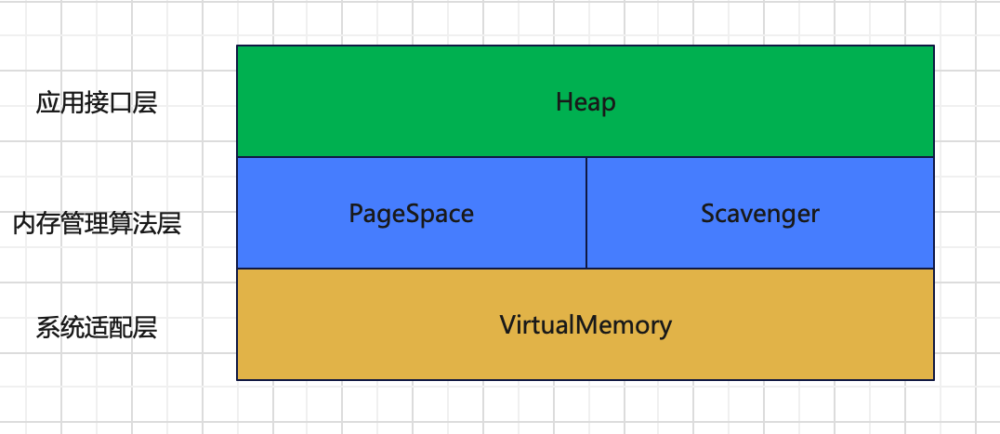
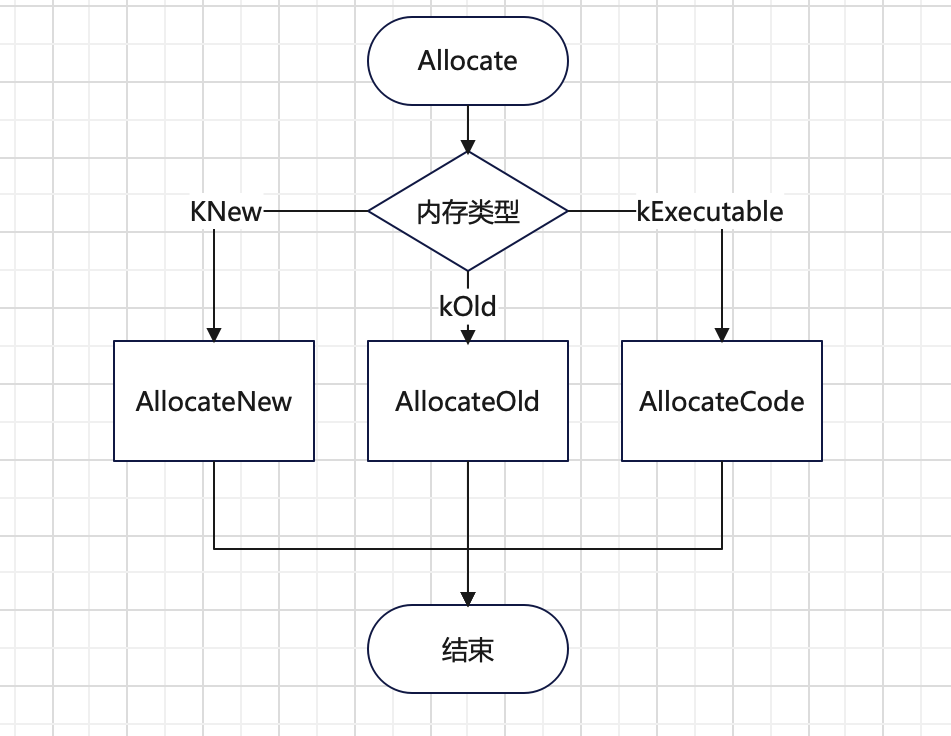
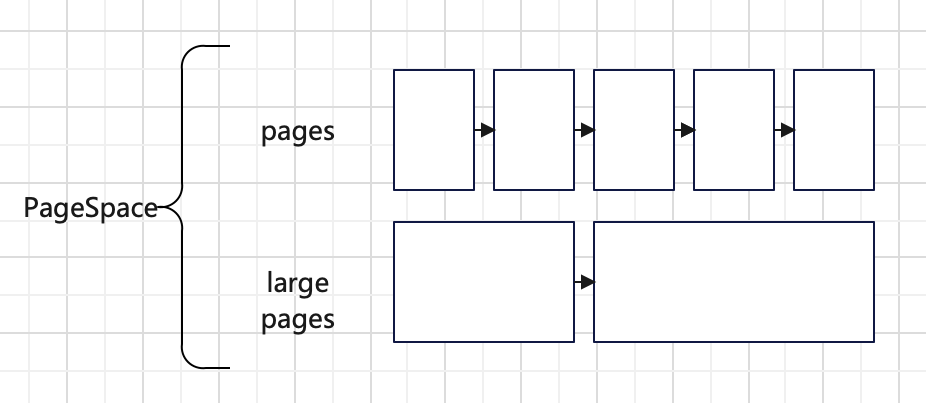
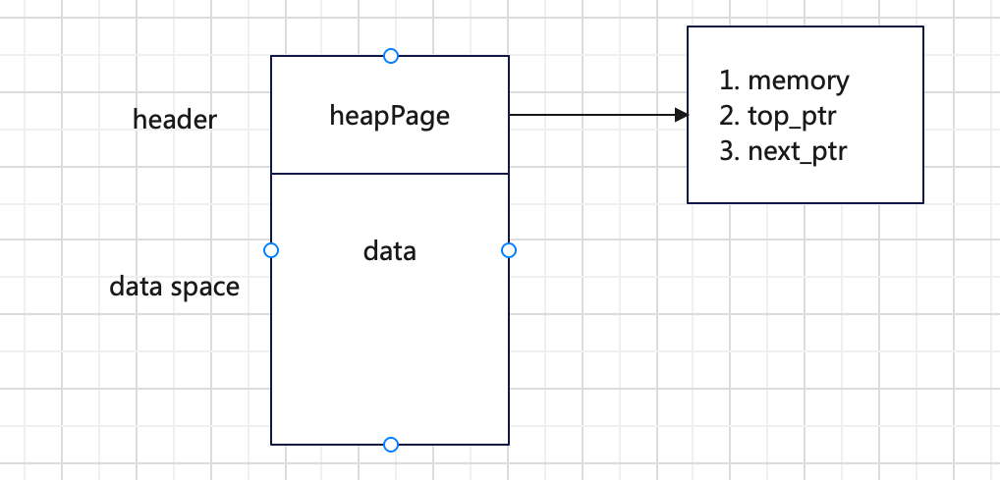
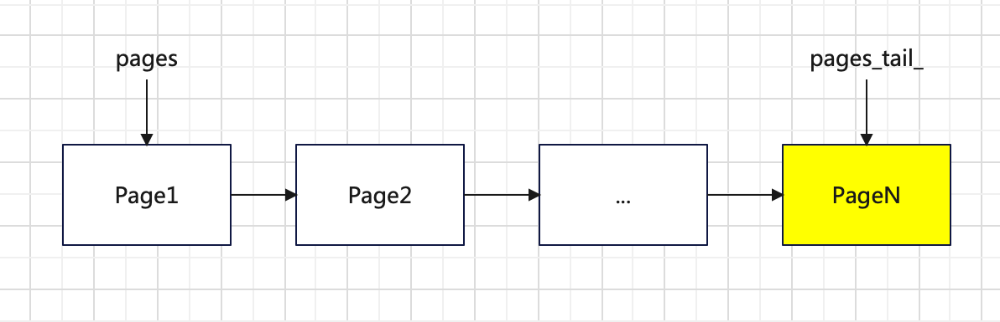
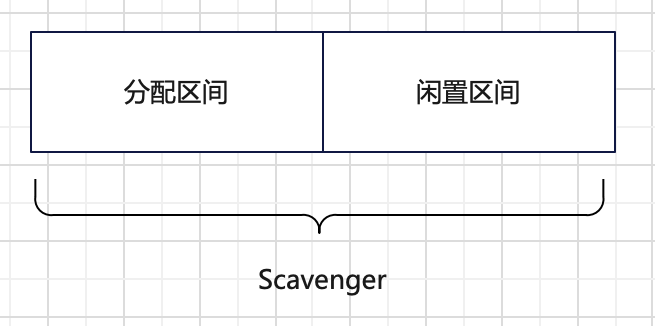
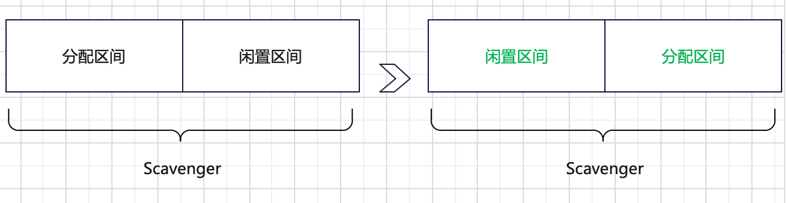
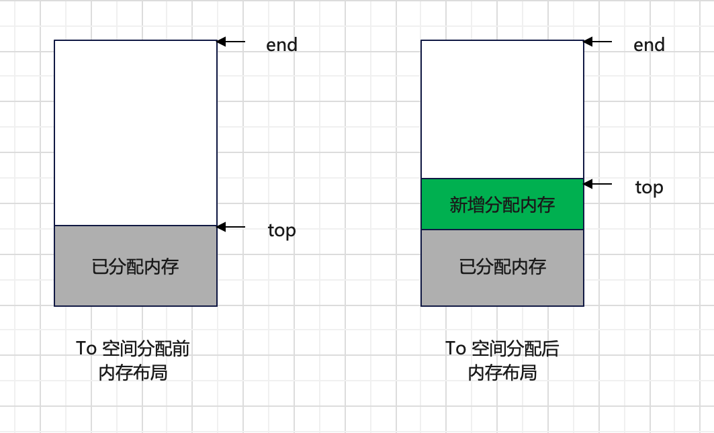
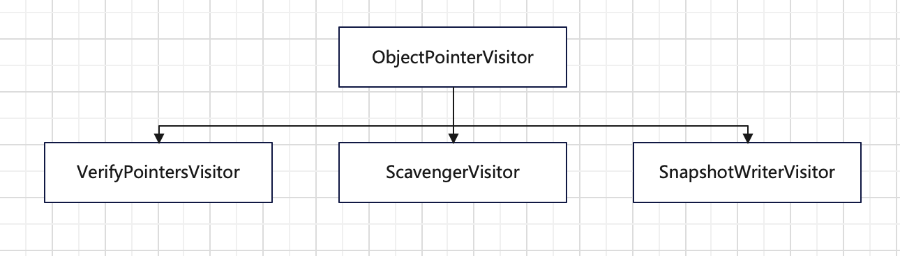

DartVM的堆内存的管理方式是托管式的内存管理，即Dart开发者在申请内存后无需考虑内存的生命周期，Dart虚拟机会自动识别不在使用的内存，并释放掉。下面我们展开介绍下DartVM的堆内存管理架构和机制。

<!-- more -->

## 概述

堆内存管理的整体架构图如下，分为三层。

- 应用接口层：通过Heap给应用代码提供内存分配接口。
- 内存管理算法层：实现应用内存分配和回收功能，当前有两种实现分别是PageSpace和Scavenger。
- 系统适配层：通过VirtualMemory适配多个操作系统，实现向操作系统申请内存和释放内存等功能。

#### 应用接口层

应用接口层管理应用的堆内存，如内存空间初始化、内存分配等，这些功能都在Heap这个数据结构里。

在Heap里内存被划分成如下三个空间。

- New Space：存放生命周期比较短的数据，如String，BigInt，Context和ExceptHandle等。最大容量是32MB，使用Scavenger进行管理。
- Old Space：存放生命周期长的数据，如Function、TokenStream等。最大容量是512MB，使用PageSpace进行管理。
- Code Space：存放可执行的代码数据。最大容量是4MB，使用PageSpace进行管理。

这个三个空间被标识为三种类型kNew、kOld和kExecutable。在Heap提供的内存分配接口中，它会根据请求的内存类型在上述对应的内存空间上进行分配，具体流程如下图所示，如果类型是kNew就在New Space里进行分配；而类型是kOld就在Old Space里进行分配；否则在Code Space里进行分配。

其中Old Space和Code Space如果没有内存空间进行分配就会报错，而New Space不会直接报错，它会先进行一次垃圾回收，然后在分配一次，如果还不行就在Old Space里进行分配。

#### 内存管理算法层

堆内存有两种算法实现--PageSpace和Scavenger。

**PageSpace**不提前分配内存，而是每次内存不足的时候，按页进行内存申请再进行分配。分配得到的页是以链表的形式进行组织。这里的页分为两种，一种是大小固定的页（目前是256KB），一种是大小不固定的大页。因此，一个PageSpace里有两条页链表分别管理这两种内存页。如下图所示，pages表示的是固定页的链表，large pages表示的是大页的链表。

这两种页虽然大小是不同的，但是结构是相同的，都是由页头和数据空间组成。如下图所示，页头放的是一个由heapPage表示的页表元数据，里面主要是三个数据，即页的虚拟内存块元数据的地址、数据空间顶部地址和下一个页表地址；而数据空间就是存放数据，不过两种页存放的数据数量存在不同，固定页里会存放多个数据，而大页里只会存放一个数据。

下面我们介绍下PageSpace进行内存分配和内存回收的过程。

当应用向PageSpace管理的内存空间申请一块内存的时候，PageSpace就会进行内存分配，有以下4个步骤。

1. 根据申请的内存大小判断是否可以在固定页里分配；
2. 如果申请的内存小于固定页的大小就按固定页进行分配；
3. 否则按大页进行分配；
4. 返回申请结果，地址或者0。

固定页方式的内存分配过程如下。

1. 判断尾部页是否存在，以及剩余空间是否足够，如果尾部页不存在或者尾部页的剩余空间不够，则跳到第2步，否则跳到第3步；

2. 申请新的固定页，使用尾插法，将其插到固定页链表的尾部，作为新的尾部页，如下图所示，新增的PageN是放在尾部的；

   

3. 在固定页里进行内存分配，此时使用的是Bump Allocation算法，即将数据空间顶部地址直接后移，得到所需的内存空间。

大页的内存分配过程比较简单，它是按所需内存大小进行对齐后的结果直接申请一块大的内存块，然后将这个内存块按大页的形式插入到大页链表的头部进行管理（头插法，与固定页链表的插入方式不同，但从目前的实现来看，固定页链表的插入方式也是可以改成这种方式，可以节省一个尾指针的空间），最后再给到申请者这块内存的地址，供其使用。

PageSpace的内存回收比较简单，它是在PageSpace析构的时候直接释放所有内存。因此，不存在动态的垃圾回收过程。

**Scavenger**使用了Cheney算法，是一种复制内存管理算法，它在初始化阶段会向系统申请了一段固定的内存，然后将内存均分为两个区间进行管理，如下图所示，在内存分配阶段会固定在一个区间里进行分配即分配区间，而另一个区间不做任何事情作为闲置区间。

当分配区间里无法分配内存了就会触发内存回收，在内存回收阶段会先依次检查分配区间里的每个数据是否存活（即是否还有存在的必要），并将存活的数据复制到闲置区间，最后释放分配区间里的数据并交换两个区间的角色。如下图所示，在经过一个分配和回收周期后，原有的分配区间变成闲置区间，而原有的闲置区间则变成分配区间。

在大部分的论文或者实现里，这两个内存区间会被称为分配区间/幸存者区间（Allocation Space/Survivor Space）或者From space/To space。DartVM里采用的是From space/To space这对名称来命名Scavenger的两个内存区间，下面我们将DartVM的Scavenger的实现分为初始化、内存分配和内存回收三个阶段分别进行介绍。

首先，在Scavenger初始化阶段，Scavenger就申请了32MB内存，并平均划分成From和To两个16MB内存空间，这两个内存空间都是通过Memory Region进行管理的。

然后，在内存分配阶段，Scavenger会在To内存空间里进行分配，它会维护一个top指针和一个end指针，top指针表示To内存空间的堆顶位置，end指针表示To内存空间的最大内存位置。主要分配步骤如下：

1. 通过end-top计算出To空间剩余的内存大小，然后判断这个剩余内存是否可以满足申请的内存大小，不满足就返回空指针，满足就进行下一步；
2. 将top指针作为申请到的内存首地址，并上移top指针分配出所申请的内存空间；
3. 返回申请到的内存首地址。

如下图例子所示，当申请一块内存之后top指针就会上移。

最后，当无法从To空间申请出内存后，就会触发内存回收过程，此过程会尝试进行无用内存的回收，从而释放出可用空间。在这个内存回收阶段里（即垃圾回收阶段），主要的步骤有。

1. 交换To和From指针，将新的To空间作为分配空间进行内存分配；
2. 使用宽度优先遍历算法（相比深度优先具有更好的局部性）遍历内存对象根节点集合（root集），将所有属于From的内存对象复制到To空间；
3. 遍历To空间所有的内存对象，逐个判断内存对象的子对象，将属于From的子对象复制到To空间；

经过上述步骤之后，存活的对象都是在新的To空间里了，而新的From空间里剩余的对象都是垃圾，下次可以直接覆写掉。在第2步中提到的根节点集合指的是From空间的存活对象内存链表的首节点，通过这些根节点我们就可以找到From空间所有的存活对象内存，从而可以将所有的存活对象都复制到To空间里。Scavenger中根节点有以下8个来源，这些对象及其子对象如果有在From空间的，就可以被复制到To空间里。

- Object Store的所有子对象；
- Isolate StubCode的StubEntry对象；
- Isolate所有Zone里的对象；
- Isolate的所有StackFrame的对象；
- Isolate的ApiState的对象；
- Isolate的CodeIndexTable的对象；
- Isolate的RawContext对象；
- old_space和code_space的对象；

因为内存对象是多链表的形式保存的，所以设计了一个基础的内存对象访问器用于对象访问，并且设计了三个子类访问器，每个子类访问器都实现了对内存对象的特定处理。如下图所示，目前有ScavengerVisitor、SnapshotWriterVisitor和VerifyPointersVisitor三个子类访问器。

其中，ScavengerVisitor是用于内存回收的访问器，它实现了有个主要的函数实现了内存对象识别和复制内存对象到To空间的功能，这个函数具体可以分为以下几个部分：

1. 从对象指针中获取原始地址；
2. 判断地址是否属于From空间，如果不是则返回，否则继续；
3. 判断地址是否已经处理过了，如果处理过就直接获取新地址，否则继续；
4. 从新的To空间申请内存空间，复制数据到新内存空间，将老Object里的rawaddr换成新内存空间的地址；
5. 将旧的Object换成新的Object。

总体上，Scavenger可以快速的分配内存且内存碎片率低，但同时它存在内存利用率低（一个闲置空间被浪费了），需要暂停业务（数据多的话会需要较长GC的时间）。

#### 系统接口层

DartVM给应用提供了自动内存管理的功能，但是具体内存还是需要向操作系统申请的。因为DartVM适配了多个操作系统（win、macos、linux），不同操作系统的内存申请接口会存在差异，所以DartVM里设计了VirtualMemory作为系统接口层，屏蔽掉不同系统带来的差异。它由以下三部分功能组成。

- 内存申请：提供了内存保留和内存提交功能；
- 内存释放：提供了释放内存的功能；
- 内存信息管理：提供了获取内存首地址、内存大小和判断是否包含某个地址等功能。

#### 总结

DartVM早期的内存管理模块具备了内存管理的基本功能，也有了相应的分层设计，避免了和系统或应用的耦合，可以支持dart的运行期间的内存需求。当然实现的算法还是比较简单的，GC暂停时间也比较长，后续会进一步改进。
