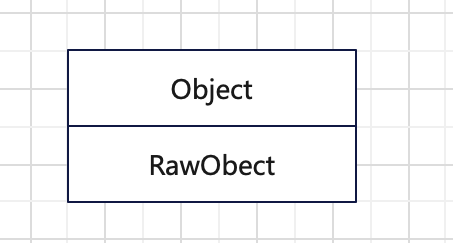
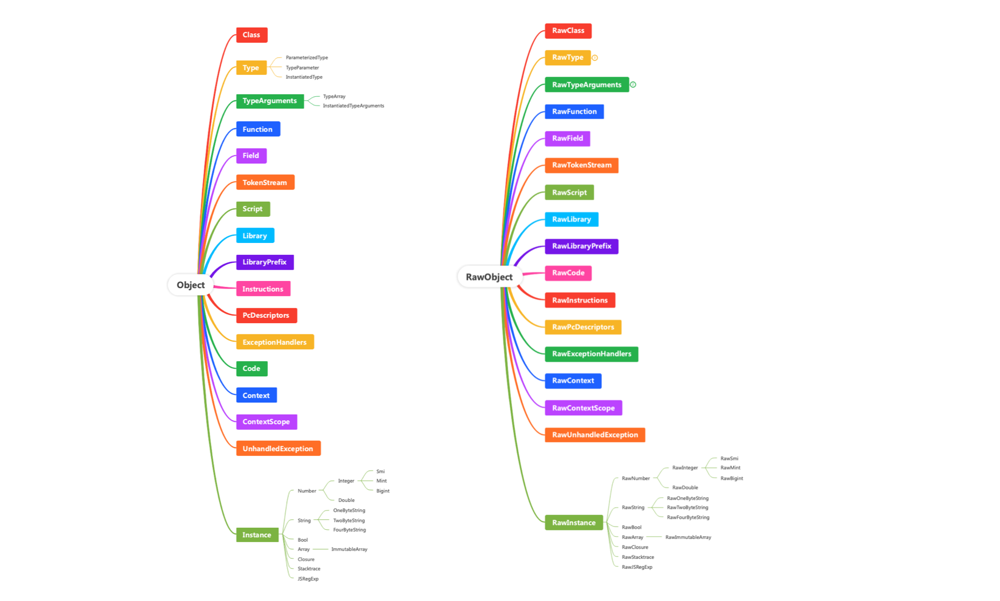
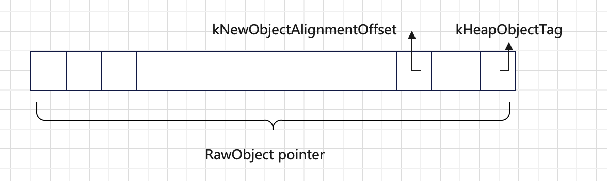

Dart是面向对象编程范式的语言，它的数据都是以对象的形式存在的，即一个数据就是一个对象（Object）。

<!-- more -->

## Object架构

DartVM里通过Object这个类型来表示Dart Object这个概念；同时，将数据在内存里布局形式以原始对象（RawObject）进行表示。因此，如下图所示DartVM的对象内存模型可以分为两层Object和RawObject。

- Object，描述数据的应用信息；
- RawObject，描述数据的内存布局信息。

它们两个是一一对应的，并且继承自它们的类型也是一一对应的。如下图所示，左边是Dart VM里基本的数据类型，右边是这些数据类型的内存形式。

### Object

Object持有一个RawObject，并提供了一些处理object的handle方法。此外，还提供了一个生成Object内存的静态方法，它由以下步骤组成：

1. 从当前isolate的heap中分配指定大小的内存；
2. 初始化这个内存块，将每个字长内存都置为null；
3. 给这个内存块首地址添加上Object标记，表示它是一个Object类型的指针；
4. 添加上类型信息；

### RawObject

RawObject的作用是封装Object的指针操作，使得用户不用直接操作内存指针，降低了用户的使用难度。由于C/C++的指针值和数值是没有区分开的，导致无法从原始指针上直接判断它是Object对象还是地址指针。为了和数值区分开，DartVM对RawObject地址做了一次重新映射（通过地址对齐的方式），将最后一位作为地址标记位，还有一位用于判断object存放的heap内存区。

 此外，RawObject持有一个RawClass，用于描述RawObject的Class信息。

## 总结

从Heap中分配的内存地址是uword类型，然后添加Object标记变成RawObject，最后添加handle进一步封装成为了面向用户的Object。

