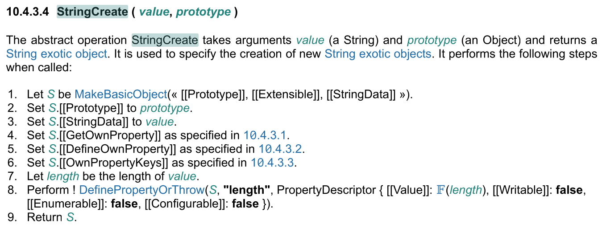

## 一、StringConstructor JS规范


## 二、V8 StringConstructor实现
```
transitioning javascript builtin StringConstructor(
    js-implicit context: NativeContext, receiver: JSAny, newTarget: JSAny,
    target: JSFunction)(...arguments): JSAny {
  const length: intptr = Convert<intptr>(arguments.length);
  let s: String;
  // 1. If no arguments were passed to this function invocation, let s be "".
  if (length == 0) {
    s = EmptyStringConstant();
  } else {
    // 2. Else,
    // 2. a. If NewTarget is undefined and Type(value) is Symbol, return
    // SymbolDescriptiveString(value).
    if (newTarget == Undefined) {
      typeswitch (arguments[0]) {
        case (value: Symbol): {
          return SymbolDescriptiveString(value);
        }
        case (JSAny): {
        }
      }
    }
    // 2. b. Let s be ? ToString(value).
    s = ToString_Inline(arguments[0]);
  }
  // 3. If NewTarget is undefined, return s.
  if (newTarget == Undefined) {
    return s;
  }

  // We might be creating a string wrapper with a custom @@toPrimitive.
  if (target != newTarget) {
    InvalidateStringWrapperToPrimitiveProtector();
  }

  // 4. Return ! StringCreate(s, ? GetPrototypeFromConstructor(NewTarget,
  // "%String.prototype%")).
  const map = GetDerivedMap(target, UnsafeCast<JSReceiver>(newTarget));
  const obj =
      UnsafeCast<JSPrimitiveWrapper>(AllocateFastOrSlowJSObjectFromMap(map));
  obj.value = s;
  return obj;
}
```
在V8实现的StringConstructor中并没有DefinePropertyOrThrow的步骤。那么V8是如何满足规范要求的呢？

由于规范中在String new出的对象上定义了length属性，因此GetOwnProperty要能够访问到该属性。
先看一下V8属性打印过程。
```c++
bool JSObject::PrintProperties(std::ostream& os) {
  if (HasFastProperties()) {
    Tagged<DescriptorArray> descs = map()->instance_descriptors(GetIsolate());
    int nof_inobject_properties = map()->GetInObjectProperties();
    for (InternalIndex i : map()->IterateOwnDescriptors()) {
      ...
      switch (details.location()) {
        case PropertyLocation::kField: {
          FieldIndex field_index = FieldIndex::ForDetails(map(), details);
          os << Brief(RawFastPropertyAt(field_index));
          break;
        }
        case PropertyLocation::kDescriptor:
          os << Brief(descs->GetStrongValue(i));
          break;
      }
      os << " ";
      details.PrintAsFastTo(os, PropertyDetails::kForProperties);
      if (details.location() == PropertyLocation::kField) {
        os << " @ ";
        FieldType::PrintTo(descs->GetFieldType(i), os);
        int field_index = details.field_index();
        if (field_index < nof_inobject_properties) {
          os << ", location: in-object";
        } else {
          field_index -= nof_inobject_properties;
          os << ", location: properties[" << field_index << "]";
        }
      } else {
        os << ", location: descriptor";
      }
    }
    return map()->NumberOfOwnDescriptors() > 0;
  }
  ...
  return true;
}
```
V8的property遍历过程是从object的map中获取。
String map的初始化过程如下：
```c++
{  // --- S t r i n g ---
    Handle<JSFunction> string_fun =
        InstallFunction(isolate_, global, "String", JS_PRIMITIVE_WRAPPER_TYPE,
                        JSPrimitiveWrapper::kHeaderSize, 0,
                        isolate_->initial_object_prototype(),
                        Builtin::kStringConstructor, 1, kDontAdapt);
    InstallWithIntrinsicDefaultProto(isolate_, string_fun,
                                     Context::STRING_FUNCTION_INDEX);

    DirectHandle<Map> string_map(
        native_context()->string_function()->initial_map(), isolate());
    string_map->set_elements_kind(FAST_STRING_WRAPPER_ELEMENTS);
    Map::EnsureDescriptorSlack(isolate_, string_map, 1);

    PropertyAttributes attribs =
        static_cast<PropertyAttributes>(DONT_ENUM | DONT_DELETE | READ_ONLY);

    {  // Add length.
      Descriptor d = Descriptor::AccessorConstant(
          factory->length_string(), factory->string_length_accessor(), attribs);
      string_map->AppendDescriptor(isolate(), &d);
    }

    // Install the String.fromCharCode function.
    SimpleInstallFunction(isolate_, string_fun, "fromCharCode",
                          Builtin::kStringFromCharCode, 1, kDontAdapt);
    ...
}
```
String map在初始化过程中加入length属性，设置的属性值为string_length_accessor,即getter/setter方法。此外，Descriptor类型用于描述对象布局，值得注意的是Descriptor是一个三元组[key, value, attributes]。

## 三、总结
- V8的String在初始化过程中，在其map的Descriptors（对象布局）中添加length属性Descriptor
- Descriptor类型为一个三元组[key, value, attributes]
- 属性的类型分为kAccessor和kField两种类型，当类型为kAccessor时（即getter/setter），该property不体现在object的内存中，仅记录在object->map中，在访问时，需要在线获取
- 因此，V8在用String创建对象的时候，对象所在的内存中并不会有length属性，所以在StringConstructor中看不到DefineProperty的过程，但属性访问时不影响length属性获取，因为属性访问是遍历object->map，map中有获取length属性的方法。