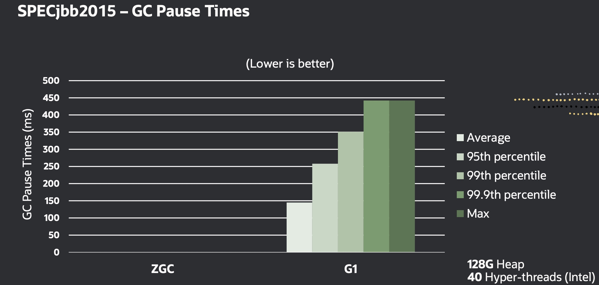
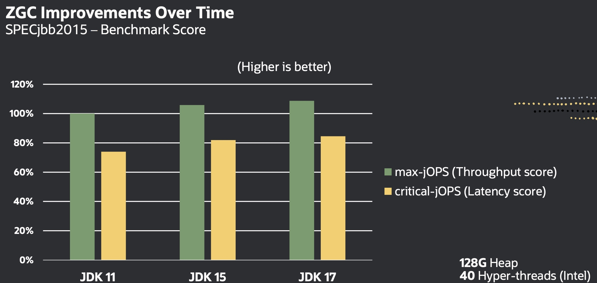
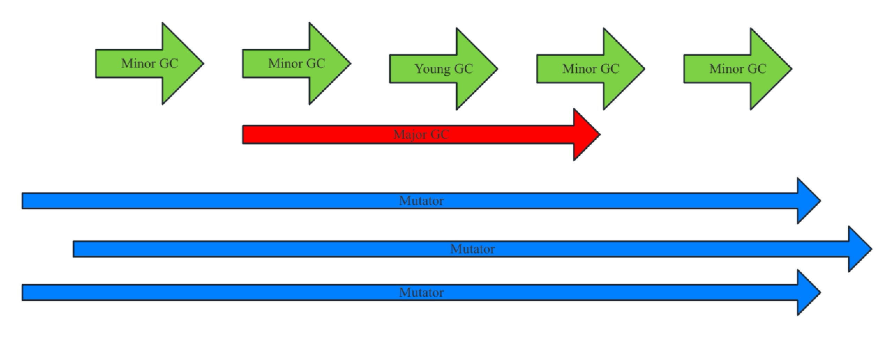

2023年9月19日发布的JDK 21中正式发布了分代ZGC（下文简称ZGC），ZGC是目前业界最新、最复杂的垃圾回收器。垃圾回收器一直是JDK中最热门技术，根据JDK版本支持的策略，JDK 8、JDK 11、JDK 17和JDK 21是目前长期支持的版本。目前这四个版本共支持七种垃圾回收器，分别是串行回收（简称Serial GC）、并行回收（Parallel Scavenge，简称Parallel GC）、并发标记清除（Concurrent Mark Sweep，简称CMS）、垃圾优先（Garbage First，简称G1）、Shenandoah GC、ZGC、Epsilon（实验特性，仅支持分配不回收，实际场景中不会采用）。其中ZGC经过近年来JDK中最热门的技术，经过近10年的发展，在2017年发布的JDK 11中提供单代ZGC为实验特性，在2020年发布的JDK 17中正式将单代ZGC升级为产品特性，在2023年发布的JDK 21正式支持分代ZGC。目前已经有不少互联网公司在实际产品中开始使用最新版本的ZGC，它是一款完全无停顿的垃圾回收器，目前应用停顿时间基本上都小于1毫秒，同时支持堆内存最高可达64TB。
以2022年 Per linden在演讲[https://cr.openjdk.org/~pliden/slides/ZGC-OracleDevLive-2022.pdf]中给出的测试数据为例，针对SPECjbb®2015测试套使用G1和ZGC（其中G1从JDK9以后就是默认的垃圾回收器），可以发现G1导致应用的停顿时间大约在300~500毫秒，而ZGC大多数情况下不超过200微秒，停顿时间约为原来的千分之一。测试效果如下所示（左图单位为ms，图中看不到ZGC的停顿时间；右图将单位切换为us，可以看到zgc停顿时间不超过200us）：



同时和G1相比吞吐量并没有明显下降（吞吐量下降约2%左右），如下图所示：



上面以128G的堆空间为例进行测试，如果堆空间进一步扩大，ZGC的会表现的更为优异。
从设计和实现效果来看，ZGC适合大内存、停顿时间要求低的场景，如金融、大数据等用户体验越来越重要的场景中发挥着关键作用。ZGC为什么能够表现的这么优异？主要原因是ZGC是完全并发垃圾回收器（JVM中的垃圾回收线程和Java应用线程并发地运行，即在内存对象发生移动时也不要去Java应用暂停），将堆空间分为新生代和老生代，垃圾回收可以并发回收新生代和老生代空间，在垃圾回收的同时应用程序还可以并发执行。用Minor GC表示新生代回收（绿色表示），Major GC表示老生代回收（红色表示），Mutator表示应用（蓝色表示），ZGC执行示意图如下：



由于ZGC是完全并发执行，设计和实现也非常复杂，回收算法采用标记-压缩（Mark-Compact）为基础，标记-压缩算法是跟踪法回收，通过根对象标记遍历标记所有活跃对象，压缩活跃对象实现内存回收。涉及到关键技术有：着色指针、读屏障、写屏障、栈帧屏障等。
## 1并发回收原理概述
并发回收有多种实现原理，最为直观的方法是目标空间不变性，将堆空间分为From和To来两个空间，Mutator在运行时产生对象（分配内存），GC工作线程（称为Collector）负责回收已经死亡的对象（将活跃对象搬移到To空间）。由于对象之间存在引用关系，Muator和Collector并发执行时可以同时访问一个对象（Mutator通常修改对象、Collector负责搬移对象），需要优雅设计处理并发问题。最直观的思路是：在垃圾回收启动后，无论是Mutator还是Collector访问对象，只要发现对象还没有转移到目标空间，就会先启动转移。当发现对象已经转移时，则通过转发指针获得目标空间中的对象并访问演示了Mutator写对象时先转移对象到目标空间，再在目标空间中写对象。

这个过程通常要借助读屏障（Load Barrier）完成上述功能。
其他并发回收原理还有源空间不变性、引用不变性，可以参考相关书籍。

## 2并发回收步骤
ZGC并发垃圾回收采用标记-压缩。整个回收过程可以分为3个阶段：分别为标记（mark）、转移（relocate或者copy）和重定位（remap）。这3个阶段完成的功能如下。
1）标记：从根集合出发，标记活跃对象，此时内存中存在活跃对象和死亡对象。
2）转移：把活跃对象转移（复制）到新的内存空间，原来的内存空间可以回收。
3）重定位：因为对象的内存地址发生了变化，所以所有指向对象老地址的指针都要调整到对象新的地址上。
并发垃圾回收就是将这3步都实现为并发执行。

在这3个阶段执行前，通常需要一个安全点执行阶段，安全点执行阶段是串行执行，此时Mutator会暂停执行，安全点的目的是为了同步Collector的工作状态。在非并发回收中，所有的工作都在安全点执行，Mutator会一直暂停，这个时间称为应用的暂停时间。
这3个阶段在实现时进一步划分为8步：
1)初始标记：暂停Mutator执行，设置标记转态以及完成根集合初始标记、完成Remap；
2)并发标记：和Mutator并发执行，并完成标记、Remap；
3)结束标记：暂停Mutator执行，完成所有对象标记、Remap；
4)标记空间释放：并发执行，在标记过程中会使用标记栈来存储待标记对象，此时可以释放未使用的标记栈空间；
5)重置转移集：并发执行，准备好待转移对象使用的空间；
6)选择转移集：并发执行，选择新生代或者老生代需要转移的页面；
7)初始转移：暂停Mutator执行，设置Rermap状态，完成根集合转移；
8)并发转移：并发执行，根据转移集将活跃对象转移至新的内存空间（页面）；
在初始标记、结束标记、初始选择这3步还需要暂停Java应用执行，所以ZGC还是存在一定的停顿时间，但是为了减少这3步的停顿时间，ZGC还引入了高效并发根标记技术。

## 3并发根标记
在标记时，首先从根集合触发。根集合通常线程的栈帧、全局变量、锁、类元数据等信息。其中最耗时的是线程栈帧遍历，线程栈帧包含了函数调用链的所有栈帧，需要将所有的栈帧都进行遍历，这将非常耗时。一个高效的并发标记方法是引入栈帧屏障技术。简单说为栈帧引入一个WaterMark，当SP（栈顶指针）大于WaterMark说明访问早期的栈，需要Mutator进行标记处理，当SP小于WaterMark说明是新增的函数调用，可以通过记录新增函数的对象，并进行遍历。
通过并发根标记技术，可以大大减少停顿时间，从而使得ZGC的停顿时间从几毫秒降至微秒级别。

## 4高效标记
垃圾回收的第一个阶段遍历根集合，对所有活跃对象进行标记。由于回收动作分成不同步骤，所以在标记完活跃对象后，需要将活跃对象状态保持下来（即对象是活跃）。由于状态和对象一一对应，所以最简单的设计是为每个对象关联一个状态信息，当识别对象是活跃状态后更新对象的状态，但是这带来两个问题：一方面是需要内存空间保持状态信息，另一方面是有额外的对象内存访问（通常需要访问对象后获取状态）。一个优化的设计是采用着色指针，即将对象的活跃保存在指针地址中，而不需要真实访问对象。
在分代ZGC中将地址的低16位用作对象状态，示意图如下所示：


其中RRRRMM、mm、FF、rr的含义如下：


在Load时将着色的指针转换为正常地址，在Store时将正常地址进行着色。例如在x86_64架构下，读屏障为：
```movq rax, 0x10(rbx)   //读取对象
shrq rax, $address_shift//右移，找到对应的着色状态
ja slow_path         //如果状态不正确，进入slow path，否则直接向下执行
```
这里可以看出，在读屏障时会有额外两条指令（上述的shrq和ja）
写屏障为：
```testl 0x10(rbx), $stroe_bad_mask//判断对象着色状态是否正确
jnz slow_path         //如果状态不正确，进入slow path，否则直接向下执行
shlq rax, $address_shift//左移
orq rax, $color//添加着色信息
movq 0x10(rbx), rax//更新对象地址
这里可以看出，在写屏障时会有额外四条指令（上述的testl、jnz、shlq和orq）
```

## 5分代回收
基于对象生命周期管理，有弱分代理论假设和强分代理论假设两种。
1）弱分代理论假设：假定对象分配内存后很快使用，并且使用后很快就不再使用（内存可以释放）。
2）强分代理论假设：假定对象长期存活后，未来此类对象还将长期存活。
基于弱分代理论将内存管理划分成多个空间进行管理，基于强分代理论可以优化GC执行的效率，不回收识别的长期存活对象，从而加快GC 的执行效率。
值得一提的是，目前弱分代理论在高级语言中普遍得到证实和认可，但是对于强分代理论只在一些场景中适用。目前弱分代理论和强分代理论在JVM 中均有体现。

所以将内存划分为多个区域，每个区域单独执行垃圾回收，能提供应用的吞吐量，减少暂停时间。通常将堆空间划分为两个，分别是新生代和老生代。新生代的垃圾回收称为Minor GC，老生代的垃圾回收称为Major GC。
通常新生代较小，老生代较大。在Minor GC执行时，对新生代中活跃对象进行标记，通常会从根集合开始跟踪遍历对象，同时为了加速新生代的遍历，记录了老生代到新生代对象的引用，称为引用集（记为RSet），将RSet也作为新生代的根跟踪标记活跃对象。Minor GC标记如下所示：


RSet通常使用写屏障，即在老生代对象关联新生代对象时记录老生代到新生代的引用，放在RSet中。
Major GC会回收整个堆空间。可以执行一次Minor GC，然后在执行老生代回收。这样做的好处是：借助一次Minor GC，新生代对老生代的引用不会包含过时引用；同时可以清空新生代。Major GC执行示意图如下所示：


分代回收存在Minor GC、Major GC，并且都采用了标记-压缩算法，由于Minor GC、Major GC和Mutator都可以并发执行，即都可以修改同一个对象。而Collector和Mutator之间的并发执行通过读屏障、写屏障和栈帧屏障实现。但是Minor GC和Major GC之间也必须考虑并发同步问题，否则也会出错。
例如在Major GC执行过程中，有触发了Minor GC，当Major GC已经标记了老生代的一个对象ObjOld，这个对象有一个指向新生代的对象（ObjNew）引用。但是Minor GC已经完成了对象的转移，此时ObjOld指向一个过时的对象（实际上对象已经被回收，这是一块非法内存），ObjOld在转移前必须更新指针才能保证GC正确性。
为此ZGC进行了以下设计：
* Minor GC执行过程中不能启动新的Minor GC和Major GC；
* Major GC执行过程中不能启动新的Major GC；
* Major GC执行过程中可以启动新的Minor GC；并且可以启动多轮Minor GC；
* Major GC执行会启动一个“特殊的”Minor GC，这个“特殊的”Minor GC不仅仅执行新生代回收，还会将新生代到老生代的引用记录在老生代的标记栈中；
* 多个GC请求会进行排队，依次处理，最终决定执行Minor GC还是Major GC；
* Minor GC在转移过程，对象可以晋升到老生代，在晋升过程中需要更新RSet中对象的状态信息（例如Remap）；
* Minor GC执行转移过程中定义转发信息（保存对象转移前后的地址信息），并且在Minor GC标记执行完成对象完成重定位；
* Minor GC执行标记过程中会使用Major GC的转发信息，并且在Minor GC标记执行完成对象完成重定位；
* Major GC执行转移过程中定义转发信息，并且在Major GC标记执行完成对象完成重定位。

## 6分代ZGC的优势与不足
上面着重讨论了分代ZGC的关键技术，使得ZGC可以支持TB级内存，同时以非常短的停顿时间完成垃圾回收。但是ZGC也存在一些不足，统计数据表明ZGC的吞吐量较G1下降约2%，主要原因是ZGC采用了读写屏障，会带来额外的负担。同时需要指出的是，复杂的实现也会消耗额外的内存（即所谓的底噪比较高）。


<!-- more -->
