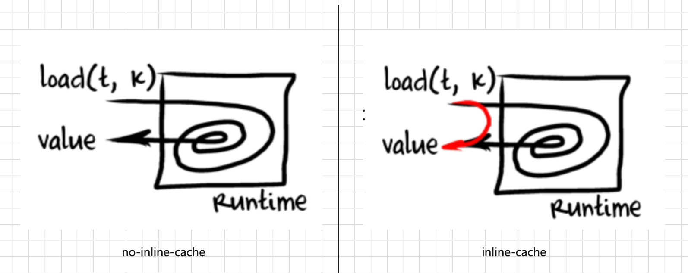
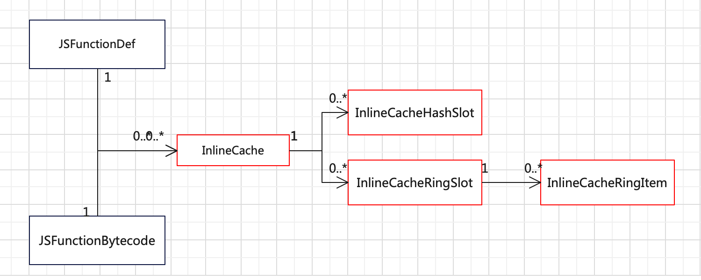
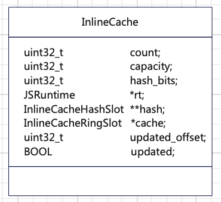
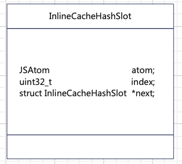
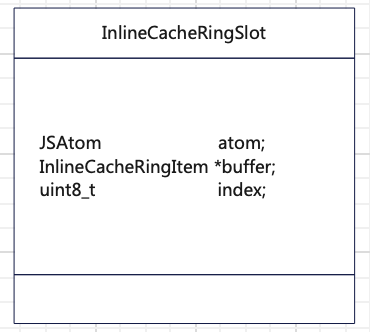
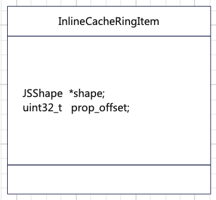

## 背景

动态语言的符号绑定是动态的，会随着程序的执行而发生变化，因此，在程序执行过程中需要先获取符号的地址，才能执行符号对应的代码。这相比静态语言程序执行多了符号查找的开销，因为静态语言的符号都在编译时静态绑定了，所以它可以在程序执行过程中直接执行符号对应的代码。这也是许多动态语言性能不如静态语言的原因之一。（如下例子）

为什么动态语言的符号绑定是动态的呢？有个原因是因为动态语言的对象类型是动态的，导致在运行之前无法根据类型确定对象的布局，从而无法确定符号的地址。但是为了提高动态语言的性能，有需要尽可能地降低这些符号绑定的开销。因此，人们根据局部性原理提出了一些投机和缓存的算法，其中一个称为in-line cache。这个优化是在动态语言的执行环境里实现的，一般称这个执行环境为虚拟机或执行引擎。

本文下面基于QuickJS这个Javascript的虚拟机，描述如何在虚拟机里实现in-line cache优化算法。首先介绍in-line cache的基本概念，然后介绍in-line cache实现的概要设计和详细设计，最后给出测试数据和结论。

<!-- more -->

## 基本概念

in-line cache优化是虚拟机中非常古老的技术，它最早是在Smalltalk编程语言的虚拟机上实现的。in-line cache的原理是利用局部性原理降低符号绑定的开销，对于同一个符号的访问，它会将前一次解析到的符号地址缓存到cache中。下次在访问该符号的时候只要简单校验下是否与上次访问该符号的条件相同（如类型是否相同），如果相同则直接使用cache中的地址，提高了访问效率；反之则需要重新查找符号地址并更新cache，会有cache访问失败的额外开销。如下图所示（图片来自【1】），左侧是没有inline-cache的虚拟机，每次读取一个数据的时候都需要到虚拟机里做符号查找等一些事情；右侧是有inline-cache的虚拟机，红线表示的是数据访问的快速路径，它可以省掉大部分虚拟机内部的复杂操作，直接获取数据。



此外，in-line cache的in-line表示的是每条需要符号绑定的指令都会有一个对应的cache。一般的实现是生成一个stub函数来保存和访问这个cache，然后修改当前指令让其直接访问这个stub函数，这样子就类似于cache是直接放在当前指令上的，所以称为in-line（在指令行上）。与之对应的是lookup cache，它只将符号和对应的地址缓存在一个cache表里，没有关联对应的指令，使用的时候需要先根据符号在cache表中查找对应的cache位置，然后在应用cache到当前访问指令。因此，相比in-line cache，lookup cache会多一个在cache表中查找cache的开销，但是lookup cache的内存开销会低一点。

## in-line cache基础算法

in-line cache优化算法演进了很多了，在hotspot/V8这些成熟虚拟机中都有很完善的实现，这使得它可以发挥出强大的效果，不过也使得它变得很复杂晦涩难懂。为了便于理解，下面我们只介绍下基础算法，其它的in-line cache算法都基于此算法改进的，可以参考相关的实现或者论文。

in-line cache优化算法为了提高需要动态符号绑定的指令的执行效率，它会为每个需要动态符号绑定的指令提供了一个缓存。对于一个特定的指令的缓存可以用两个状态来描述，分别是无缓存状态和有缓存状态，有缓存状态下又可以分为缓存命中状态和缓存未命中状态。每个状态都有特定的处理过程，分别如下。

1. 无缓存状态下执行指令，会为当前指令执行默认的符号查找程序找到符号地址，并生成一个缓存绑定到当前指令；
2. 在有缓存状态下执行指令，会检验当前的参数信息（如类型）是否满足缓存的要求；
   - 如果满足则是缓存命中状态，直接使用缓存里的符号地址；
   - 如果不满足则是缓存未命中状态，执行默认的符号查找程序找到符号地址，并更新到缓存中。

在具体实现中，可以将无缓存状态当作缓存没命中状态处理，因此，它们可以共用一个处理子过程，而缓存命中状态使用另一个子过程。

## QuickJS 的in-line cache实现方案

QuickJS中没有为符号绑定的指令做优化，导致动态符号绑定指令增多时，其性能偏低。故而我们为其设计实现了in-line cache优化，期望可以提升其性能。

### 适用场景

为了降低实现难度，本次只针对对象属性的读写指令做了in-line cache优化，其它如函数调用、对象运算操作等也需要动态绑定的指令暂时没有支持。并且当前方案不支持原型链上的属性地址缓存。

如下示例程序，定义了一个变量value，然后设置它的属性x为2，最后读取属性x的值。

```javascript
var value;
value.x = 2;
value.x;
```

它使用到的bytecode指令如下所示。

```
OP_get_field object atom
OP_get_field2 object atom
OP_put_field object atom val
```

我们需要为这三个bytecode指令添加in-line cache优化。

### 概要设计

QuickJS执行JS代码是通过bytecode解释器进行的，JS代码会先编译成bytecode格式的代码，然后在解释执行。因此，inline cache主要是在bytecode上进行的。目前我们是按函数级别添加cache表的，即每个函数添加一个cache表用于保存属性符号对应的地址偏移。为了快速找到指令对应的cache项（在cache表中的位置），我们将cache项的索引值保存到读写指令上。因为QuickJS中的属性符号是uint32表示的，但cache的容量是远远小于32位数值的，所以我们还需要通过hash将属性符号映射为cache索引值。为了避免每次访问cache的时候都计算一遍hash，新增了一个hash表用于记录属性符号对应的cache索引值。又因为我们支持poly inline cache（即每个属性符号有多个地址偏移），所以需要记录每个地址偏移对应的类型信息。

要实现上述的功能，我们需要添加4个类型用于保存上所需数据，具体如下类图所示，红色边框是新增的，图中每个类型的作用是：

- JSFunctionDef，它是QuickJS原有的数据结构，用于描述JS源码格式的函数的信息，持有一个InlineCache，用于表示本函数具有的符号和其地址。
- JSFunctionBytecode，它是QuickJS原有的数据结构，用于描述JS bytecode格式的函数的信息，持有一个InlineCache，用于表示本函数具有的符号和其地址。
- InlineCache，它用于描述了指令的符号及其对应地址的缓存表，它有两个主要成员，一个是InlineCacheHashSlot类型的成员；另一个是InlineCacheRingSlot类型的成员。
- InlineCacheHashSlot，它记录符号和对应的缓存索引。之所以要有它是因为我们的cache表是以函数为单位的，因此需要通过符号的hash值进行索引。通过InlineCacheHashSlot记录下符号和对应的缓存索引，可以降低计算符号hash值的次数。
- InlineCacheRingSlot，它表示一个属性符号对应的缓存槽，持有一个InlineCacheRingItem类型的成员。
- InlineCacheRingItem，它表示缓存槽中的一个缓存项，每个缓存项纪录了一个符号和其对应的地址偏移。



除了上述新增的数据类型，我们将inline cache的功能划分为四部分组成。

- InlineCache表构建，为了每个函数生成一个IC表用于存放属性读写指令生成的IC。
- 指令IC生成，为属性读写指令生成IC，并改写当前指令纪录下IC在IC表中的位置。
- 指令IC应用，如果属性读写指令具有IC信息，则根据这个信息从IC表中读取IC信息。然后检查当前IC是否可以用于当前指令，可以的话就根据IC信息获取属性位置；反之则使用原有的属性位置获取方式重新获取属性信息并更新IC表。
- InlineCache表适配QuickJS内存管理器，为了避免内存泄露，将InlineCache表的指针信息添加到QuickJS内存管理器中，使其可以自动管理。

下面我们展开介绍下这些类型和模块的功能。

### 详细设计

在上文模块功能介绍的时候，我们介绍过在指令IC应用的阶段需要去改写指令，这会影响到QuickJS原有指令的语法规范，导致不兼容官方版本生成的bytecode代码。因此，为了避免这个情况的出现，我们新增了三条属性读写的指令，它们用于带IC的属性读写场景，从而不影响官方bytecode的流程。下面我们先介绍下新增指令的规范，然后在依次介绍上述每个新增类型的结构，最后在依次介绍inline cache各个模块的功能。

#### 新增指令

QuickJS的bytecode有三条属性读写指令，分别是OP_put_field、OP_get_field和OP_get_field2（它会保留栈上的Object信息，而OP_get_field执行后会直接覆盖掉栈上的Object信息）。它们的格式如下，这三个指令都是由opcode和属性（atom）组成的，opcode是1个字节和atom是4个字节，它们的参数是放到栈上的，故整条指令由这5个字节组成。

```shell
OP_get_field atom
OP_get_field2 atom
OP_put_field atom
```

我们以这三条指令为参考，设计了如下三条新的指令，还是保留5个字节的格式，但是把后面4个字节替换成指令的IC的在IC表中的偏移值。

```
OP_get_field_ic ic_offset
OP_get_field2_ic ic_offset
OP_put_field_ic ic_offset
```

#### inline cache类型

##### InlineCache



如上图所示，InlineCache有8个成员变量，其中3个变量是为了实现方便添加的，分别是，

- rt，它使得InlineCache能快速申请到对应Runtime的内存；
- updated，它表示当前指令更新了所在函数的IC表，需要更新当前指令，设置IC信息；
- updated_offset，它表示更新过的IC在IC表中的索引。

有2个变量是计算和保存JS对象属性的hash信息相关的，分别是，

- hash_bits，它表示要将属性hash映射后的最大值的位数，最大值和cache slot的最大数量一致；
- hash，记录属性hash信息。

有3个变量是cache相关的，分别是，

- count，表示当前cache数量；
- capacity，表示cache的容量；
- cache，记录属性的类型和对应的地址偏移。

##### InlineCacheHashSlot



如上图所示，InlineCacheHashSlot有3个成员变量，分别是

- atom，它表示当前hash表项对应的属性值；
- next，它指向下一个HashSlot，之所以有next指针，是因为InlineCacheHashSlot使用链表法解决hash冲突，如果有不同属性的hash值相同则通过单链表串联起来。
- index，它记录当前属性对应的cache的索引值。

##### InlineCacheRingSlot



如上图所示，InlineCacheRingSlot有3个成员变量，分别是

- atom，它表示当前hash表项对应的属性值；
- buffer，它记录了当前属性的多个类型信息和对应地址偏移，从而实现了poly inline cache；
- index，它记录上一次匹配上的buffer的索引，可以降低buffer匹配的时间。

##### InlineCacheRingItem



如上图所示，InlineCacheRingItem有2个成员变量，分别是

- shape，它记录了对象的类型；
- prop_offset，它记录了当前属性的地址偏移；

#### inline cache模块

##### InlineCache表构建

当前实现是将InlineCache表构建分成3个阶段完成的。

1. 函数源码读入阶段，这个时候会生成每个JS函数的内存表示形式，所以我们会跟着初始化函数的InlineCache。主要是设置InlineCache的成员变量的初始化值，其中会按初始容量先分配一个hash表，但是cache表暂时不会生成。主要的接口是，

   ```c++
   InlineCache *init_ic(JSRuntime *rt)
   ```

2. 函数bytecode生成阶段，这个时候我们会将函数中的每个属性读写指令的属性值记录到InlineCache的hash表中。此时有一个主要函数接口emit_ic，和三个辅助函数，分别是，

   ```
   // 生成属性所需的IC信息，它调用add_ic_slot1完成功能。
   void emit_ic(JSParseState *s, JSAtom atom);
   
   // 将属性值（atom）添加到ic的hash表中。
   uint32_t add_ic_slot1(InlineCache *ic, JSAtom atom)
   
   // 计算属性值（atom）的hash index。
   uint32_t get_index_hash(JSAtom atom, int hash_bits)；
   
   // 扩展hash表容量。
   int resize_ic_hash(InlineCache *ic)；
   ```

3. 函数bytecode生成完阶段，这个时候我们会根据hash表记录的属性数量生成InlineCache的cache表空间，并将每个cache项与hash表中的每一项依次关联在一起。主要接口是，

   ```
   int rebuild_ic(InlineCache *ic)
   ```

##### 指令IC生成

在函数通过解释器执行阶段，当函数中的属性读写指令第一次被执行的时候，会去生成它的IC信息。它由以下步骤完成。

1. 在当前JS对象的类型信息中找到属性的地址偏移。

   ```
   JSShapeProperty* find_own_property_ic(JSProperty** ppr, JSObject* p, JSAtom atom, uint32_t* offset);  
   ```

2. 记录到InlineCache的cache表里。

   ```
   uint32_t add_ic_slot(InlineCache *ic, JSAtom atom, JSObject *object,
                        uint32_t prop_offset);
   ```

3. 更新当前函数的bytecode，将当前的属性读写指令变更为带ic的属性读写指令，并将bytecode中的属性值改为属性的cache的索引值。

##### 指令IC应用

在函数通过解释器执行阶段，当执行到带IC的属性读写指令的时候，我们会根据当前指令带有的cache索引值获取cache和属性值，然后然后检查当前IC是否可以用于当前指令。主要接口是，

```c++
force_inline JSAtom get_ic_atom(InlineCache *ic, uint32_t cache_offset);

JSValue JS_GetPropertyInternalWithIC(JSContext *ctx, JSValueConst obj, 
                               JSAtom prop, JSValueConst this_obj,
                               InlineCache *ic, int32_t offset, 
                               BOOL throw_ref_error)
int32_t get_ic_prop_offset(InlineCache *ic, uint32_t cache_offset,
                                        JSShape *shape)
```

JS_GetPropertyInternalWithIC里如果发现IC里记录的类型都无法满足当前指令的object类型，则会走到虚拟机里默认的属性地址查找的方法上，然后会更新IC。

##### InlineCache表适配QuickJS内存管理器

需要适配的接口有，

```
 void mark_children(JSRuntime *rt, JSGCObjectHeader *gp,
                          JS_MarkFunc *mark_func)
```

需要添加的接口有，

```
int free_ic(InlineCache *ic);
```

（时序图）

## 总结

in-line cache利用局部性原理，通过缓存为动态绑定提供了一条快速路径，以低概率场景开销增加为代价换取高概率场景的效率提升。

## 参考

1. [Explaining JavaScript VMs in JavaScript - Inline Caches](https://mrale.ph/blog/2012/06/03/explaining-js-vms-in-js-inline-caches.html)

