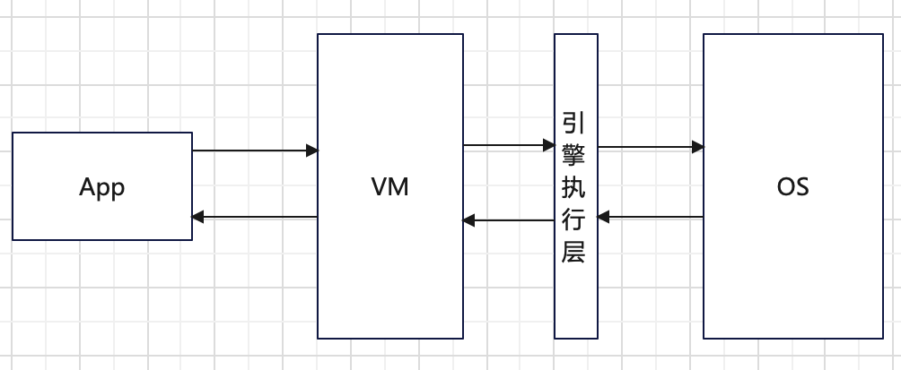
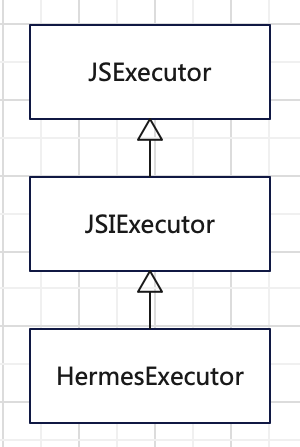
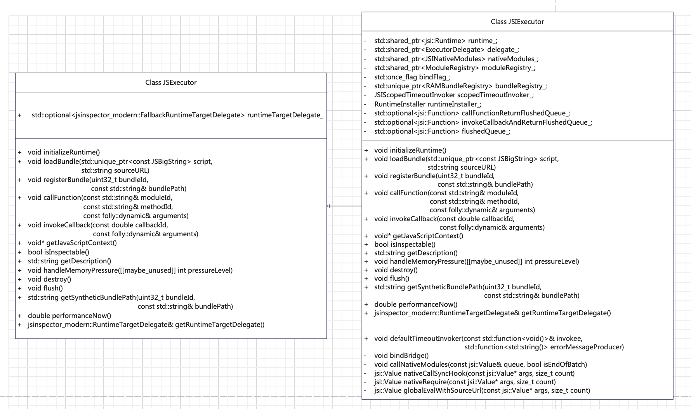
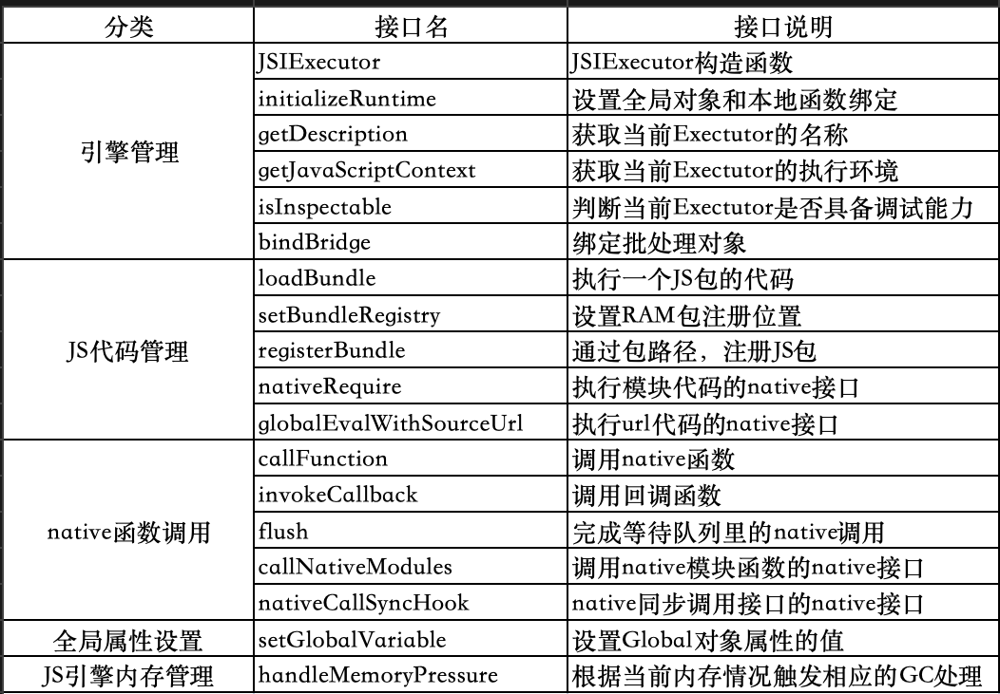
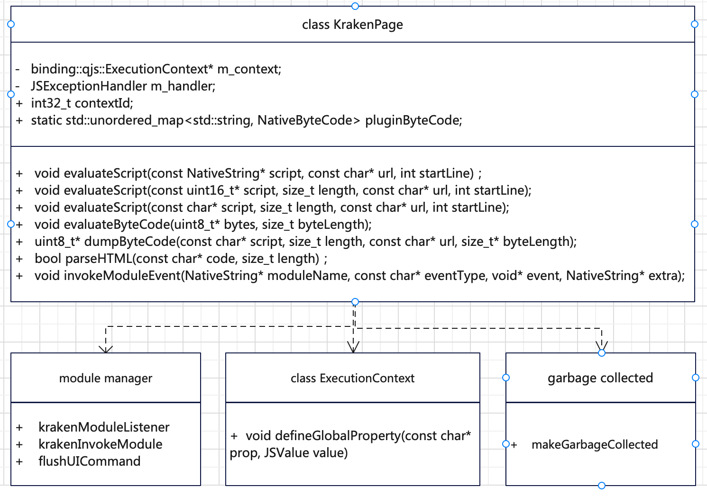
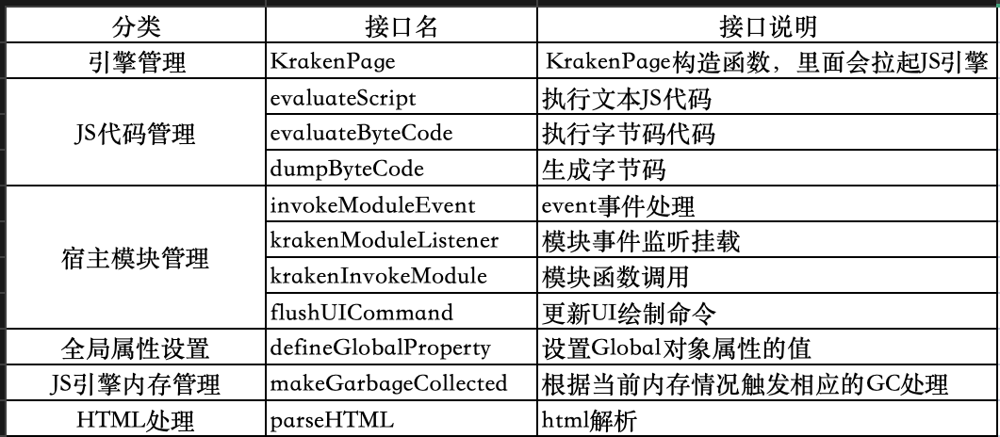
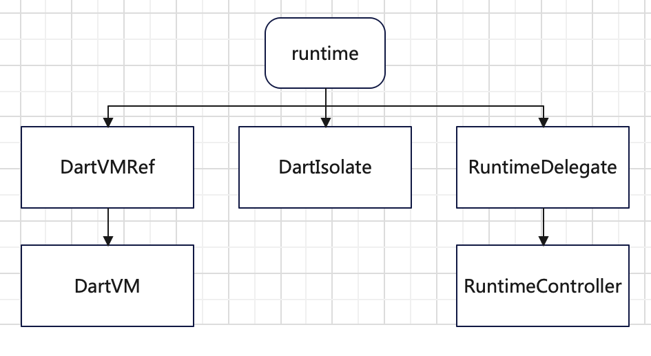
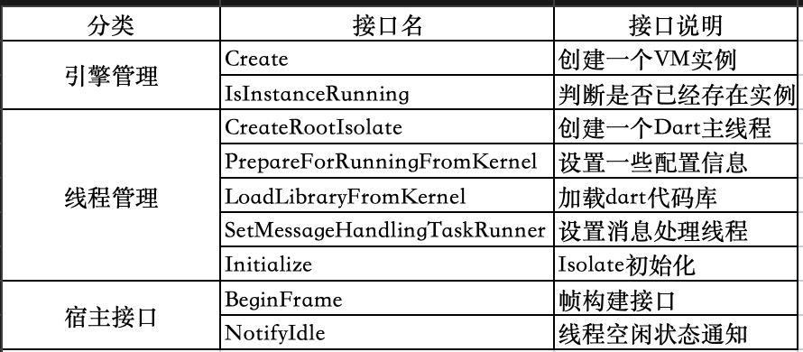

## 背景

从上世纪50年代第一台计算机出现以来，计算机已经从只有单一的数值计算功能演变成具有事务处理、数据处理和控制管理等多种多样的功能，极大提高了人类社会的生产力。并且，近年来随着计算机AI能力的逐步增强，计算机显露出可以独立于人类完成复杂工作的能力，未来社会可能会因此发生相应的巨变。虽然计算机能力越来越强使得用户使用越来越方便，但是对于开发者而言，需要处理计算机问题也越来越复杂。因此，计算机系统经常使用分层设计来降低系统的复杂度（常见的是三层分层），而相应的代价是层级之间的交互通信成本。在设计一个计算机复杂系统时，需要平衡好分层数量和相应的交互成本，使得系统具有高可靠性的同时也具有高性能。

<!-- more -->

应用框架也是计算机分层设计的一个产物，它针对计算特定领域开发所需的公共能力进行封装。主要是进一步封装操作系统能力和领域开发所需的核心功能，并为开发者预留了高效的定制和扩展的能力，使得应用开发者可以在应用框架的基础上快速开发自己的新功能，而无需进行领域通用功能的重复开发，提高了应用开发者的效率。每个大的计算机应用领域都有相应的应用框架，其中，GUI应用开发框架是目前常见的应用框架，它使得应用开发者可以快速搭建出想要的应用GUI界面。

由于，应用框架为了同时具备高性能和高开发效率，在使用系统编程语言开发性能模块的同时也会内置应用编程语言虚拟机以支持应用编程语言的执行。因此，应用框架需要具备管理内置应用编程语言虚拟机的能力。又因为此处需要管理的功能一般比较多，所以根据分层设计思想，大部分应用框架都会将管理内置应用编程语言虚拟机的能力单独设计成一个引擎执行层，称为runtime或者executor。下面我们主要以业界已有的开源应用框架为例子，介绍这个引擎执行层的主要功能。

## 引擎执行层

如下图所示，引擎执行层是应用编程语言执行环境与操作系统的中间桥梁，应用编程语言执行环境通过它可以获取操作系统资源或执行操作系统功能，反过来操作系统通过它管理应用编程语言执行环境或执行对应的应用编程语言。一般而言，它的主要功能是根据应用或者应用框架的需求定制的，并且为了降低性能开销都会做得比较精简。

后面我们通过研究react-native、kraken和flutter三个框架的引擎执行层的主要功能，探索应用框架的引擎执行层需要具有的功能集合。

### React-Native的引擎执行层

React-Native是基于Javascript应用编程语言的跨平台应用框架，它为兼容了多个JS引擎的差异，提出了一个引擎兼容层-- JSI，并且在引擎执行层采用了接口-实现分离的设计，从而在保证框架结构稳定的同时可以根据新引擎或新需求进行接口定制和扩展。React-Native引擎执行层的基础接口是JSExecutor，然后根据JSI接口实现了JSIExecutor，以及在JSIExecutor的基础上定义了HermesExecutor以支持Hermes引擎。它们三者的继承关系如下图所示，HermesExecutor继承自JSIExecutor，而JSIExecutor继承自JSIExecutor。因为HermesExecutor对JSIExecutor的变动主要是调试相关的功能，并且JSC是直接使用JSIExecutor作为引擎执行层，所以我们主要介绍下JSIExecutor的功能。

JSIExecutor的功能如下类图所示，它的接口有18个，其中主要是其父类JSExecutor里定义功能接口的实现。

将这些接口按功能划分为引擎管理、JS代码管理、native函数调用、全局属性设置和JS引擎内存管理5部分，具体如下表所示。

### Kraken的引擎执行层

Kraken是一套以兼容W3C标准为目标的夸端UI框架，它借助Flutter的夸端能力（以flutter为host）实现多端运行，并引入web的开发范式（HTML/CSS/JS）兼容web开发者生态。它的引擎执行层是基于QuickJS构建的，为了性能没有引入引擎兼容层，也是直接基于QuickJS构建了一个引擎层（ExecutionContext）。

kranken引擎执行层代码结构如下图所示，基本的接口由KrakenPage实现，然后宿主模块和GC的管理由各自独立的模块完成。此外，全局属性管理直接由引擎层的接口完成，引擎执行层没有在对其进行二次封装。

KrakenPage及其子模块的主要接口有11个，除了HTML处理模块，其它的接口功能分类和React-Native是相同的。

### Flutter的引擎执行层

Flutter的应用开发语言是dart，它的引擎执行层是基于DartVM的功能构建的。因为Flutter和DartVM是相互耦合的设计（没有多个引擎替换的兼容性需求），所以Flutter的引擎执行层是分模块的设计，没有统一的入口。如下图所示，Flutter的引擎执行层是runtime，主要的功能分为三部分。

它们的功能如下：

- DartVMRef：管理DartVM的声明周期，VM的数据处理放在了DartVM这个类里；
- DartIsolate：Dart线程的数据管理，一个Isolate对应一个Dart线程；
- RuntimeDelegate：Dart用到的宿主接口，具体实现在RuntimeController里。

runtime的接口比较多，下面列出了9个主要的接口及其功能说明。

## 总结

综合上述三个例子，应用框架的引擎执行层一般会有三个功能引擎管理、线程/代码管理和宿主接口管理。相比VM本身的接口，引擎执行层的数量相对较少，可以简化应用框架使用VM的难度。因此，一个功能完善的应用框架一般都会有一个引擎执行层来使用VM的功能并隔离VM的复杂性。
