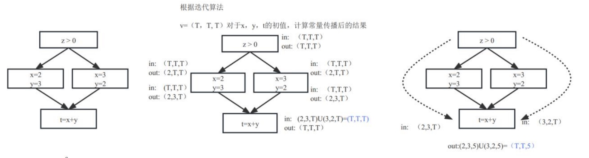
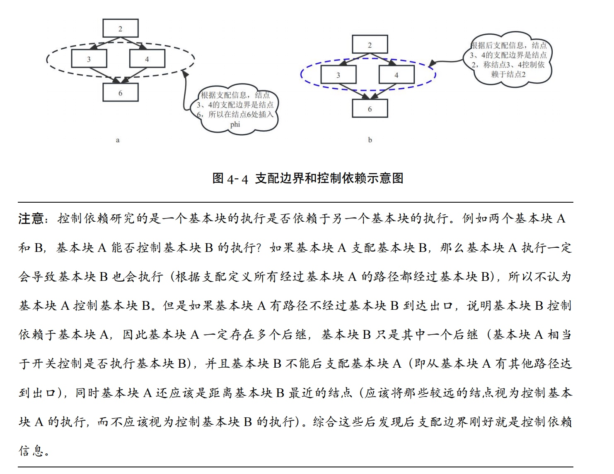
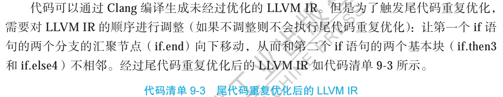
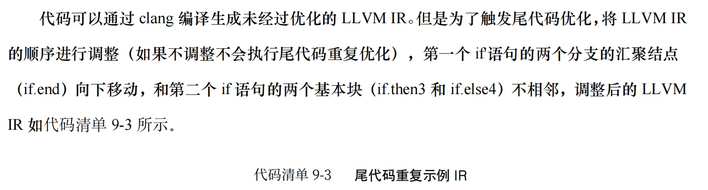

# 勘误表

2025年6月更新网友反馈如下问题，待下一次印刷时修正。

1.第42页，图3-6b中in、out求解有问题。

在3-6b中，中间左侧代码，x=2时in和out是正确的，当y=3时in为（2、T、T）、out为（2、3、T）；中间右侧代码，x=3时in为（3、T、T）、out为（3、2、T）。

2.第54页关于控制依赖描述错误，缺少部分内容。

这段注意中“如果基本块 A 支配基本块 B，那么基本块 A 执行一定会导致基本块 B 也会执行（根据支配定义所有经过基本块 A 的路径都经过基本块 B），所以不认为基本块 A 控制基本块 B。”缺少了部分前提。应该修改为：
如果基本块A支配基本块B，且基本块B逆支配基本块A，那么基本块A执行一定会导致基本块B也会执行。（根据支配、逆支配定义所有经过基本块A的路径都经过基本块B），所以不认为基本块A控制基本块B。

3.第210页，代码9-3的标题错误。

印刷校正前疏忽导致9-3标题错误。代码9-3是对clang编译后的LLVM IR调整后的LLVM IR，其目的是为了触发尾代码优化，而非书中提到的经过尾代码优化后的LLVM IR。

感谢泽文和他的小伙伴，发现了上述问题。

2025年1月第二版次印刷修正了如下错误。

1. 部分图文不一致说明
由于印刷原因，书中部分图文不完全一致。书中文字介绍图中蓝色线由于印刷统一印刷为红色线，例如在第97页第二段提到：DAG中chain关系用蓝色虚线，实际印刷为红色虚线，glue关系用蓝色实线，实际印刷为红色实线。故图7-7中红色虚线表示chain关系，在本书其它地方类似。

2. 在”5.2.1 循环识别“这一小节的第一段最后一句“逆序遍历待控制流对应的支配树”修正为“逆序遍历待分析的控制流对应的支配树”。

3. 45 页表3-3 liveuse集合 错误
   p75 代码6-6上 calss ->class
4. p53：到达基本块 6 的所有路径都经过基本块 2

    p159：LiveRefGens[rx] --> LiveRegGens[rx]

    p237：Indexe -->Indexes

     p251：REG_SEQUCENCE --> REG_SEQUENCE

     p336：PROT顺序 --> RPOT顺序

    p396：垃圾回收期 --> 垃圾回收器

5. 书中“寄存器分配前的调度算法...而寄存器分配后的调度算法...还需要关注寄存器分配的压力”。
这里的“寄存器分配前”和“寄存器分配后”写反了。

感谢网友 @ywgrit，@punkyc，@IanIsMyUsername，@mengdouer，sunshaoce 的反馈。
<!-- more -->
