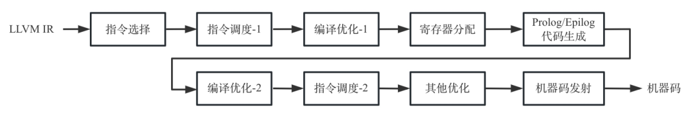

代码生成是编译器后端的统称，在编译器的实现中占据着非常重要的地位，也是非常复杂的模块。以LLVM 15为例，整个项目代码行数超过1000万[^1]，其中clang相关代码超过400万行，LLVM中端优化以及后端代码生成相关代码也已经有近400万行代码。其中代码生成代码量约为200万行，包含了架构无关的代码和架构相关的代码。其中架构无关代码约为50万行，架构相关约为150万行。架构无关的代码主要包了含指令选择、指令调度、寄存器分配和机器码生成；架构相关代码是LLVM所有支持的后端代码总和，目前LLVM已经支持超过20种后端，有些后端的实现非常复杂，如X86后端代码量超过了20万行，而有些又非常简单，如BPF后端代码量只有1万行左右。

<!-- more -->

虽然代码生成模块非常复杂，但LLVM通过模块化的设计，将不同的功能设计为不同的Pass然后再进行组合，以完成代码生成。其代码生成整体逻辑图如霞所示。

每个模块的主要工作简单总结如下：

- 指令选择：为LLVM IR选择合适的机器指令。LLVM实现了3种指令选择算法，分别是FastISel，SelectionDAGISel，GlobalISel。目前LLVM后端默认使用的是基于DAG的SelectionDAGISel指令选择算法，在指令选择阶段引入了图IR，对LLVM IR使用图匹配的方法生成MIR。值得注意的是MIR不完全是目标无关的IR（MIR结构与后端无关，但是大部分MIR的操作码已经和具体后端相关，只有少数MIR和后端无关，例如一些伪指令）。

- 指令调度-1：根据MIR中数据依赖对指令进行调度。目前LLVM实现了几种指令调度策略，如基于表调度（List Scheduling）、循环调度等；此时的优化也称为Pre-RA的调度，目的在于减少寄存器分配过程中的压力；在指令选择阶段也有指令调度（图中没有体现）。

- 编译优化-1：基于SSA形式的MIR进行编译优化，例如进行死代码删除、公共表达式消除等优化。

- 寄存器分配：将MIR中使用的逻辑寄存器映射到物理寄存器，目前LLVM中提供了4种寄存器分配算法，分别是basic、fast、greedy和pbqp，可以通过命令参数regalloc指定。

- Prologue/Epilogue代码生成：为函数生成前言和后序代码，例如处理栈帧布局等。

- 编译优化-2：经过寄存器分配后的MIR为非SSA形式，可以再次执行一些编译优化，例如复制传播等，需要注意的是，此时执行的编译优化思想和SSA形式的优化相同，但是由于MIR不再具有SSA特点，所以导致优化算法实现也有所不同。

- 指令调度-2：再次执行指令调度，此时的优化也称为Post-RA的调度，目的在于提高执行效率。

- 其它优化：执行机器码发射前的优化，例如执行基本块重排等优化；在此处还允许后端实现自己特殊的优化。

- 机器码发射：寄存器分配完成后就可以进入到机器码发射阶段（真正生成目标机器代码），为了更好的生成目标代码，LLVM引入了MCInst IR（MC），可以更加优雅地处理JIT代码、汇编和反汇编。

如上面提到，BPF后端代码较少，整体比较简单，所以本书主要以BPF后端为例来介绍代码生成，BPF后端的代码生成过程大概涉及45个Pass（不同版本略有不同），上面提到的每个模块都有涉及。而其他一些复杂的后端，例如X86或者Aarch64其代码生成过程涉及的Pass通常超过100个（BPF后端的Pass都包含在这100多个Pass中），和BPF后端相比这些额外的Pass多数是后端优化相关。

当然，要在书中将这45个Pass都详细地介绍也是不可能的事情，故而我们主要对最重要的一些Pass——指令选择、指令调度、寄存器分配、代码输出——进行介绍。除此以外，本书还介绍了一些较为实用的优化Pass，例如If-Conversion（对于GPGPU这样特殊架构效果很好）、公共代码提取（对于代码小型化有效果）、代码布局（对于代码运行性能有效果）等。

实际上，在编译器领域中，除了开发更多、更强大功能的Pass外，对于Pass还有两个方向的研究，一方面是Pass之间的执行顺序对于性能的影响，另一方面是代码生成过程中Pass的重要性（例如JIT中关闭一些不重要的Pass可能获得更好的性能）。

对于Pass顺序的研究一直以来都是编译优化中的较为重要的一个方向，原因是编译优化的Pass之间可能存在相互影响，导致不同Pass执行顺序下产生的机器码质量不同。该问题根本的原因是编译优化是NP难题，无法找到最优解。但是可以根据场景需求，对于Pass顺序进行调整生成高质量机器码，这方面有不少论文，读者可以自行查询。

对于Pass重要性的研究，一些学者通过代码生成过程中不同Pass的耗时进行量化分析（Pass的耗时从一个方面反映了重要度），例如在一些基准测试中Top 20的Pass耗时如下表所示：

| 后端优化Pass | 运行时间据均值和标准差 | 最大值 | 最小值 |
|---|---|---|:--|
| DAG to DAG Instruction Selection（指令选择） | 49.52%±7.14% | 81.44% |7.31%  |
| Assembly Printer（汇编输出） | 8.93%±2.67% | 15.80% | 0.44% |
| Greedy Register Allocator（Greddy寄存器分配） | 8.59%±2.78% | 70.13% |0.38%  |
| Live Variable Analysis（活跃变量分析） | 4.19%±1.58% |19.75%  | 0.32% |
| Live Interval Analysis（变量活跃区间分析） | 2.85%±1.26% | 21.74% | 0.20% |
| Prologue/Epilogue Insertion（函数栈帧生成） | 1.90%±0.66% | 3.97% | 0.05% |
| Virtual Register Map（寄存器分配后映射） |1.79%±0.83%  | 4.14% | 0.005% |
| Simple Register Coalescing（寄存器合并） | 1.64%±0.81% | 57.65% | 0.28% |
| Optimize for Code Generation（窥孔优化） | 1.61%±0.69% | 12.28% | 0.02% |
| Module Verifier（IR验证） | 1.22%±0.37% | 6.02% | 0.10% |
| Dominator Tree Construction（支配树构建） | 1.22%±0.45% | 2.64% | 0.004% |
| Machine Function Analysis（管理分析Pass，已经被Pass Manager替代） | 1.13%±0.43% | 2.42% | 0.05% |
| Machine CSE（公共表达式消除） | 1.08%±0.24% |4.14%  | 0.10% |
| Machine Dominator Tree Construction（支配树构建） | 1.06%±0.41% | 2.20% | 0.004% |
| Control Flow Optimizer（Branch Folding，分支折叠） | 1.03%±0.36% | 23.54% | 0.002% |
| Calculate Spill Weights（活跃变量区间权重计算） | 0.96%±0.56% |2.34%  |0.01%  |
| Two-Address Instruction Pass（二地址指令变换） | 0.93%±0.26% | 6.69% | 0.13% |
| Machine Instruction LICM（循环不变量外提） | 0.85%±0.35% | 2.32% | 0.003% |
| Loop Strength Reduction（循环变量强度削弱） | 0.77%±2.93% | 81.99% | 0% |
| Remove Dead Machine Instructions（死指令删除） | 0.64%±0.16% | 1.25% | 0.03% |

该结果是基于LLVM 3.0进行编译，测试套为SPEC CPU2006，执行后端前经过了充分的中端优化，这一研究目的是为了预测在JIT 等场景中后端编译优化的时间（由于JIT 是运行时进行的编译优化，需要在编译质量和编译时间寻找平衡，通过预测编译优化所需的时间可以确定JIT 应该使用的编译优化）。通过该表可以看到不同的编译优化耗时占比情况，通常来说编译耗时较长，功能越重要。例如指令选择、寄存器分配、汇编码生成是编译后端必需的功能，其耗时占比接近70%，这也和本书重点介绍内容一致。

除了重点Pass外，本书中对于表中其他Pass基本都有涉猎（个别除外，例如Machine Function Analysis已经被Pass Manager替代），不过详细程度不同，有些仅仅简单介绍了原理（比如支配树），关于这些Pass更多内容读者可以自行阅读源码或者参考相关资料。通过该表读者可以对代码生成的功能和重要度有一个简单的印象，更多信息可以参考论文[^2].

[^1]: 代码行数统计包含代码仓中所有类型的原始文件，但是不包含编译生成的中间代码（例如TD文件在编译后生成大量的代码不在统计之列）。
[^2]: “A LLVM JIT Compilation Cost Analysis”，R-Auler、E-Borin，2013。https://www.ic.unicamp.br/~reltech/2013/13-13.pdf。
