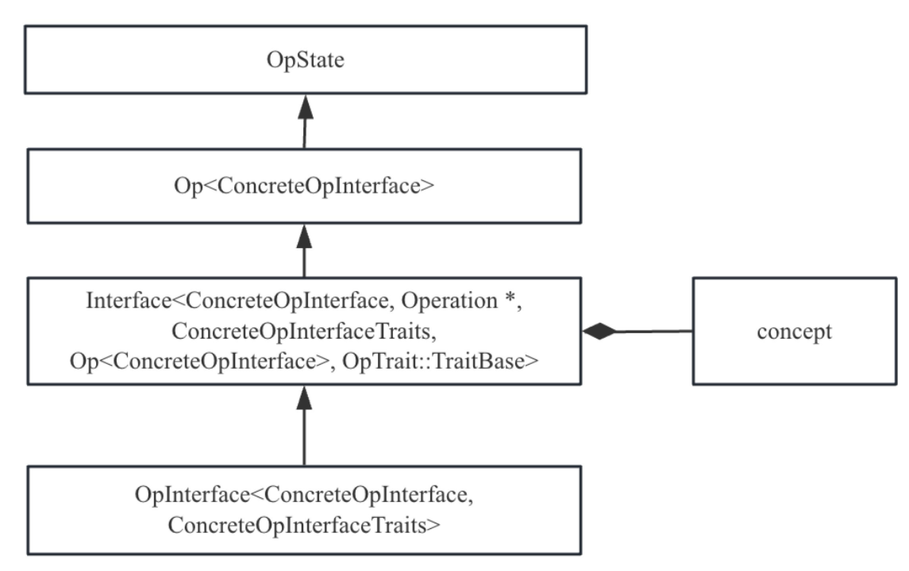
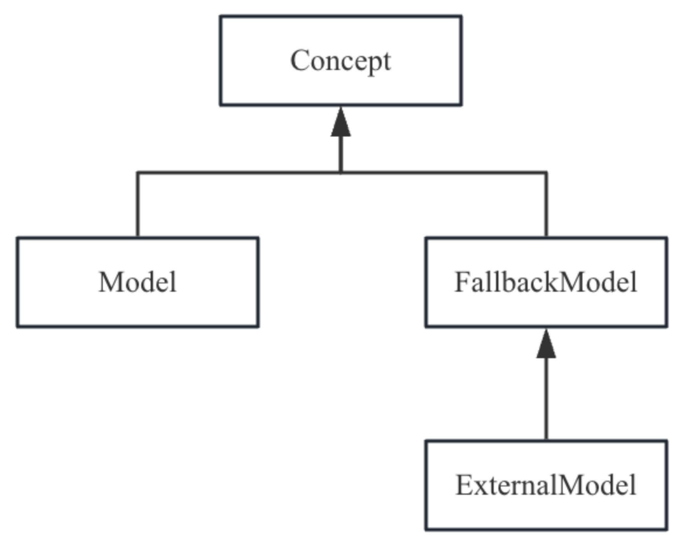

特质为一组属性、操作或者类型进行通用操作（而非一个属性、操作或者类型），并且处理的属性、操作或者类型。在实现过程中被一组操作、类型或者属性直接继承，这就产生一个问题，能否为继承于同一特质的操作、类型或者属性提供动态绑定的能力，而非完全的静态绑定能力？接口正是基于这一诉求产生的。接口和特质有一些类似的地方，实际上接口的功能基于特质实现的，在本节后续内容详细介绍相关原理。
可以为方言、操作、类型和属性定义接口，而方言接口使用比较特殊，所以在本节按照使用方式将接口分为两类：方言接口和操作、属性、类型接口，下面分开介绍。

### 4.3.1方言接口

在MLIR中每一个方言都是一种IR，不同的IR完成不同的功能。但是不同的方言之间可能存在一些共性，例如一些优化可以适用于多种方言，比如内联。但是不同的方言的对于内联的处理有所不同，对于这样的诉求，定义一个方言接口如DialectInlinerInterface，让打算实现内联的方言都实现该接口中相关API，从而完成动态绑定能力。

#### 1.接口定义
在MLIR框架中定义了方言接口基类DialectInterfaceBase::Base<>，开发者定义的方言接口，需要继承于该基类。然后针对不同的方言，继承方言接口并实现方言特殊的处理。例如内联接口定义为代码4-10所示。

```//方言的内联接口
class DialectInlinerInterface :
    public DialectInterface::Base<DialectInlinerInterface> {
public:
  //如果区域scr能够内联到区域dst中则返回true
  //参数valueMapping包含了区域src所有需要重映射的值，例如可以用它判断
//初始基本块的参数能否替代区域src的值
  virtual bool isLegalToInline(Region *dest, Region *src,
                               IRMapping &valueMapping) const {
    return false;
  }
};
```

根据内联接口，不同的方言可以特例化实现，例如方言affine内联的实现如代码4-11所示。

```struct AffineInlinerInterface : public DialectInlinerInterface {
  //方言affine有特殊的内联约束，例如。这里忽略具体实现
  bool isLegalToInline(Region *dest, Region *src,
                       IRMapping &valueMapping) const final {
    ...
  }
};
//当方言实现接口，需要将接口注册到方言中，通常在方言的构造函数
AffineDialect::AffineDialect(MLIRContext *context) ... {
  addInterfaces<AffineInlinerInterface>();
}
```

#### 2.MLIR框架如何使用接口
在使用方言接口时，需要根据方言获取对应的接口，然后根据接口可以使用接口相关API，示例如代码4-12所示。
```//获取方言
Dialect *dialect = ...;
//将方言强制转换为接口
if (DialectInlinerInterface *interface = dyn_cast<DialectInlinerInterface>(dialect)) {
  //强制转换成功，说明方言实现相关的接口，就可以使用接口
  ...
}

```
方言和方言接口本身并没有继承关系，实际也是利用dyn_cast的能力，完成方言对象到接口对象的转换。这一点和3.3.2节中从Operation*到具体操作的强制类型转换类似，不同的是方言对象本身包含了已经注册的接口，所以在dyn_cast时无需构造接口对象，只需要从已经注册的接口对象中查询是否包含强制类型转换的接口对象，如果存在直接返回查询到的接口对象即可，如果查询不到，则返回空。
另外MLIR框架对内联还辅助实现一个集合类（DialectInterfaceCollection）帮助访问所有内联，该集合类方便找到各种对象对应的方言，从而方便开发者通过集合对象统一访问方言接口，感兴趣的读者可以查看源码了解详细内容。

#### 3.常见方言接口概览

### 4.3.2操作、属性和类型接口
MLIR框架还允许分别为操作、属性和类型提供接口，这三类接口的实现和使用方法几乎一致，本节以操作接口为例进行介绍。
#### 1.操作接口的示例
假设有这样一个需求，在编译优化过程中希望得到操作的运行时计算花费的成本，然后根据计算成本进行优化，例如将计算密集型的任务调度到GPGPU上执行。由于不同的操作计算成本各有差异、而且计算成本还可能依赖输入，例如scf方言中的for操作对于不同的输入其计算成本时不同，为此我们定义一个接口，对于需要计算成本的操作都使用这个接口约束，接口对应的TD实现如代码4-12所示。

```//定义接口ComputationCostInterface，继承于OpInterface记录
def ComputationCostInterface : OpInterface<"ComputationCostInterface"> {
  let description = [{ "get Op computation cost" //描述信息：获取操作的计算成本
  }];
  let cppNamespace = "::mlir"; //命名空间
  let methods = [
      //定义接口方法
      InterfaceMethod<
        /*desc=*/[{ //方法描述
        }],
        /*retType=*/"int64_t", //方法的返回值
        /*methodName=*/"getComputationCost", //方法名
        /*args=*/(ins) //方法的入参，本里没有参数
      >,
  ];
}
```
使用mlir-tblgen工具将代码4-12翻译成记录然后在翻译成C++代码。我们不再关注记录，仅仅关注生成的C++代码。由于生成的C++代码比较复杂，理解起来比较困难，所以下面先介绍操作接口的一些基础知识。

#### 2.操作接口的C++实现
在C++中，为了方便实现自定义接口，框架提供了OpInterface基类用于支持自定义操作、属性和类型接口，它们的类结构如图4-1所示。


OpState在3.3节已经看到，它包含了一个字段Operation*，而模版类Op、Interface和OpInterface分别提供了一些公共能力，特别是通过Interface类实现了接口的动态绑定能力。下面对这三个类进一步展开介绍。
操作接口直接继承于OpInterface，OpInterface的定义如代码4-14所示。

```//定义模版类OpInterface，它接受两个模版参数，分别是操作接口以及特质
template <typename ConcreteType, typename Traits>
class OpInterface
    : public detail::Interface<ConcreteType, Operation *, Traits,
                               Op<ConcreteType>, OpTrait::TraitBase> {
public:
  //定义辅助类型，方便代码开发，可以少写代码
  using Base = OpInterface<ConcreteType, Traits>;
  using InterfaceBase = detail::Interface<ConcreteType, Operation *, Traits,  Op<ConcreteType>, OpTrait::TraitBase>;
  using InterfaceBase::InterfaceBase;
protected:
  //给定操作返回操作接口真正的实例对象。
//这个函数也是将操作强制类型转换到操作接口的关键，dyn_cast会使用这个函数
  static typename InterfaceBase::Concept *getInterfaceFor(
Operation *op) {
    OperationName name = op->getName();
    //根据操作名获取操作元数据，元数据存放在MLIRContext中
    if (std::optional<RegisteredOperationName> rInfo = 
name.getRegisteredInfo()) {
      //元数据中包含操作接口，直接返回
      if (auto *opIface = rInfo->getInterface<ConcreteType>())
        return opIface;
      //元数据中不包含操作接口，则尝试获取方言接口
      return rInfo->getDialect().getRegisteredInterfaceForOp<
ConcreteType>( op->getName());
    }
    //如果没有操作元数据，则直接从方言中获取方言接口
    if (Dialect *dialect = name.getDialect())
      return dialect->getRegisteredInterfaceForOp<ConcreteType>(name);
    return nullptr;
  }
  ...
};

```
如代码4-14注释所示，代码中最重要的函数是getInterfaceFor，它的目的是给定一个操作获取操作接口实现或者方言接口实现，通过该函数开发者能方便的从操作对象得到接口对象，实现过程也需要借助于dyn_cast来完成。不过需要注意的是在dyn_cast实现强制类型转换的过程本质上通过Operation*重新构造了具体操作接口，构造过程在模版类OpInterface中。模版类OpInterface继承于Interface，Interface提供了一个关键的字段Concept*，是具体操作真正实现的接口，它也是具体操作通过接口实现动态绑定的关键。Interface的实现如代码4-15所示。

```template <typename ConcreteType, typename ValueT, typename Traits,
          typename BaseType,
          template <typename, template <typename> class> class BaseTrait>
class Interface : public BaseType {
public:
  using Concept = typename Traits::Concept;
  ...
//给定一个值，构造Interface
//当对操作直接赋值给一个接口类型时调用这个显式构造函数，
//在构造函数中调用getInterfaceFor获取操作的具体接口实现
explicit Interface(ValueT t = ValueT()) : BaseType(t),
conceptImpl(t ? ConcreteType::getInterfaceFor(t) : nullptr) {
assert((!t || conceptImpl) &&
"expected value to provide interface instance");
}
//其它构造Interface的构造函数，可以显式提供参数.
Interface(ValueT t, const Concept *conceptImpl)
: BaseType(t), conceptImpl(const_cast<Concept *>(conceptImpl)) {
assert(!t || ConcreteType::getInterfaceFor(t) == conceptImpl);
}
  ...
private:
  //conceptImpl指针指向真正接口实现对象
  Concept *conceptImpl;
};
```

代码4-14中定义了getInterfacefor函数，4-15中为Interface定义了构造函数。当开发者使用dyn_cast<**Interface>(concreteOp*)将具体操作对象转换到接口时，就是调用模版类Interface的构造函数实现。
模版类Interface中最关键的是字段Concept*，它指向操作接口真实的实现，当为具体操作实现不同的Concept并将其注册到Interface中就能实现接口的动态绑定能力。模版类Interface又继承于Op类，目的是为了实现具体操作和接口之间的关联，模版类Op实现在3.3节已经提到，这里不再展开。

#### 2.接口框架机制
模版类Interface中的Concept指针是接口实现动态绑定的关键。下面我们看看是如何实现的。针对代码4-12来说，接口ComputationCostInterface定义一个函数getComputationCost，允许开发者进行重载实现。这个功能对应的C++代码如代码4-16所示。

```class ComputationCostInterface {
    virtual int64_t getComputationCost() const = 0;
};
```
本质上就是在接口ComputationCostInterface中提供一个虚函数，同时让具体的类继承于该接口并重载相关API，当实例化不同的派生类时就实现了动态绑定的能力。但是在MLIR框架中，对象不允许存在虚函数，所以需要提供一套模拟虚函数的实现机制。
注意：C++的虚函数实现可以简单总结为几个关键点：为定义虚函数类生成一个虚函数表，虚函数表的条目个数等于虚函数的个数，每个条目存放的时虚函数的地址，虚函数表只会存储虚函数的地址，非虚函数无须存储，因为非虚函数在编译器就可以确定函数调用的地址。当派生类继承基类时，如果派生类重载虚函数，则派生类对应的虚函数表中对应条目更新为派生类重载的虚函数地址，否则重用基类的虚函数地址。对于有虚函数的类在实例化对象时，都会为对象额外分配一个指针的空间（称为vptr），同时将vptr指向类的虚函数表关联。这样通过指针调用虚函数时，总是从指针访问到对象的vptr，再通过vptr指向的虚函数表找到真正调用的函数，具体虚函数的指向过程可以参考其它资料。
为了模拟虚函数的执行，一定需要一个机制来模拟虚函数表，同时允许派生类重写接口中的APIs。为此MLIR框架引入了Concept的概念，就是模版类Interface中的Concept指针，它指向接口的具体实现。这意味着一个接口提供了几种实现，例如ComputationCostInterface通过mlir-tblgen工具生成的部分代码片段如代码4-17所示。

```namespace mlir {
class ComputationCostInterface;
namespace detail {
    //定义特质，操作、类型和类型可以继承于特质
struct ComputationCostInterfaceInterfaceTraits {
  //Concept是一个结构体，它只有成员变量，每个成员变量都是函数指针，
  //这些函数指针模拟了接口类声明API的实现，所以增加了额外的参数
  //Concept本质上是为了模拟虚函数表，所以它不会有任何实现
  struct Concept {
//该方法来自于接口定义文件，包含额外两个参数，Concept*和Operation*
//Concept*模拟C++中的this指针
//Operation*表示一个非静态的接口API
int64_t (*getComputationCost)(const Concept *impl, ::mlir::Operation *);
  };
 
  //Model是接口的默认实现，即当开发者没有重载接口时使用Model作为接口实现
  template<typename ConcreteOp>
  class Model : public Concept {
  public:
using Interface = ::mlir::ComputationCostInterface;
//通过继承关系，将Model中的接口实现传递至基类
Model() : Concept{getComputationCost} {}
            //针对接口中的API提供默认实现
static inline int64_t getComputationCost(const Concept *impl, ::mlir::Operation *tablegen_opaque_val);
  };
   //FallbackModel是MLIR框架提供的逃生模型，主要原因时MLIR是开放生态，可能
  //存在一些场景，例如使用了未注册的操作，或者操作未实现接口，
//对于这样的情况可以通过该机制定义逃生模型，一般该模型实现会关联到方言
  //当开发者使用FallbackModel时需要通过？？？方式注册才能使用
  //模板参数ConcreteOp指的是继承于FallbackModel的具体接口实现
  template<typename ConcreteOp>
  class FallbackModel : public Concept {
  public:
using Interface = ::mlir::ComputationCostInterface;
FallbackModel() : Concept{getComputationCost} {}
            //针对接口中的API提供默认实现
static inline int64_t getComputationCost(const Concept *impl, ::mlir::Operation *tablegen_opaque_val);
  };
  //ExternalModel是MLIR框架提供给开发者实现接口的基类
//该接口实现也有默认实现，适用于开发者没有重新实现接口的情况
  //ExternalModel有两个模板参数，第一个是接口实现类，第二个参数是适用的操作类型
  //这样的设计确保ExternalModel作用于具体的操作
  template<typename ConcreteModel, typename ConcreteOp>
  class ExternalModel : public FallbackModel<ConcreteModel> {
  public:
using ConcreteEntity = ConcreteOp;
  };
};
...
} // namespace detail

//定义接口类
class ComputationCostInterface : public ::mlir::OpInterface<ComputationCostInterface, detail::ComputationCostInterfaceInterfaceTraits> {
public:
  using ::mlir::OpInterface<ComputationCostInterface, detail::ComputationCostInterfaceInterfaceTraits>::OpInterface;
  //定义辅助类，通过ComputationCostInterface::Trait可以访问到特质
  //这个特质非常重要，自动将接口转化为特质，一方面让接口和特质在实现层面统一
  //即具体操作定义时可以把接口和特质看做相同的。
  template <typename ConcreteOp>
     struct Trait : public detail::ComputationCostInterfaceTrait<ConcreteOp> {};
  //接口对外提供的API
  int64_t getComputationCost();
};
//接口特质类的定义和实现，在本例中特质没有任何API
namespace detail {
  template <typename ConcreteOp>
  struct ComputationCostInterfaceTrait : public ::mlir::OpInterface<ComputationCostInterface, detail::ComputationCostInterfaceInterfaceTraits>::Trait<ConcreteOp> {
  };
}// namespace detail
} // namespace mlir
//Model和FallbackModel中关于接口中的API的默认实现
namespace mlir {
//Model类中API的实现，可以看到并没有使用Concept*参数
//通过对Operation*进行类型转换后调用具体操作API实现
template<typename ConcreteOp>
int64_t detail::ComputationCostInterfaceInterfaceTraits::Model<
ConcreteOp>::getComputationCost(const Concept 
*impl, ::mlir::Operation *tablegen_opaque_val) {
  return (llvm::cast<ConcreteOp>(tablegen_opaque_val)).
getComputationCost();
}
//FallbackModel类中API的实现，通过参数Concept*调用API实现
//参数Concept*指向一个接口实现对象
//由于接口实现可以由开发者动态提供，因此实现了动态绑定功能
template<typename ConcreteOp>
int64_t detail::ComputationCostInterfaceInterfaceTraits::FallbackModel<
ConcreteOp>::getComputationCost(const Concept 
*impl, ::mlir::Operation *tablegen_opaque_val) {
  //注意impl的静态类型为Concept，真实类型为具体的接口实现对象
//所以可以使用static_cast进行类型转换
  return static_cast<const ConcreteOp *>(impl)-> 
getComputationCost(tablegen_opaque_val);
}
} // namespace mlir

//接口API的默认实现，可以看到它通过getImpl()找到真正的接口实现
//原因是接口继承于模板类Interface
//而Interface在构造对象时通过getInterfaceFor找到了真正的接口实现
int64_t mlir::ComputationCostInterface::getComputationCost() {
  return getImpl()->getComputationCost(getImpl(), getOperation());
}
```

简单可以总结一下，一方面接口定义会自动生成特质，从而将接口看作特质的一种。另外接口通过定义Concept类结构，如图4-2所示。

允许开发者提供不同的接口实现，并将接口实现注册到操作中，从而实现接口动态绑定。

#### 4.操作接口的定义、注册和使用
接口的定义和使用相对复杂，原因是接口定义会生成特质和接口实现类，因此接口中包含额外的信息，本节先介绍TD中接口定义和注册，最后介绍如何使用接口。
##### 接口定义介绍
代码4-12是一个简单的接口示例，使用mlir-tblgen工具将其转化为记录，得到代码4-18所示。

 ``` def ComputationCostInterface {// Interface Trait NativeTrait InterfaceTrait OpInterfaceTrait OpInterface
  code description = [{...  }];
  string cppInterfaceName = "ComputationCostInterface";
  string cppNamespace = "::mlir";
  list<InterfaceMethod> methods = [...]; // 接口成员函数和静态函数
  string extraClassDeclaration = "";
  code extraSharedClassDeclaration = [{}];
  string extraClassOf = "";
  list<Interface> baseInterfaces = [{}];
  string trait = "ComputationCostInterface::Trait";
  code extraConcreteClassDeclaration = [{}];
  code extraConcreteClassDefinition = [{}];
  code extraTraitClassDeclaration = [{}];
  string verify = "";
  bit verifyWithRegions = 0;
  list<Trait> dependentTraits = [];
}
```
代码4-18中有几个字段虽然为空，但是在一些场景也被广泛使用，主要包含：
* extraClassDeclaration：为接口定义C++代码，这些代码出现在接口类中（代码4-17中ComputationCostInterface），由于这些代码仅仅出现在接口类中，且没有给开发者提供重写的机会，这意味着所有继承于接口的具体操作都共享这一部分代码，因此通常会将接口实现过程公共、不变的代码声明为extraClassDeclaration，这样当具体操作强制类型转换为接口时可以使用这些代码。
* extraTraitClassDeclaration：为接口对应的特质定义C++代码，该代码仅仅出现在特质中（代码4-17中ComputationCostInterfaceTrait），当接口被视为特质使用时可以使用这些代码。
* extraSharedClassDeclaration：由于TD中接口定义可以自动生成特质类和接口类，该字段表示定义C++代码既出现在特质类中也会出现在接口类中（代码4-17中ComputationCostInterface和ComputationCostInterfaceTrait）。只有当代码需要被特质和接口共享时才会使用这个字段。
* methods：接口定义的APIs，包括一般的成员函数也包括静态函数，成员函数本质上是虚函数和，两者在TD中定义差别不大，成员函数可以使用$_op这样的占位符用于指代当前的操作，在mlir-tblgen工具自动生成的C++代码中成员函数会增加一个额外的参数参数指代操作。
这里以成员函数为例介绍相关的字段，成员函数指的是TD中使用InterfaceMethod定义的函数，它包括一下字段：
* description：成员函数的描述。
* returnType：成员函数的返回值。
* methodName：成员函数的名字。
* arguments：成员函数的参数，由于函数可以没有参数，所以该字段可以为空。
* methodBody：成员函数实现，可以为空。如果提供了该内容，在mlir-tblgen工具自动该生成的代码中它出现在接口默认实现中（代码4-17中Model），不会出现其它地方，实际上定义了该字段，继承于该接口的具体操作也不能重写该成员函数，它和extraClassDeclaration非常类似。
* defaultImplementation：成员函数的默认实现体，可以为空。如果提供了该内容，在mlir-tblgen工具自动该生成的代码中它出现在特质中（代码4-17中ComputationCostInterfaceTrait），由于特质被具体操作直接继承，所以相当于操作提供默认成员函数的实现，如嗲吗4-17所示Model中相关接口成员函数的实现就是转发到具体操作中相关API实现。

##### 接口注册
接口要想被使用，首先要进行注册。而操作接口依赖操作元数据，每个操作中都包含一个成员InterfaceMap，正如名字所示，它以键值对的形式存放操作实现的接口，其中key为接口的ID，value为接口的实现。
当操作要使用接口，必须先调用模板基类类Op的成员方法attachInterface将操作的接口注册到元数据中，在注册过程中首先构造接口对象，然后再插入到操作元数据中。
默认情况下，即开发者没有实现自己的接口实现类，MLIR框架在创建操作元数据时，具体来说是通过addOperation注册操作时会创建元数据，并调用attachInterface注册接口，此时会将Model作为默认实现注册到元数据。当开发者定义继承于ExternalModel实现了自己的接口实现类,需要在接口使用前通过attachInterface将接口实现类注册到具体操作。
目前MLIR为了防止接口实现类对于框架的影响，只允许注册一次接口实现类，也就说说对于一个具体操作，在TD中显式指定了接口，那么Model类会被注册；所以实际常见的是为具体操作新增一个接口（即它没有出现在具体操作的定义中），通过实现ExternalModel并将其注册到具体操作上。
所以通常是ExternalModel为操作动态注册或者延时注册接口（可能的情况是接口尚未实现），但这有一个潜在的风险，即开发者忘记为接口注册这些需要动态注册的接口，在运行时就会出错。在规范开发时可以为具体操作调用declarePromisedInterface将需要实现、但尚未实现的接口注册到方言的unresolvedPromisedInterfaces结构中，这样发生错误时能准确给出哪些接口尚未实现。
##### 接口使用
当接口定好以后，就可以在操作定义时使用这个接口。假设我们有三个操作Conv2D1、Conv2D2和Conv2D3需要实现接口，其定义示意如代码4-19所示，关于操作定义更详细的介绍参考第3.3节。

```//定义操作Conv2D1、Conv2D2和Conv2D3，假设方言为Uniform
//第一种接口使用方法：将接口ComputationCostInterface看作特质使用
def Uniform_Conv2D1Op: Uniform_Op<"Conv2D1", [ComputationCostInterface]>
//第二种接口使用方法：使用DeclareOpInterfaceMethods记录修饰接口
def Uniform_Conv2D2Op: Uniform_Op<"Conv2D2", [DeclareOpInterfaceMethods<ComputationCostInterface>]>
//第三种接口使用方法：使用DeclareOpInterfaceMethods记录修饰接口
//并指明接口重载的方法
def Uniform_Conv2D3Op: Uniform_Op<"Conv2D3", [DeclareOpInterfaceMethods<ComputationCostInterface, "getComputationCost">]>
```
对于这三种使用方法其效果略有不同。
对于第一种使用方法，将接口视为特质来使用，本质上是使用接口中定义的特质ComputationCostInterfaceTraits，而非真正的接口。这样的使用方式实际上将接口退化为特质使用，操作并没有对接口中成员函数重载。
对于第二种使用方法来说，通过DeclareOpInterfaceMethods修饰接口，表示操作生成的C++代码中包含接口中成员函数的声明，接口中成员函数的实现需要开发者自己完成。但是对于接口中methodBody和defaultImplementation已经实现的成员函数并不会重新声明。
对于第三种使用方法来说，通过DeclareOpInterfaceMethods修饰接口时还指定接口的成员函数列表，列表中的函数是有默认实现的成员函数（即defaultImplemtation字段指定了默认实现）。通过该方法，mlir-tblgen工具为具体操作生成的C++代码中不仅仅包含接口中成员函数的声明，还包含重载函数的声明，开发者需要实现这些函数。关于接口更详细的使用方法可以参考官网[ 接口使用介绍：https://mlir.llvm.org/docs/Interfaces/。2024年8月访问。]。

#### 5.常见操作、属性和类型接口概览TODO

<!-- more -->
