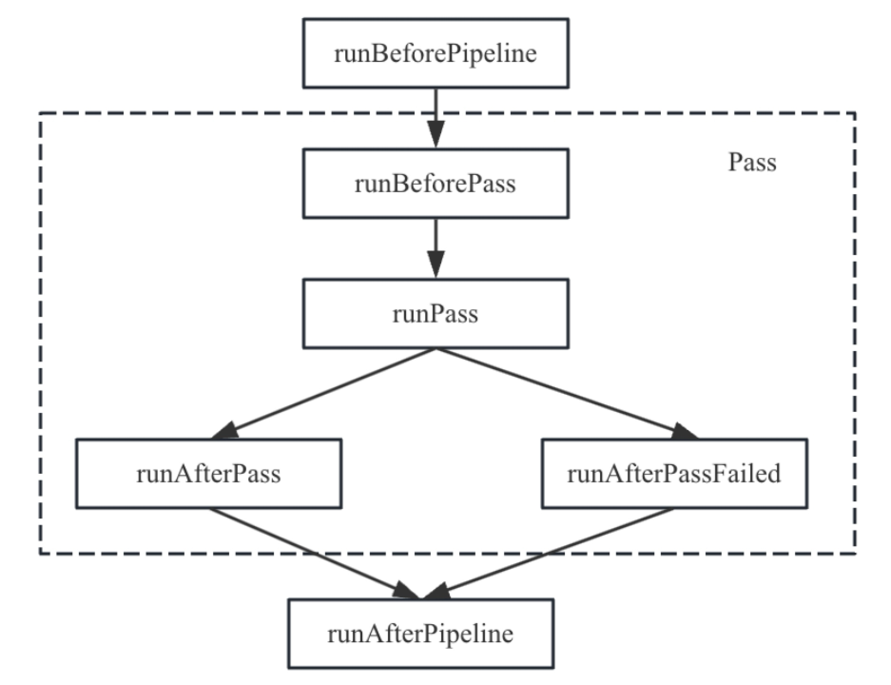

# 第5章：Pass和Passmanager

MLIR中提供了变换（Transformation）和分析（Analysis）的概念，变换指的是将IR进行优化，生成新的IR（和方言降级略有不同，降级一般不涉及优化，仅仅简单的将某一算子变成一个或多个新类型的操作）；而分析是提供一些信息供优化使用。本节主要讨论变换Pass，最后简单介绍分析管理。
注意：MLIR的分析和LLVM中的分析存在很大不同，LLVM分析是以Pass的方式存在，并且可以穿插在变换之间，同时提供了一套相对完善的用法，例如缓存分析结果等。但是MLIR非常困难提供类似于LLVM中的分析Pass，原因是MLIR中IR不统一，基于一种IR的分析很难在其他类型的IR中使用，导致很难提供一套既能在多种IR共享数据，且同时可以作用对多种IR进行分析的框架。所以MLIR中分析是以类的形式存在，仅仅提供多种IR共享数据的能力。

## 5.1Pass、Pass管理器和Pass流水线

MLIR框架提供Pass（遍）、Pass Pipeline（Pass流水线）、OpPassManager（操作Pass管理器）、PassManager（Pass管理器）等功能，方便开发者进行优化或者IR变换。其中Pass主要用于定义针对操作的变换，Pass Pipeline主要用于将多个Pass进行组合排布执行，而PassManager管理Pass和Pass Pipeline。为了方便统一管理Pass和Pass Pipeline，将Pass Pipeline设计为针对一个操作的多个Pass排布，通过OpPassManager结构进行管理（OpPassManager实际上继承于PassManager类型），这样OpPassManager也是针对一个操作，而一个一般的Pass也是针对一个操作，所以它们的地位相同，即它们又可以再次被组合成一个Pass Pipeline，由它们的共同父操作的OpPassManager进行管理。依此类推，所有的Pass可以构成一颗树。
假设有一个最顶层操作，为它提供一个Pass Pipeline，由一个OpPassManager进行管理，其中存在两个子Pass Pipeline，见图5-1中Sub OpPassManager1和Sub OpPassManager2，它们分别针对顶层操作的负载IR（payload IR，参考2.1.5节IR结构），而其中Sub OpPassManager1针对的负载操作还可以进一步包括负载IR，所以还可以进一步设计Pass Pipeline。该顶层操作对应的Pass执行排布如图5-1所示。


本节将对Pass、Pass Pipeline、执行框架等注意展开介绍。

### 5.1.1Pass介绍
MLIR中变换的基础是操作。所以框架中定义了基类OperationPass，所有的Pass都继承于OpeartionPass，它有几个特点：
* 针对特定的操作进行处理；对于一般的Pass来说，如果没有指定操作则是针对任意操作进行处理，但是对于Pass Pipeline来说必须指定一些信息，其中包含要针对的操作，否则不能执行。
* 提供了一个接口canScheduleOn，用于判断Pass能否运行于特定的操作。
* 提供了一个接口getAnalysis，用于获取分析结果。
通过基类OperationPass方便过滤需要处理的操作，这是一种过滤条件，即只有操作类型符合要求才会执行。在MLIR框架中还有一些另外的过滤条件，例如MLIR框架还提供了Pass的另外一个基类InterfacePass，表示Pass仅仅作用于某一些接口限定的操作。如果操作没有对应的接口，不会执行相关Pass。
注意：由于Pass执行过程中可能因为操作不满足一些条件因此不需要执行Pass，这一功能可以通过接口canScheduleOn进行实现，但需要注意的是，由于针对一个操作可能存在多个Pass，所以Pass执行框架会先遍历该操作所有Pass，如果其中一个Pass不能被执行，则该操作所有的Pass都不会执行，而不是仅仅跳过不能调度执行的Pass。

### 5.1.2Pass定义
Pass可以通过TD文件进行定义。TD中的记录PassBase约定了自定义Pass包括了哪些参数，PassBase对应的代码片段如代码5-1所示。

```Class PassBase<string passArg,string base>{
//Pass的名字，在opt命令行中使用
String argument = passArg;
//定义了Pass的基类，这个基类指的是C++类，通过是Operation
String baseClass = base;
//Pass的简单描述，这个描述体现在opt--help输出
String summary = "";
//Pass的完整描述，这个描述体现在自动生成的文档中
String description = "";
//Pass的构造函数，如果没有在TD文件中定义，则自动生成一个默认的函数签名
Code constructor=[{}];
//声明Pass依赖的的方言，只有在此处声明后的方言，才可以在该Pass中使用。
//该字段对应的函数为getDependentDialects，在该函数需要将方言注册到
//MLIRContext中，这样Pass才可以使用方言。
//如果没有注册方言，Pass使用相关方言会报错。
list<string> dependentDialects=[];
//Pass的参数
list<Option> options=[];
//Pass的统计信息，在统计Pass信息时使用。在TD文件中定义变量名、描述信息，就可以统计Pass的执行次数，并可以通过PassManager中的enableStatistics函数打开Pass执行次数统计，并在Pass执行结束后输出信息，在mlir-opt工具中可以通过参数mlir-pass-statistics直接使用。
list<Statistic> statistics=[];
}
```

开发者可能会对代码5-1中字段dependentDialects有一些疑问，为什么要在Pass中显式定义依赖的方言？而不是直接在MLIRContext中直接加载方言[ MLIR框架提供的一些工具例如mlir-opt、mlir-translate在开始执行前都会初始化MLIRContext，并注册相应的方言，否则MLIRContext在遍历IR时无法识别操作，就会报错。另外在变换时、方言降级时也需要依赖其它方言，因此早变换和降级过程会生成其它方言中的操作。]？首先要说明的是，Pass中可以使用的方言必须是MLIRContext已经加载过的方言，如果方言未加载则不能使用，如果使用则会报错（找不到对应方言）。
但是MLIRContext已经加载的方言比较难以确定，因为方言降级路径不唯一，所以会导致MLIRContext中加载的方言不确定。所以一般会在此处将该Pass所依赖的方言都进行加载，如果方言已经加载搭配MLIRContext中它并不会被重复加载。当然如果可以确定所有进入到该Pass的路径都已经加载了相关方言，Pass可以进行忽略加载方言。例如有一个Pass要处理linalg方言中的操作，如果无论何种路径进入到该Pass时都已经加载过linalg方言，那么该Pass可以不添加依赖再去加载linalg方言。
另外还需要注意，方言的加载可能发生在多线程执行环境中，所以方言加载一般需要放在Pass真正运行之前，否则会报“并发运行错误和不安全运行错误”。
下面以affine方言中循环不变量外提为例，简单介绍Pass定义。循环中不变量外提是指将循环不变量其提升到循环体的外部，从而加速执行效率。Pass定义如代码5-2所示。

```//定义Pass，对应的C++类为AffineLoopInvariantCodeMotion
//Pass名字为affine-loop-invariant-code-motion
//该Pass仅仅适用于操作类型为FuncOp
def AffineLoopInvariantCodeMotion
:Pass<"affine-loop-invariant-code-motion","func::FuncOp">{
//summary是简单描述
let summary="Hoist loop invariant instructions out side of affine loops";
//Pass的构造器，通过下面的函数构造C++对象
let constructor="mlir::createAffineLoopInvariantCodeMotionPass()";
}
```
通过工具mlir-tblgen翻译代码5-2，得到的记录如代码5-3所示。

```def AffineLoopInvariantCodeMotion{//记录的基类为Pass BasePass
string argument="affine-loop-invariant-code-motion";
string baseClass="::mlir::OperationPass<func::FuncOp>";
string summary="Hoist loop invariant instructions out side of affine loops";
String description="";
String constructor="mlir::affine::createAffineLoopInvariantCodeMotionPass()";
list<string> dependentDialects=[];
list<Option> options=[];
list<Statistic> statistics=[];
}
```
对照代码5-1非容容易理解代码5-3，继续使用mlir-tblgen运行代码5-3可以得到对应的C++文件，其中Pass定义相关的头文件如代码5-4所示。

```template<typename DerivedT>
class AffineLoopInvariantCodeMotionBase : public ::mlir::OperationPass<func::FuncOp>{
public:
Using Base = AffineLoopInvariantCodeMotionBase;
//辅助类，用于定义Pass
AffineLoopInvariantCodeMotionBase() : ::mlir::OperationPass<func::FuncOp>(::mlir::TypeID::get<DerivedT>()){}
AffineLoopInvariantCodeMotionBase(const AffineLoopInvariantCodeMotionBase &other) : ::mlir::OperationPass<func::FuncOp>(other){}
//Pass名字，在命令行通过该名字关联到Pass
static const expr::llvm::StringLiteral getArgumentName(){
return ::llvm::StringLiteral("affine-loop-invariant-code-motion");
}
.....
//支持LLVM开发体系中dyn_cast功能
static bool classof(const::mlir::Pass *pass){
return pass->getTypeID()==::mlir::TypeID::get<DerivedT>();
}
......
//Pass依赖的方言，此处为空
void getDependentDialects(::mlir::DialectRegistry&registry) const override{
}
//定义C++对象的ID宏，用于标识对象
MLIR_DEFINE_EXPLICIT_INTERNAL_INLINE_TYPE_ID(AffineLoopInvariantCodeMotionBase<DerivedT>)
};
```
代码5-4显式Pass继承于C++模板类mlir::OperationPass，这说明了MLIR中变换的基础是操作，所以框架中定义了模板类OperationPass。模板类是MLIR中Pass执行的基础框架部分。
在TD文件中定义通用Pass定义（即适用于任意的操作）也非常简单，例如MLIR框架中CSE（Common Sub-express Elimination，公共子表达式消除），其Pass定义如代码5-5所示。

```//定义CSE，它只有一个Pass名字，并没有过滤参数，所以适用于任何操作
def CSE:Pass<"cse">{
...
}
```
同样通过工具mlir-tblgen翻译代码5-5，忽略记录信息，直接看对应的C++如代码5-6所示。
```
template<typename DerivedT>
class CSEBase : public ::mlir::OperationPass<>{
public:
...
}
```
代码5-6中mlir::OperationPass<>是一个特殊的类，等价于参数为void，MLIR社区用这个类匹配任意的操作，也称为any操作。
为了更好的管理Pass，MLIR社区还提供了PassPipeline，一个PassPipeline示例如代码5-7所示。

```void pipelineBuilder(OpPassManager& pm){
pm.addPass(std::make_unique<MyPass>());
pm.addPass(std::make_unique<MyOtherPass>());
}
```
从代码5-7中可以看出一个Pass Pipeline本质上就是一个OpPassManager。Pass和Pass pipeline的管理和执行由顶层的OpPassManager负责，为了简单，这里使用PassManager代替OpPassManager。PassManager首先将所有Pass、Pass pipeline中定义的依赖方言全部加载到PassManager中，只有加载过的方言才能被使用。
当PassManager中存在多个Pass时一般会按照Pass定义的顺序执行，所以读者需要特别注意在定义Pass Pipeline时考虑好Pass执行的顺序，否则可能导致一些错误[ 最常见的问题是方言降级过程，在第6章介绍。方言降级也是基于Pass框架实现，方言降级需要考虑类型，而不同的Pass执行顺序可能会导致类型不存在，从而导致降级失败。]，目前对于如何合理的组织Pass完全依赖于使用者，MLIR社区尚未有合理的解决方案。但是对于连续多个Pass Pipeline在一起的情况会进行合并，并对Pass进行排序，按照过滤Pass优先、一般Pass在后的原则进行。
当Pass、Pass Pipeline定义完成后，要想使用它们，必须将其注册到MLIContext中。

### 5.1.3Pass、Pass Pipeline注册
Pass和Pass Pipeline需要注册至MLIRContext后才能使用。在MLIRCnntext中Pass和Pipeline分别管理，它们各自由一个全局Map管理注册信息。在每个Pass和Pipeline中会调用框架中的函数mlir::registerPass和PassPipelineRegistration分别将Pass和Pipeline注册到全局变量中。在构造PassManager时将相关的Pass、Pipeline进行初始化。
在使用mlir-tblgen运行代码5-3时，除了生成代码5-4的内容外，还有将Pass注册的辅助代码，代码如5-8所示。

```//注册LICM Pass
inline void registerAffineLoopInvariantCodeMotion(){
::mlir::registerPass([]()->std::unique_ptr<::mlir::Pass>{
return mlir::affine::createAffineLoopInvariantCodeMotionPass();
});
}
```
在代码5-8中，函数mlir::registerPass本质上通过一个全局变量管理所有注册的Pass，该变量是Map结构，其中key为TD文件中的passArg，表示pass的名字；而value为一个结构体，包含了（passArg，description，functor）其中passArg和key相同，description表示Pass的描述，而functor则是registerPass中参数，这个参数是一个函数指针，会调用Pass的构造器。
除了代码5-8外，工具mlir-tblgen还会生成代码将TD文件中所有定义的Pass都注册的一个辅助函数，形如register+groupName+Passes()的函数中，例如方言affine中所有的Pass会有一个对应的辅助函数registerAffinePasses，在registerAffinePasses会调用每一个Pass的注册函数，例如会调用registerAffineLoopInvariantCodeMotion，如代码5-9所示。

```//注册affine方言中所有的Passes
inline void registerAffinePasses(){
...
registerAffineLoopInvariantCodeMotion();
...
}
```
除了自动生成的代码外，开发者需要实现Pass的构造函数，用于构造一个Pass对象。实现过程中通常会定义一个类继承于上述自动生成的类，例如LoopInvariantCodeMotion继承于代码5-4中的AffineLoopInvariantCodeMotionBase，并且在Pass的构造函数中实例化对象，如代码5-10所示。

```//Pass对应的具体类，开发者实现runOnOperation即可，
//runOnOperation函数MLIR框架调用
struct LoopInvariantCodeMotion
: public affine::impl::AffineLoopInvariantCodeMotionBase<
LoopInvariantCodeMotion>{
void runOnOperation()override;
...
};
//创建Pass对象的函数
std::unique_ptr<OperationPass<func::FuncOp>>
mlir::affine::createAffineLoopInvariantCodeMotionPass(){
return std::make_unique<LoopInvariantCodeMotion>();
}
```
代码5-10中最关键的函数为runOnOperation，这个函数在模板类模板类mlir::OperationPass为虚函数，需要开发者进行实现，并描述Pass真正的工作。
通过工具mlir-tblgen就可以将Pass定义、注册和MLIR框架结合起来，开发者只需要显式调用Pass注册后就可以触发执行，而MLIR框架会调用到开发者实现的runOnOperation函数，从而执行用户的代码变换。
类似于Pass，MLIR社区也提供了Pass Pipeline的注册机制，通过passPipelineRegistration完成Pipeline的注册，注册后也是通过全局变量进行管理Pipeline对象。例如一个Pass Pipeline注册示例如代码5-11所示。

```void registerMyPasses(){
//passPipelineRegistration接受一个functor，这个functor定义一个Pass Pipeline
passPipelineRegistration<>(
"argument","description",[](OpPassManager &pm){
pm.addPass(std::make_unique<MyPass>());
pm.addPass(std::make_unique<MyOtherPass>());
});
}
```
当完成Pass、Pass Pipeline注册后，就可以调用Pass或者Pass Pipeline。以mlir-opt工具为例，想要使用mlir-opt工具执行Pass，首先需要将Pass注册到mlir-opt工具（本节介绍注册函数），然后就可以通过mlir-opt工具执行Pass。例如MLIR框架中提供的mlir-opt工具中会调用registerAffinePasses，表示所有Affine相关的Pass都可以通过mlir-opt工具使用，当用户使用mlir-opt -affine-loop-invariant-code-motion命令就可以触发相关的Pass，并执行代码5-10中的runOnOperation函数。

### 5.1.4Pass执行顺序
看到在Pass定义的时候通常约定要处理的操作，这个操作也称为Pass的锚点，Pass的构造函数会返回模板类OperationPass和对应操作的实例，形如OperationPass<func::FuncOp>的对象，这样的Pass称为特定Pass（op-specific）。也有一些Pass可以处理任意的操作，例如CSE，它继承于mlir::OperationPass<>，这样的Pass称为通用Pass（op-agnostic），它们的构造函数返回一个基类Pass的指针。
对于锚点Pass来说，Pass只需要处理约定的操作，其他无关的操作无需处理。而操作在MLIR中具有层级结构，如果Pass执行顺序也应该和操作定义的层次一致，那么执行效率最高，因为只需要通过一次遍历IR就可以完成所有Pass的执行。因此管理Pass的PassManager对应的Pass Pipeline也应该体现IR结构。官网中给出这样的一个例子，如代码5-12所示。

```module {
spirv.module "Logical" "GLSL450"{
func @foo(){
...
}
}
}
```
代码5-12代码片段蕴含IR层级代码5-13所示。

```
`builtin.module`
	`spirv.module`
		`spirv.func`
```
对于代码5-13来说，定义的Pass Pipeline也应该按照这样的层级结构。官网提供了一个示例，如代码5-14所示。

```//定义顶层ModuleOp的PassManager
auto pm = PassManager::on<ModuleOp>(ctx);
//为最顶层PassManage添加Pass
pm.addPass(std::make_unique<MyModulePass>());
//定义子Pass Pipeline
OpPassManager &nestedModulePM = pm.nest<spirv::ModuleOp>();
nestedModulePM.addPass(std::make_unique<MySPIRVModulePass>());
//为子Pass Pipeline在定义子Pass Pipeline
OpPassManager &nestedFunctionPM = nestedModulePM.nest<func::FuncOp>();
nestedFunctionPM.addPass(std::make_unique<MyFunctionPass>());
OpPassManager &nestedAnyPM=nestedModulePM.nestAny();
nestedAnyPM.addPass(createCanonicalizePass());
nestedAnyPM.addPass(createCSEPass());
```
代码5-14片段对应的Pass结构如代码5-15所示。

```
OpPassManager<ModuleOp> //最顶层的Pass Pipeline，只能处理ModuleOp
  MyModulePass
  OpPassManager<spirv::ModuleOp>//中间层Pass Pipeline
    MySPIRVModulePass
    OpPassManager<func::FuncOp>//最内层的Pass Pipeline
      MyFunctionPass
      OpPassManager<>//可以处理任意的操作
      Canonicalizer
      CSE
```
图5-1描述的就是一种泛化的PassPipeline。
注意：默认情况下PassManager要求文件中顶层操作是builtin.module，如果测试文件中不符合该要求，如文件是以func.func为顶层操作，直接运行会报错形如can't run 'func.func' passmanager on 'builtin.module' op。可以通过在命令行中添加完整的操作层级，例如--pass-pipeline="builtin.module(func.func(passname))"来解决。
由于Pass执行排布和IR结构保持一致，所以可以在遍历IR结构的过程中运行Pass，如果操作是Pass要处理的操作，则运行Pass；否则跳过该操作。对于Pass的执行顺序的约定如下：
* 针对一个操作，将执行该Pass Pipeline下所有的可以运行的Pass；也就是说两个类型相同的操作，它们依次执行完各自可以运行的所有Pass[ 这样设计的目的是为了方便同一操作在不同Pass之间的数据复用。当然另一种执行Pass的方案是依次遍历Pass，针对一个Pass将所有需要执行的操作依次执行，这样的方案也是可以的，但可能对缓存不够友好。]。
* 如果Pass是OpPassManger，针对操作中的区域、基本块进行遍历，然后针对遍历的每一个操作寻找对应的Pass Pipeline，并执行。
Pass可以多线程执行，由于执行时可能会依赖分析Pass，所以需要为操作准备对应的分析Pass即可，当多个并行执行的Pass有一个失败，整体认为并行执行失败。

### 5.1.5Pass实现的约束

Pass执行时针对操作进行处理，Pass框架在设计之初就确定了可以多线程执行，所以Pass实现需要遵守一定的规则，主要限制包括：
* 不得检查当前操作的同级操作的状态，不得访问嵌套在这些同级下的操作。因为其他线程可能正在并行修改这些操作。但是可以允许检查祖先/父操作的状态。
* 不得修改、删除当前操作下嵌套的操作以外的操作的状态。这包括从祖先/父块添加、修改或删除其他操作。同样是因为其他线程可能同时对这些操作进行操作。作为例外，当前操作的属性可以自由修改。这是修改当前操作的唯一方法（即不允许修改操作数等）。
* 不得在多个Pass的runOnOperation函数调用之间维护可变的状态。因为同一个Pass可以在许多不同的操作上运行，但执行时没有严格的执行顺序保证。当多线程处理时，特定的Pass实例甚至可能不会在IR内的所有操作上执行。因此，一个Pass的运行不应依赖于所处理的操作。
* 不得为Pass维护任何全局可变状态，包括使用静态变量。所有可变状态都应该由Pass的实例来维护。
* Pass必须是可复制构造的，PassManager可以创建Pass的多个实例以便并行处理操作。
* Pass针对的操作类型必须符合以下要求：操作必须被注册且被标记为IsolatedFromAbove特质[ 违反该要求，将得到形如trying to schedule a pass on an operation not marked as IsolatedFromAbove的错误。该约束本质上是说明Pass Pipeline中的Pass不能实现跨Pass间的优化。读者需要了解Pass的最小粒度，并非任意的操作都可以作为Pass的锚点。]。
Pass的约束非常重要，但对开发者来说并不友好，可能在实现Pass的过程中违反约束导致运行失败，为此MLIR框架提供方便进行匹配——重写机制，在重写机制中定义了很多辅助函数，例如添加、删除、修改等函数方便开发者实现相关功能，该内容在第6章进一步介绍。

### 5.1.6Pass插桩机制

为了方便跟踪Pass的执行，MLIR框架针对Pass执行提供了插桩机制。该机制非常灵活，是一个可定制的插桩框架，通过类PassInstrumentation来检测Pass和分析计算的执行。类PassInstrumentation提供了PassManager的钩子函数来观察各种事件，这些钩子函数主要包括：
* runBeforePipeline：该钩子函数在执行Pass Pipeline之前运行。
* runAfterPipeline：无论Pass Pipeline执行成功与否，该钩子函数在执行Pass Pipeline执行后立即运行。
* runBeforePass：该钩子函数在执行Pass之前运行。
* runAfterPass：该钩子函数在Pass成功执行后立即运行。如果这个钩子被执行，则另一个钩子函数runAfterPassFailed不会执行。
* runAfterPassFailed：该钩子函数在Pass执行失败后立即运行。如果这个钩子被执行，则另一个钩子函数runAfterPass不会执行。
* runBeforeAnalysis：该钩子函数在分析计算之前运行。如果分析请求另一个分析作为依赖项，则可以从当前钩子函数对依赖的runBeforeAnalysis/runAfterAnalysis对进行调用。
* runAfterAnalysis：该钩子函数在分析计算后立即运行。
和Pass、Pass Pipeline相关的API会被整合到Pass的执行过程。例如PassManager包含一个Pass的场景，首先PassManager的顶层是Pass Pipeline，Pass插桩后其执行过程如图5-2所示。



而插桩中runBeforeAnalysis/runAfterAnalysis在Pass执行过程中获取分析结果时会被执行。
当开发者实现自己的Pass插桩后，通过PassManager的addInstrumentation接口就可以把插桩注册到PassManager中，并在相应的调用点执行插桩中的回调函数。当然开发者可以注册多个Pass插桩，多个插桩在PassManager以类似堆栈的方式运行，即最后一个插桩执行runBefore*钩子函数它对应的runAfter*钩子函数将是第一个被执行。类PassInstrumentation保证以线程安全的方式执行钩子函数，因此不需要额外的同步。下面给出一个示例Pass插桩，用于统计支配信息计算次数，由于支配信息计算是分析过程，所以Pass插桩要对分析相关的钩子函数进行实现，如代码5-16所示。

```
//自定义Pass插桩
struct DominanceCounterInstrumentation : public PassInstrumentation{
//设计一个计数器，用于存储支配信息计算的次数
unsigned &count;
DominanceCounterInstrumentation(unsigned &count):count(count){}
//在分析计算后调用该钩子函数，如果分析是计算支配信息，则累加计数器
void runAfterAnalysis(llvm::StringRef,TypeID id,Operation*)override{
if( id == TypeID::get<DominanceInfo>())
++count;
}
};
//下面是Pass插桩的使用示例，首先使用前需要找到对应的上下文
MLIRContext *ctx = ...;
PassManager pm(ctx);
//将Pass插桩注册到PassManager中
unsigned domInfoCount;
pm.addInstrumentation(std::make_unique<DominanceCounterInstrumentation>(domInfoCount));
//遍历操作，运行PassManager
ModuleOp m=...;
if(failed(pm.run(m)))
...
//运行完成后则可以通过参数domInfoCount获取全部支配信息的计算次数
llvm::errs() << "DominanceInfo was computed" << domInfoCount << "times!\n";
```
### 5.1.7标准插桩

Pass插桩是MLIR框架非常有用的功能，在MLIR社区提供了三个基于Pass插桩的有用实现，包括：时间统计、IR打印、Pass失败捕获。

#### 1.时间统计
有一个常见的需求统计Pass执行时间信息，因此MLIR框架在类PassManager有一个函数enableTiming允许开发者针对PassManager统计Pass执行信息。例如mlir-opt工具就是利用该函数实现了Pass信息统计，在使用时通过给mlir-opt传递参数-mlir-timing即可。功能就是基于Pass插桩的能力实现，定义PassTming类，它继承于PassInstrumentation，并实现相关的钩子函数，在钩子函数runBefore*中记录起始时间，在钩子函数runAfter*中获取结束时间，从而在PassManager运行结束后可以打印Pass的统计信息。
Pass执行信息在串行执行和并行执行输出有所不同，读者可以参考官网了解时间统计的具体格式和含义。

#### 2.IR打印
IR打印也是利用Pass插桩功能，定义IRPrinterInstrumentation类，它继承于PassInstrumentation，并实现runBeforePass、runAfterPass、runAfterPassFailed截获执行的操作，输出操作，从而实现IR打印。基于这个Pass插桩，MLIR框架实现了和LLVM一样的IR输出。为了便于读者只关注关心的IR，MLIR社区还提供了一系列的参数控制IR打印的范围。常见的命令参数有：
* mlir-print-ir-before：设置关注的Pass，在Pass运行之前打印IR。
* mlir-print-ir-before-all：在每个Pass运行之前都打印IR。
* mlir-print-ir-after：设置关注的Pass，在Pass运行之后打印IR。
* mlir-print-ir-after-all：在每个Pass运行之后都打印IR。
* mlir-print-ir-after-change：如果Pass改变了IR则在Pass执行后打印IR。该选项需要和mlir-print-ir-after或者mlir-print-ir-after-all配合使用。
* mlir-print-ir-after-failure：在Pass执行失败后打印IR。
* mlir-print-ir-module-scope：打印当前操作的顶层操作全部打印出来，该参数需要禁止Pass并发执行（需设置mlir-disable-threading）。

#### 3.Pass执行失败捕获与重放机制
Pass在执行过程中可能发生错误，编译系统的输入可能包含了许多操作，而编译器过程中还可以应用多种Pass的组合，但是编译执行过程中可能遇到Pass失败的场景，而这时要准确定位到哪个Pass在对哪个操作处理时发生错误就非常困难。所以MLIR框架提供了Pass失败捕获机制以及重放机制。
失败捕获机制的实现原理比较简单，也是基于Pass的插桩机制实现的。定义CrashReproducerInstrumentation类，它继承于PassInstrumentation，并实现runBeforePass、runAfterPass、runAfterPassFailed截获执行的操作。当Pass执行失败运行runAfterPassFailed，将Pass执行失败的信息并将其记录下来。为了准确记录Pass执行失败的信息，还需要记录Pass执行的上下文信息，所以失败捕获机制还会实现Pass插桩中的runBeforePass、runAfterPass函数，在runBeforePass中会记录相关上下文信息，主要包括要执行的Pass以及对应的操作；当Pass成功运行时runAfterPass会删除上下文信息。
捕获回放机制在Pass执行失败会将操作以及执行的Pass Pipeline执行记录下来。在Pass执行过程可以传递不同的参数用于记录Pass Pipeline信息。例如可以传递mlir-pass-pipeline-crash-reproducer和mlir-pass-pipeline-local-reproducer，它们分别记录Pass执行失败时操作对应的完整Pass Pipeline、或仅记录失败Pass。传递参数mlir-pass-pipeline-local-reproducer仅仅记录Pass执行失败时最新的Pass Pipeline信息，该选项要求Pass执行不能并行执行（可以通过参数mlir-disable-threading设置），因为并行执行时最新记录的Pass上下文信息可能和失败Pass信息并不相同。而参数mlir-pass-pipeline-crash-reproducer可以支持Pass并发执行。
一个捕获回放机制的示例如代码5-17所示。为了记录Pass执行失败的信息，需要在Pass执行时传递参数为mlir-pass-pipeline-crash-reproducer。

```//两个func操作，通过捕捉得到IR
func.func @foo(){
%0=arith.constant 0:i32
return
}
func.func @bar(){
return
}
//下面重放，即针对上面的mlir通过下面的命令可以重现问题
{-#
external_resources:{
mlir_reproducer:{
verify_each:true,
pipeline:"builtin.module(func.func(cse, canonicalize{max-iterations=1 max-num-rewrites=-1 region-simplify=false top-down=false}))", disable_threading:true 
}
}
#-}
```
同时MLIR社区还提供了重放机制，例如在mlir-opt工具中通过参数-run-reprodcuer可以重新运行指定的操作和Pass Pipeline。这个功能的实现也比较简单，从mlir-reprodcuer中获取Pass Pipeline等信息，然后针对相应的操作执行Pass即可。


## 5.2分析和分析管理
与变换过程一样，分析也是一个重要的概念。它在概念上类似于变换过程，只不过分析仅仅计算特定操作的信息而不修改它。在MLIR中，分析不是Pass，而是独立的类，它们按需延迟计算并缓存以避免不必要的重新计算。也就说是MLIR中的分析需要先定义一个类，用于描述分析过程和分析结果，并在变换Pass中显式的生成分析对象以及调用分析过程。为了使用方便，MLIR引入了AnalysisManager，它仅仅管理分析对象。
MLIR中的分析不得对操作进行修改。目前MLIR框架构造分析对象的方式为：通过一个Operation*或者Operation*和AnalysisManager&为参数的构造函数进行构造（其中参数AnalysisManager用于查询分析依赖）。
分析可能会提供额外的钩子函数来控制各种行为：bool isInvalidated(const AnalysisManager::PreservedAnalyses &)。给定一个保留的分析集，如果它确实应该失效，则isInvalidated将返回true。这也允许在分析未明确标记分析结果是否需要保留的情况处理失效情况，例如可以根据其他属性或其他分析集的结果对当前分析集设置保存或失效。如果一个分析依赖另外一个分析，它必须检查依赖的分析是否无效。
分析类提供两类结果处理：查询分析结果、保存分析结果。
查询分析结果对应API主要有：
* getAnalysis<>：对当前操作进行分析，在必要时构建它，通常在构建分析对象时会进行分析。
* getCachedAnalysis<>：获取当前操作的分析（如果已存在）。
* getCachedParentAnalysis<>：获取给定父操作的分析（如果存在）。
* getCachedChildAnalysis<>：获取给定子操作的分析（如果存在）。
* getChildAnalysis<>：获取给定子操作的分析，在必要时构建它。
保存分析结果：使用分析查询结果API得到的分析结果会被缓存，以避免稍后再次使用时不必要的计算。为了避免过时的分析结果，所有分析结果都被假定经过一次使用就无效。为了避免无效，在Pass中必须专门标记已知要保留的分析。提供的API有：
* markAllAnalysesPreserved：保存所有的分析结果。
* markAnalysesPreserved<>：保存指定类的分析结果。
<!-- more -->
