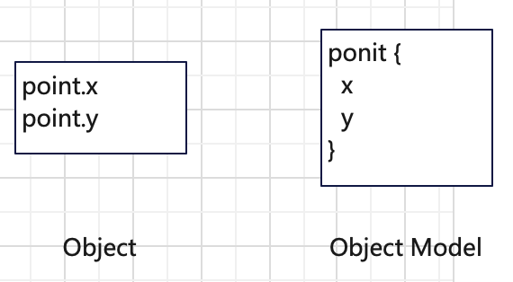
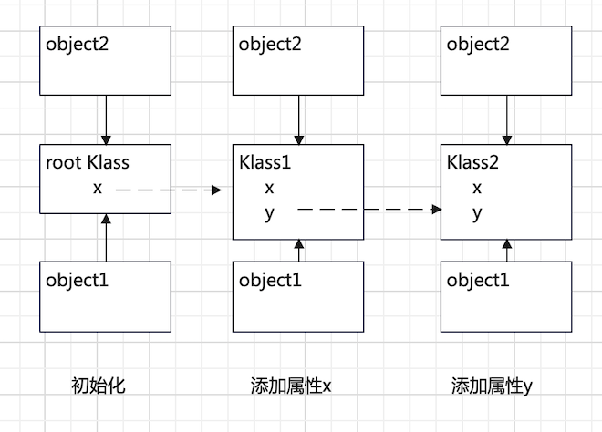

## 背景

高级编程语言编写的程序需要进行转换和额外的运行时环境（它实现了语言所需的特定功能）才能在机器运行起来。转换的方式有两种，一种是离线转换（即，在运行之前提前转换好），另一种是在线转换（即，在运行的时候转换）。其中，在线转换将所需的转换工具和运行时环境工具实现在一起，称为虚拟机（或执行引擎）。随着高级语言的发展，虚拟机的实现也越来越复杂，具有非常多的模块，如compilers, runtime routines, object model和garbage collector等。本文基于Javascript这个动态类型语言简单地展开介绍下object model的基本原理，主要内容来自于Vyacheslav Egorov的文章--[Explaining JavaScript VMs in JavaScript - Inline Caches](https://mrale.ph/blog/2012/06/03/explaining-js-vms-in-js-inline-caches.html)的学习总结和自我理解仅供参考。

<!-- more -->

## 对象模型的概念

在编程语言里，一个对象变量是一个结构化数据的意思，它是由一组属性及其对应的值构成的，而这个结构化数据在虚拟机里是通过对象模型（object model）进行表示的。如下图所示，对象模型描述了数据在虚拟机中的表示方式，即数据的底层内存布局结构。只有知道了数据的内存布局结构，我们才能正确地访问特定数据的某个属性。在现代虚拟机中，由于需要记录一些虚拟机管理所需的信息（如类型信息，GC信息等），对象一般都会有一个对象头的数据来描述这些信息，使得整个对象模型变得很复杂。为了了解最基本的对象模型的概念，本文不涉及GC这些复杂的机制，因此只需要最基本的模型就能满足结构化数据表示。



下面我们使用表（Table，表可以使用字符串也可以使用数字来索引属性，是Object的初级形态）来表示对象模型这个抽象概念，并使用JavaScript来描述基于表的对象模型的实现方式。如下代码所示，Table表示一个对象模型，创建一个对象的时候，虚拟机就会创建一个Table的实例。

```javascript
function Table() {
}
```

如下代码所示，程序创建了一个point的对象，在虚拟机里就是创建了一个Table，因此每个对象都有与之对应的Table。

````javascript
// 程序
var point = {};

// 虚拟机内部实现
point = New Table();
````

## 对象模型的实现

下面我们会介绍Table两种实现方式，分别是：

- 映射表，将对象的属性-值对一一存放在映射表里。
- 类C结构体索引表，一个带有类型信息的数据结构。

### 映射表

映射表是键-值一一对应的结构，它和对象模型的基本概念非常一致，因此可以直接用于构建基本的对象模型。如下代码所示，Table里面有一个Map用于保存属性和对应的值。添加属性和对应的值的时候，就以属性作为键值往表里设置属性和值。获取属性值的时候，就以属性作为键值查找Map，找到对应的值。

```javascript
function Table() {
  this.map = new Map;
}
```

因为Table中只有Map，导致Table实例之间是相互独立的，无法快速处理对象之间关系如判断两个对象是否具有相同的属性）或实现一些面向对象语法特性（如继承），所以我们需要改进Table的实现方式，即下一节介绍的内容。

### 类C结构体索引表

类C结构体索引表是把对象属性和它的值分开存放，对象的所有属性都被放到一个成为Klass的数据结构里，然后每个Table都会关联一个Klass，根据Klass提供的属性的索引在Table里存放各个属性对应的值到索引表里。虚拟机里会有一个初始的Klass作为root Klass。在对象创建阶段，每次新创建的Table都会关联到root Klass。

```javascript
function Klass(kind) {  
}

var ROOT_KLASS = new Klass();
function Table() {
  this.klass = ROOT_KLASS;
  this.properties = []; 
}
```

在对象属性更新阶段，如果对象新增了一个属性且这个属性不在当前Klass里，则会创建一个新的Klass并复制持有当前Klass的所有属性，然后添加这个新属性到新的Klass里。然后使对象Table关联到新的Klass。此外旧的Klass也会持有这个新属性，只是它只用于跳转，即后续有对象也是基于旧的Klass添加了相同的属性，则直接关联到这个新的Klass不用在创建新的。通过引入Klass将属性单独存放，使得具有相同属性的Table可以通过关联相同的Klass共用属性信息。

如下例子所示，object1创建并且添加了两个属性之后，再去创建object2，则object2可以直接共用object1已经创建好的klass。



## 总结

对象模型是对象在虚拟机的表示方式，它实现了对象的内存布局结构，故而它是语言虚拟机的基础机制之一。本文描述的对象模型的两个实现方式，第一个说明了对象模型本质是一个映射表，只要把属性和对应的值一一存储在映射表里，就能实现对象属性的读写。第二个说明了通过增加类型信息（Klass）可以使得对象之间共用属性信息，在减少一些虚拟机冗余信息的同时增加了后续优化冗余的空间，如通过inline cache的优化，可以相同类型的属性的读写时间。可以认为它是成熟虚拟机的对象模型的最基础版本，对于我们后续研究Hotspot/V8有比较大的帮组。

## 参考

1. [Explaining JavaScript VMs in JavaScript - Inline Caches](https://mrale.ph/blog/2012/06/03/explaining-js-vms-in-js-inline-caches.html)


